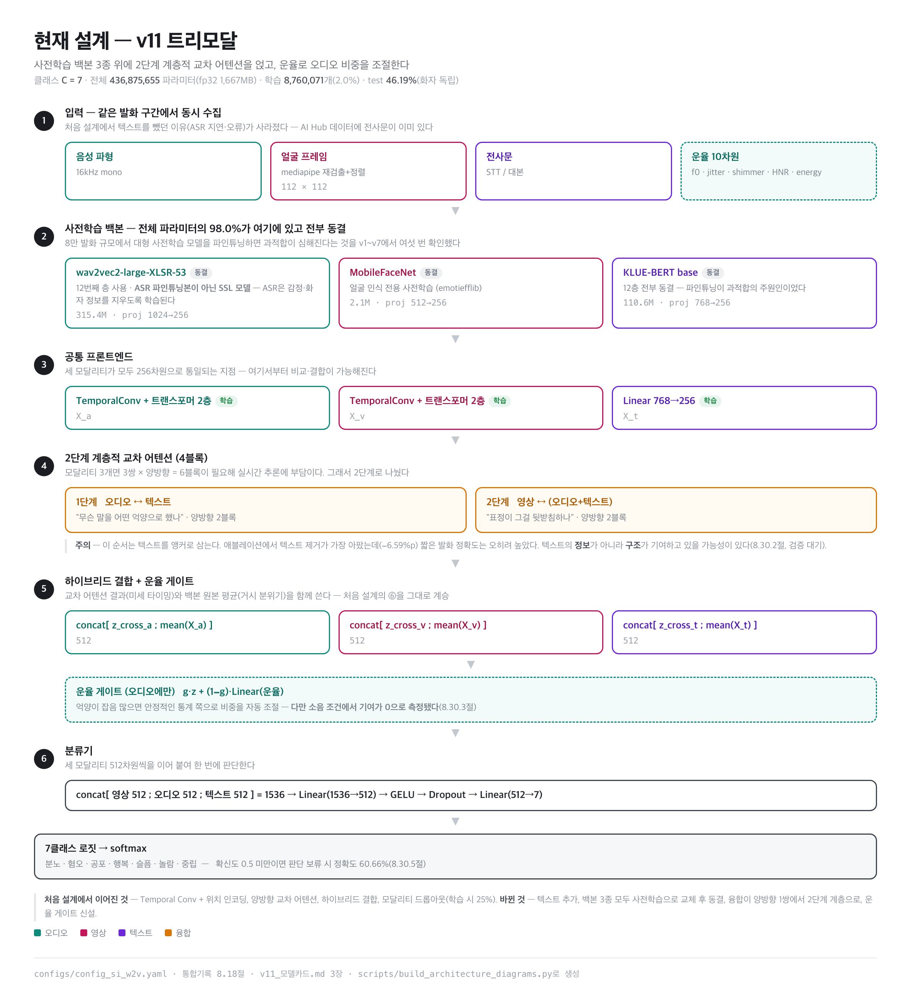

# v11 모델 카드 — 트리모달 한국어 감정인식

**이 프로젝트에서 만든 모델 중 가장 좋은 것.** 이 문서는 v11의 모든 사양·성능·한계·재현
방법을 한곳에 모은 것이다. 실험 서사와 그 과정의 판단 근거는 `감정인식_프로젝트_통합기록.md`에 있다.

> 작성 기준: 2026-08-07 / 체크포인트 `archived_runs/checkpoint_v11_best/best_model.pt`
> 이 문서의 모든 수치는 `results/eval/v11.json`, `results/csv_summary/checkpoint_v11_epoch_summary.csv`,
> 그리고 `configs/config_si_w2v.yaml`에서 직접 추출했다.

---

## 목차

[TOC]

---

## 1. 한눈에 보기

| 항목 | 값 |
|---|---|
| 이름 | v11 (트리모달 + wav2vec2 오디오 백본) |
| 과제 | 한국어 발화의 7클래스 감정 분류 |
| 입력 | 음성 파형 + 얼굴 프레임 + 전사문 |
| 출력 | 7클래스 확률 |
| **test 정확도** | **46.19%** (다수 클래스 기준선 27.00% 대비 **+19.19%p**) |
| test weighted F1 | 0.4575 |
| test macro F1 | 0.4190 |
| 평가 조건 | **화자 독립** (test 화자 40명이 train에 없음) |
| 전체 파라미터 | 436,875,655 (1,667MB @ fp32) |
| 학습 파라미터 | 8,760,071 (전체의 2.0%) |
| 추론 시간 | 350.8ms (맥 MPS) / 1,882.5ms (CPU) |
| 학습 데이터 | AI Hub 멀티모달 영상, 79,601 발화 |
| 학습 시간 | 약 24분/에폭 × 15에폭 (A100 80GB) |
| 최고 지점 | 9에폭 (val 46.80%) |

**한 줄 요약**: 음성·표정·문장을 함께 보고 감정을 판단하며, **처음 보는 화자**에 대해
찍기(27%)보다 19%p 잘 맞힌다. 7클래스 목표(60%)에는 못 미치지만, **긍정/부정/중립
3클래스로 재매핑하면 재학습 없이 67.34%**다(8.4절).

---

## 2. 성능

### 2.1 전체 지표

test 세트 11,464 발화 기준.

| 지표 | 값 | 비고 |
|---|---|---|
| 정확도 | **46.19%** | |
| 다수 클래스 기준선 | 27.00% | 무조건 "혐오"만 찍기 |
| 기준선 대비 | **+19.19%p** | 분할이 바뀌면 기준선도 바뀌므로 항상 이 값으로 비교할 것 |
| weighted F1 | 0.4575 | 클래스 크기로 가중 |
| macro F1 | 0.4190 | 클래스 동등 취급 — 소수 클래스 성능이 드러남 |
| 정확도 표준오차 | 약 0.47%p | √(0.46×0.54/11464) — *한 모델의* 신뢰구간용 |
| **두 모델 차이의 표준오차** | **약 0.66%p** | √(SE₁²+SE₂²). **두 모델 비교는 이 값을 써야 한다** |
| 유의미한 차이의 하한 | **약 1.3%p** | 1.96×0.66%p. 이보다 작은 차이는 단일 실행으로 구분 불가 |

### 2.2 클래스별

| 감정 | 개수 | precision | recall | F1 |
|---|---:|---:|---:|---:|
| 분노 (angry) | 963 | 0.45 | 0.44 | 0.45 |
| 혐오 (disgust) | 3,095 | 0.47 | 0.43 | 0.45 |
| **공포 (fear)** | 679 | **0.20** | **0.24** | **0.22** |
| **행복 (happy)** | 2,465 | **0.59** | **0.69** | **0.63** |
| 슬픔 (sad) | 1,179 | 0.38 | 0.31 | 0.34 |
| 놀람 (surprise) | 1,600 | 0.48 | 0.53 | 0.51 |
| 중립 (neutral) | 1,483 | 0.37 | 0.31 | 0.34 |

**행복만 실용 수준이고 나머지는 30~50%대다.** 공포가 가장 나쁘며(F1 0.22), 데이터도
가장 적다(679개, 5.9%).

### 2.3 혼동 행렬

행=정답, 열=예측.

| | 분노 | 혐오 | 공포 | 행복 | 슬픔 | 놀람 | 중립 |
|---|---:|---:|---:|---:|---:|---:|---:|
| **분노** | **428** | 341 | 30 | 43 | 24 | 67 | 30 |
| **혐오** | 343 | **1328** | 233 | 349 | 289 | 323 | 230 |
| **공포** | 27 | 162 | **163** | 66 | 95 | 95 | 71 |
| **행복** | 31 | 220 | 49 | **1700** | 76 | 183 | 206 |
| **슬픔** | 27 | 301 | 156 | 128 | **369** | 77 | 121 |
| **놀람** | 59 | 202 | 118 | 214 | 31 | **847** | 129 |
| **중립** | 28 | 259 | 86 | 397 | 94 | 159 | **460** |

### 2.4 주요 오분류 — 혐오가 흡수한다

| 정답 → 예측 | 비율 |
|---|---|
| 분노 → **혐오** | 35.4% (341/963) |
| 중립 → 행복 | 26.8% (397/1,483) |
| 슬픔 → **혐오** | 25.5% (301/1,179) |
| 공포 → **혐오** | 23.9% (162/679) |
| 중립 → **혐오** | 17.5% (259/1,483) |

**상위 5개 중 4개가 "→ 혐오"다.** 혐오는 test의 27%를 차지하는 최다 클래스이자
**경멸(contempt)이 병합된 클래스**다. 애매한 부정 감정의 흡수처가 되고 있다.

### 2.5 다른 버전과의 비교

**화자 독립 조건(비교 가능):**

| 버전 | 구성 | test | 기준선 대비 |
|---|---|---|---|
| v10 | 멜 오디오 백본 | 44.15% | +17.15%p |
| **v11** | **wav2vec2 오디오 백본** | **46.19%** | **+19.19%p** |
| v12a | v11 + wav2vec2 24층 | (val 45.35%, test 미측정) | — |
| v12b | v11 + 모달리티별 보조 학습 | 45.22% | +18.22%p |
| v12b(10에폭) | 같음, train 높은 시점 | 44.01% | +17.01%p |
| v10+v11 앙상블 | 확률 평균 | 46.37% | +19.37%p |

**1.3%p 미만 차이는 단일 실행으로 구분되지 않는다**(2.1절). 이 기준으로 다시 보면:

| 비교 | 차이 | 판정 |
|---|---:|---|
| v11 − v10 | +2.04%p | **구분됨** — wav2vec2 전환은 실재하는 개선 |
| v11 − v12b | +0.97%p | **구분 안 됨** |
| v11 − 앙상블 | −0.18%p | 구분 안 됨 |

앙상블은 추론 비용이 2배인데 이득이 없어 채택하지 않았다. **v12b는 "더 나쁘다"가 아니라
"개선을 보이지 못했다"가 정확하다** — 다만 일반화 격차는 별개로 측정됐다(통합기록 8.27절).

> 위 판정은 두 모델을 독립으로 본 보수적 기준이다. 같은 test셋이라 짝지어 검정(McNemar)하면
> 더 좁아질 수 있으나 **per-sample 예측을 저장하지 않아 확인할 수 없다.** 앞으로의 비교는
> 시드를 2~3개 돌리거나 예측을 저장해야 한다.

**참고 — 화자 누수 조건(비교 불가):** v9 test 47.52%, 4중 앙상블 48.69%. 이 수치들은
같은 화자가 train과 test에 모두 있던 조건이라 실제 배포 성능을 과대평가한다. **v11의
46.19%와 직접 비교하면 안 된다.**

### 2.6 단일 모달리티 베이스라인

각 브랜치만으로 학습한 결과(val 기준).

| 베이스라인 | 최고 val | 분할 조건 |
|---|---|---|
| 텍스트 (KLUE-BERT) | 39.54% | 누수 (부풀려짐) |
| 오디오 (wav2vec2) | 39.48% | 화자 독립 |
| 오디오 (멜) | 31.74% | 화자 독립 |
| 영상 (MobileFaceNet, 얼굴 수정 후) | 35.59% | 누수 (부풀려짐) |
| 영상 (MobileNetV3) | 23.89% | 누수 |
| 영상 (소형 CNN) | 24.03% | 누수 |

**오디오 백본 A/B가 v11의 근거다** — 같은 분할·같은 시드에서 멜 31.74% vs wav2vec2
39.48%로, 기준선 대비 상승폭이 2.6배였다.

**주의**: 단일 성능이 곧 융합 기여도는 아니다. 모달리티 애블레이션 결과는 2.7절 참고 —
단일 성능 순위(텍스트≈오디오>영상)와 융합 기여도 순위(텍스트>오디오≈영상)가 다르다.

### 2.7 모달리티 애블레이션 (통합기록 8.30.1절)

학습 시 모달리티 드롭아웃과 같은 방식으로 각 브랜치 입력을 0으로 만들고 평가했다.

| 조건 | 정확도 | 기여도 | macro F1 |
|---|---:|---:|---:|
| 전체 | 46.19% | — | 0.4190 |
| 오디오 제거 | 42.50% | +3.69%p | 0.3667 |
| 영상 제거 | 42.87% | +3.32%p | 0.4018 |
| **텍스트 제거** | **39.60%** | **+6.59%p** | 0.3626 |

**세 브랜치 모두 유의하게 기여한다 — 공짜로 뺄 수 있는 것이 없다.** 담당 감정은
다르다: 오디오는 분노(제거 시 −17%p)·중립, 영상은 행복(−22%p), 텍스트는 전반.
영상을 빼면 슬픔·중립·놀람이 오히려 오른다(+5%p씩).

### 2.8 소음 강건성 (통합기록 8.30.3절)

| 조건 | 정확도 | 손실 |
|---|---:|---:|
| 깨끗 | 46.19% | — |
| SNR 20dB | 43.92% | −2.27%p |
| **SNR 10dB** | **37.18%** | **−9.01%p** |

**20dB와 10dB 사이에 절벽이 있고 일반 가정의 음성 SNR이 그 구간이다.** 운율 벡터는
소음 상황에서 기여가 0이다. 소음에서는 공포가 오분류 흡수처가 된다(예측 835→3,121건).

### 2.9 신뢰도 보정과 판단 보류 (통합기록 8.30.5절)

ECE 0.0710 → **0.0226**(온도 T=1.17, val 적합). 판단 보류를 걸면:

| 확신도 임계값 | 응답률 | 응답한 것의 정확도 |
|---:|---:|---:|
| 0.0 | 100% | 46.19% |
| 0.5 | 40.4% | **60.66%** |
| 0.6 | 22.6% | **68.91%** |
| 0.7 | 12.1% | **75.29%** |

**재학습 없이 지금 쓸 수 있다.** 로봇은 모든 발화에 반응할 필요가 없다.

---

## 3. 아키텍처

### 3.1 전체 흐름

```
음성 파형 ──→ wav2vec2 XLSR-53 (12층) ──→ proj(1024→256) ──→ TemporalConvFrontend ──→ X_a
운율 10차원 ─────────────────────────────────────────────────────────────┐
얼굴 프레임 ─→ MobileFaceNet ──→ proj(512→256) ──→ TemporalConvFrontend ──→ X_v
전사문 ─────→ KLUE-BERT ─────→ proj(768→256) ─────────────────────────────→ X_t
                                    │
                    2단계 계층적 교차 어텐션 (4블록)
                      1단계: 오디오 ↔ 텍스트
                      2단계: 시각 ↔ (오디오+텍스트)
                                    │
              하이브리드 결합 [교차어텐션 ; 모달리티 평균]
                                    │
                     운율 게이트(오디오에만) ←──────────────┘
                                    │
                    분류기 Linear(1536→512) → GELU → Dropout → Linear(512→7)
                                    │
                              7클래스 로짓
```



> 위 그림은 `scripts/build_architecture_diagrams.py`로 생성한다. 처음 설계(이중모달)와
> 비교하려면 통합기록 2.2절의 도면을 함께 볼 것 — **무엇이 남고 무엇이 바뀌었는지**가
> 두 그림을 나란히 놓으면 드러난다.

### 3.2 파라미터 구성

| 구성 | 전체 | 학습 가능 | 상태 |
|---|---:|---:|---|
| wav2vec2 XLSR-53 | 315,438,720 | 0 | **동결** |
| 오디오 proj Linear(1024→256) | 262,400 | 262,400 | 학습 |
| 오디오 TemporalConvFrontend | 1,973,248 | 1,973,248 | 학습 |
| MobileFaceNet | 2,059,520 | 0 | **동결** |
| 시각 proj Linear(512→256) | 131,328 | 131,328 | 학습 |
| 시각 TemporalConvFrontend | 1,973,248 | 1,973,248 | 학습 |
| KLUE-BERT base | 110,617,344 | 0 | **동결** |
| 텍스트 proj Linear(768→256) | 196,864 | 196,864 | 학습 |
| 계층적 교차어텐션 4블록 | 3,159,040 | 3,159,040 | 학습 |
| 운율 게이트 | 273,408 | 273,408 | 학습 |
| 하이브리드 분류기 | 790,535 | 790,535 | 학습 |
| **합계** | **436,875,655** | **8,760,071** | |

**전체의 98.0%가 동결된 사전학습 가중치다.** 실제로 학습하는 것은 876만 개(2.0%)뿐이다.
이 설계는 v7의 교훈에서 나왔다 — 8만 발화 규모에서 대형 사전학습 모델을 파인튜닝하면
과적합이 심해진다.

용량으로 보면 **97.5%가 백본 둘**이다: wav2vec2 1,203MB + KLUE-BERT 422MB.

### 3.3 모듈별 상세

#### 오디오 백본 (`src/models/audio_backbone_w2v.py`)

- **wav2vec2-large-XLSR-53**, 12번째 트랜스포머 층의 hidden state 사용
  - ASR 파인튜닝본이 아닌 **SSL만 거친 다국어 모델**. ASR은 "누가 어떤 감정으로 말했든
    같은 글자"를 목표로 해서 감정·화자 정보를 지우도록 학습되기 때문(arXiv:2104.03502)
  - 층 12는 "SER은 중간 층이 낫다"는 일반론으로 정한 값. **이후 우리 데이터에서
    24층이 프로브상 더 나은 것으로 나왔으나 실제 학습은 반대였다**(통합기록 8.24·8.26절)
  - 16kHz 파형 입력, 20ms(50fps) 단위 출력
- **입력 정규화 필수**: XLSR-53은 `do_normalize=True`, `return_attention_mask=True`
  (공식 `preprocessor_config.json` 확인). zero-mean/unit-variance 정규화를 **패딩을
  제외한 유효 구간에서만** 수행한다 — 안 그러면 같은 발화가 배치 구성에 따라 다른 입력이 된다
- `proj` Linear(1024→256) 후 `TemporalConvFrontend`

#### 시각 백본 (`src/models/visual_backbone.py`)

- **MobileFaceNet** (`emotiefflib`의 `mbf_va_mtl`), 112×112 입력
  - 얼굴 인식 전용 사전학습 + valence-arousal 멀티태스크로 학습된 체크포인트
  - 우리 크롭이 112×112라 해상도 불일치가 없다
  - 출처: github.com/HSE-asavchenko/face-emotion-recognition (Savchenko et al.)
- **전용 정규화**: mean=std=0.5 (ImageNet 통계가 아님, [-1,1] 범위)
- 동결 시 `train()`을 오버라이드해 백본만 `eval()` 유지 — BatchNorm 러닝 통계가
  우리 데이터로 흘러가지 않게
- 프레임별 적용 후 `proj` Linear(512→256) → `TemporalConvFrontend`

#### 텍스트 백본 (`src/models/text_backbone.py`)

- **klue/bert-base**, `last_hidden_state`를 시퀀스로 유지([CLS]만 쓰지 않음)
- `text_freeze_layers: 12` — **완전 동결**(embeddings + 12개 encoder layer + pooler)
- `proj` Linear(768→256)
- **알려진 특성**: `train()` 오버라이드가 없어 **동결 상태에서도 내부 dropout(0.2)이
  학습 중 활성**이다. 다른 두 백본과 다르다. 의도된 것인지 확인되지 않았고,
  v7~v11 전체에 해당한다(통합기록 §10 미검증 항목)

#### 공통 프론트엔드 (`src/models/common.py`)

`TemporalConvFrontend` = Conv1d(k=3) → GELU → Conv1d(k=3) → Dropout → 위치인코딩 →
TransformerEncoder(2층)

- `d_model=256`, `n_heads=8`, `ffn_dim=1024`
- 위치 인코딩 최대 길이 2000 (8초 오디오 = 400프레임이므로 여유)
- `enable_nested_tensor=False` — MPS에서 nested-tensor 경로가 미구현 연산을 불러 죽는 문제

#### 융합 (`src/fusion/`)

**2단계 계층적 교차 어텐션, 총 4블록**(6블록이 아님):

```
1단계 (언어 축):  CA1 = CrossAttn(Q=X_a, KV=X_t)     오디오가 텍스트를 참조
                  CA2 = CrossAttn(Q=X_t, KV=X_a)     텍스트가 오디오를 참조
                  AT_seq = concat([CA1, CA2], 시간축)

2단계 (표정 축):  CA3 = CrossAttn(Q=X_v, KV=AT_seq)  시각이 (오디오+텍스트)를 참조
                  CA4 = CrossAttn(Q=AT_seq, KV=X_v)  그 반대. 다시 오디오/텍스트로 분리
```

각 블록: `LayerNorm(Q + DropPath(MHCA))` → `LayerNorm(Z + DropPath(FFN))` (post-LN)

**하이브리드 결합**: `[교차어텐션 결과 ; 모달리티 평균]`을 concat (512차원)
- 교차 어텐션은 미세 타이밍, 평균 풀링은 거시 분위기를 담는다는 설계
- 평균 풀링은 패딩 위치를 제외한다

**운율 게이트** (`gated_prosody.py`, 오디오에만 적용):
```
g = Sigmoid(W_g · [z_audio_hybrid ; p_a])
z_audio_final = g ⊙ z_audio_hybrid + (1-g) ⊙ Linear(p_a)
```
음성 신호가 잡음이 많을 때 안정적인 운율 통계 쪽 비중을 자동으로 높인다는 취지.

**분류기** (`classifier.py`): `Linear(1536→512) → GELU → Dropout(0.35) → Linear(512→7)`

---

## 4. 데이터

### 4.1 출처와 규모

| 항목 | 값 |
|---|---|
| 데이터셋 | AI Hub "멀티모달 영상"(상황·행동), dataSetSn=58 |
| 원본 규모 | 5,600클립 → 80,121 발화 |
| 최종 사용 | **79,601 발화** |
| 손실 | 520개 (0.65%) — 얼굴 검출이 끝내 실패한 발화 |
| 정답 라벨 | `emotion.multimodal.emotion` (사람이 4개 모달리티를 종합 판단한 값) |

**데이터 계보**:
```
원본 80,121
  → 얼굴 검출 실패 6,157 제외 (person bbox 버그 수정 과정)
  → 5201-5600 배치 재다운로드로 5,637 복구
  = 79,601  (data/manifests/all.csv)
  → 화자 단위 재분할 = data/manifests_si/
```

### 4.2 분할 — 화자 독립

| split | 발화 | 비율 |
|---|---:|---:|
| train | 56,694 | 71.22% |
| val | 11,443 | 14.38% |
| test | 11,464 | 14.40% |

**단순 무작위 분할이 아니다.** AI Hub 데이터는 40클립이 원본 영상 1편을 이루고 `person_id`가
전역 고유 번호라, 클립 단위로 섞으면 같은 사람이 train/test에 모두 들어간다. 실제로 이전
분할에서는 test 화자 278명이 **전원** train에도 있었다.

**union-find로 화자를 공유하는 블록들을 하나의 연결 요소로 묶어 분할**한다:

```bash
python scripts/split_manifest.py --manifest data/manifests/all.csv \
    --out-dir data/manifests_si --unit speaker --seed 2026 --verify
```

`--verify`가 화자 중복 0을 확인한다. test 화자 40명은 train에 한 명도 없다.

**이 분할 때문에 v9(47.52%) → v10(44.15%)로 6.51%p가 빠졌다.** 그만큼이 화자 암기에서
오던 몫이었다.

### 4.3 라벨 체계 — 7클래스

`src/datasets/labels.py`

```python
EMOTION_LABELS = ["angry", "disgust", "fear", "happy", "sad", "surprise", "neutral"]
```

두 가지 매핑이 적용된다:
- `RAW_LABEL_ALIASES`: `dislike → disgust` (AI Hub 원본 표기 차이)
- `LABEL_MERGE`: **`contempt → disgust`** (8클래스 → 7클래스 병합)

**경멸 병합 이유**: 데이터가 2천 개 넘게 있어도 recall이 4~8%에 그쳤고, 얼굴 크롭 버그를
고친 뒤에도 30%가 혐오로 오분류됐다. 데이터량 문제도 영상 브랜치 문제도 아닌 특징 표현
자체의 한계로 판단해 병합했다. 그 결과 test +2.16%p 개선.

**부작용**: 혐오가 test의 27%를 차지하는 최다 클래스가 되면서 애매한 부정 감정의 흡수처가
됐다(2.4절 참고).

### 4.4 클래스 분포 (test 기준)

| 감정 | 개수 | 비율 |
|---|---:|---:|
| 혐오 | 3,095 | 27.00% |
| 행복 | 2,465 | 21.50% |
| 놀람 | 1,600 | 13.96% |
| 중립 | 1,483 | 12.94% |
| 슬픔 | 1,179 | 10.28% |
| 분노 | 963 | 8.40% |
| 공포 | 679 | 5.92% |

최다/최소 비율 4.6배. 학습 시 `1/√count` 가중치로 완화한다.

### 4.5 라벨의 성질 — 사실상 음성 감정 라벨이다

AI Hub 원본은 발화마다 감정 라벨을 **네 개** 갖고 있다(image / sound / text / multimodal).
우리는 multimodal만 정답으로 쓴다. 전체 79,601개에서 나머지 셋과의 일치율을 집계하면:

| 라벨 | train | val | test |
|---|---|---|---|
| **소리** | 73.15% | 74.19% | **74.42%** |
| 영상 | 40.32% | 40.49% | 41.33% |
| 텍스트 | 33.78% | 33.68% | 34.58% |
| 넷 다 일치 | — | — | 약 10% |

**정답의 74%가 소리로 결정된다.** 반대로 **영상 브랜치는 화면이 58% 반박하는 답을
맞히도록 학습돼 왔다.** 가장 극단적인 것은 중립으로, 정답이 중립인 발화 중 영상만 본
사람도 중립이라고 한 것은 6.9%뿐이다.

이것이 v1~v11 과적합의 근본 원인으로 보인다(통합기록 8.23절).

**한계**: 네 라벨을 같은 작업자가 매겼을 가능성이 높아, 이 수치는 "독립적 사람의 정확도"가
아니라 "작업자의 종합 판단이 어느 모달리티에 끌려갔는지"일 수 있다.

---

## 5. 전처리

### 5.1 오디오

| 항목 | 값 |
|---|---|
| 샘플레이트 | 16,000Hz mono |
| 최대 길이 | **8.0초** (초과분 절단) |
| wav2vec2 입력 | 원본 파형, zero-mean/unit-variance 정규화 |
| 멜 (wav2vec2 경로에선 미사용) | n_mels=80, n_fft=400, hop=160 |

**멜 스펙트로그램은 wav2vec2 경로에서 쓰이지 않지만 데이터셋은 여전히 계산한다** —
config 스키마 호환과 멜 백본 재현을 위해서다.

### 5.2 운율 (`src/features/prosody.py`)

발화 단위 고정 10차원:

```
f0_mean, f0_std, jitter_approx, shimmer_approx, hnr_approx_db,
energy_mean, energy_std, voiced_ratio, duration_sec, zcr_mean
```

- `librosa.pyin`으로 F0 추출(C2~C7 범위). **매우 느려서** feature cache의 존재 이유가 된다
- jitter/shimmer/HNR은 Praat(parselmouth) 대신 librosa 근사치 — 추가 시스템 의존성을
  피하려는 선택이며, 정밀도가 중요해지면 eGeMAPS/openSMILE로 교체해야 한다
- **정규화**: train 세트에서만 fit한 IQR 클리핑(1.5×IQR) + z-score
  (`data/prosody_stats_train_si.json`). val/test는 transform만 한다
- `duration_sec`은 8초에서 포화한다(절단 때문)

### 5.3 영상

| 항목 | 값 |
|---|---|
| 크기 | 112×112 RGB |
| 최대 프레임 | 32 (초과 시 `np.linspace` 균등 샘플링) |
| 정규화 | mean=std=0.5 → [-1, 1] |
| 캐시 저장 | uint8 (읽을 때 /255.0) |

**얼굴 크롭 생성**: MediaPipe로 person bbox 안에서 얼굴을 재검출·정렬한다.
`src/features/face_align.py`

**알려진 특성**: `max_frames`가 상한이 아니라 step 계산에만 쓰인다
(`step = max(1, span // max_frames)`). 실제 저장 프레임 수가 `max_frames`~`2×max_frames`
사이에서 진동하며, 실측 최대 47개다(설정값 24). 데이터셋이 32개로 재샘플링하므로 모델
입력은 항상 ≤32이지만, **어느 원본 프레임이 선택되는가**에는 영향이 있다. 8만 발화 재추출
비용 대비 이득이 없어 고치지 않았다.

### 5.4 텍스트

| 항목 | 값 |
|---|---|
| 토크나이저 | klue/bert-base |
| 최대 길이 | 64 토큰 (초과 시 절단) |
| 패딩 | 배치 내 최장 길이 |
| 원본 | AI Hub 제공 전사문 (STT 아님) |

**실사용과의 차이**: 학습은 정확한 전사문을 쓰지만 로봇에서는 Whisper STT 결과를 쓰게
된다. 이 차이의 영향은 미측정이다.

### 5.5 특징 캐시

`data/feature_cache/{utt_id}.npz`에 mel·prosody·frames를 저장한다. `librosa.pyin`이
매우 느려서 매 에폭 재계산하면 학습이 GPU가 아니라 CPU에 묶인다.

- 프레임은 **uint8**로 저장(float32 대비 4배 절약, 303GB → 83GB)
- 운율은 **원본(raw)** 을 저장하고 정규화는 읽을 때 적용 — 통계를 바꿔도 캐시 무효화 불필요
- 임시 파일에 쓴 뒤 원자적 rename

**주의(잠재 함정)**: 캐시 키가 `utt_id`뿐이라 `n_mels`·`hop_length`·`face_size`를 바꾸면
낡은 캐시를 조용히 재사용한다. 현재 모든 config가 같은 값이라 사고는 없었다.

---

## 6. 학습 설정

`configs/config_si_w2v.yaml` 전체.

### 6.1 모델

```yaml
d_model: 256              # 모든 모달리티의 공통 차원
n_heads: 8
ffn_dim: 1024
backbone_layers: 2        # TemporalConvFrontend의 TransformerEncoder 층 수
num_classes: 7
prosody_dim: 10
cross_attn_dropout: 0.2
cross_attn_drop_path: 0.1 # stochastic depth
backbone_dropout: 0.2
visual_cnn_dropout: 0.15
classifier_dropout: 0.35
text_dropout: 0.2         # BERT 내부 hidden/attention dropout override
text_freeze_layers: 12    # 완전 동결
visual_freeze_layers: 9   # 0보다 크면 전체 동결
```

### 6.2 오디오 백본

```yaml
backbone: "wav2vec2"
pretrained_model: "models/wav2vec2-large-xlsr-53"   # 로컬 safetensors 변환본
w2v_layer: 12
w2v_freeze: true
sample_rate: 16000
```

**safetensors 변환이 필요한 이유**: transformers 최신 버전이 CVE-2025-32434 때문에
torch<2.6에서 `.bin` 로딩을 거부하는데, `facebook/wav2vec2-*`는 safetensors를 제공하지
않는다. 서버 torch가 2.5.1+cu121이고 올리면 학습 환경 전체가 위험해지므로 가중치만
변환해 쓴다.

```bash
python scripts/convert_to_safetensors.py \
    --repo facebook/wav2vec2-large-xlsr-53 --out models/wav2vec2-large-xlsr-53
```

변환은 `torch.load(weights_only=True)`로 읽어 차단에 걸리지 않으며, 422개 텐서가
비트 단위로 동일함을 확인했다.

### 6.3 학습

```yaml
batch_size: 128
epochs: 40                # 실제로는 15에폭에서 중단
lr: 0.0002
weight_decay: 0.05
modality_dropout_prob: 0.25
label_smoothing: 0.1
lr_scheduler_patience: 3
lr_scheduler_factor: 0.5
num_workers: 8
checkpoint_interval: 20

train_manifest: "data/manifests_si/train.csv"
val_manifest:   "data/manifests_si/val.csv"
test_manifest:  "data/manifests_si/test.csv"
prosody_stats_path: "data/prosody_stats_train_si.json"
feature_cache_dir:  "data/feature_cache"
checkpoint_dir:          "checkpoints_si_w2v"
periodic_checkpoint_dir: "checkpoints_periodic_si_w2v"
```

- **옵티마이저**: AdamW, param group 2개(bert / 나머지). v11은 BERT 완전 동결이라
  bert group이 비어 있다(파라미터 0개)
- **손실**: `CrossEntropyLoss(weight=1/√count 정규화, label_smoothing=0.1)` — 수식과
  실제 가중치 값은 **13.1절** 참고
  - 검증 손실은 **가중치·smoothing 없이** 계산한다. 따라서 **train_loss와 val_loss를
    직접 비교하면 안 된다**(계산식이 다름). 정확도 비교는 유효하다
- **gradient clipping**: `max_norm=1.0`
- **스케줄러**: `ReduceLROnPlateau(mode="min", factor=0.5, patience=3, min_lr=1e-6)`,
  **val_loss** 기준
- **체크포인트 선택**: **val_accuracy** 최고 시점
  - 이 규칙은 v12b에서 검증됐다 — val 최고(5에폭) test 45.22% vs train 높은
    10에폭 스냅샷 44.01%로 1.21%p 우위
- **시드**: 42 (`random`, `torch`, `torch.cuda`). cudnn 완전결정은 미적용(속도 이유)

### 6.4 모달리티 드롭아웃

학습 시 각 샘플에 25% 확률로 한 모달리티를 통째로 0으로 만든다.

**"오디오"는 멜 + 운율 + 파형 셋을 모두 지워야 한다.** 하나라도 남기면 "마이크가 완전히
죽은 상황"이 절반만 시뮬레이션된다. 이 버그를 두 번 겪었다(운율 누락, 파형 누락).

텍스트는 `attention_mask`를 전부 0으로 만들되 첫 토큰만 1로 남긴다 — BERT류는 최소 1개
유효 토큰이 필요하다.

---

## 7. 학습 경과

| ep | train_loss | train_acc | val_loss | val_acc | val_f1 | lr |
|---:|---:|---:|---:|---:|---:|---:|
| 1 | 1.6892 | 39.78% | 1.4921 | 43.00% | 41.07% | 2.0e-04 |
| 2 | 1.5976 | 44.50% | 1.5244 | 41.98% | 40.52% | 2.0e-04 |
| 3 | 1.5600 | 46.66% | 1.4507 | 44.56% | 44.68% | 2.0e-04 |
| 4 | 1.5350 | 47.93% | 1.4403 | 45.12% | 44.52% | 2.0e-04 |
| 5 | 1.5094 | 49.24% | 1.4343 | 45.24% | 44.94% | 2.0e-04 |
| 6 | 1.4890 | 50.40% | 1.4467 | 44.96% | 44.86% | 2.0e-04 |
| 7 | 1.4660 | 51.34% | 1.4275 | 46.22% | 44.83% | 2.0e-04 |
| 8 | 1.4372 | 52.63% | 1.4471 | 45.67% | 45.33% | 2.0e-04 |
| **9** | 1.4105 | 54.31% | **1.4208** | **46.80%** | 46.19% | 2.0e-04 |
| 10 | 1.3827 | 55.76% | 1.4721 | 44.74% | 44.59% | 2.0e-04 |
| 11 | 1.3502 | 57.33% | 1.4920 | 44.23% | 44.84% | 2.0e-04 |
| 12 | 1.3166 | 59.14% | 1.5018 | 44.98% | 44.66% | 2.0e-04 |
| 13 | 1.2841 | 60.64% | 1.5299 | 43.80% | 43.44% | 1.0e-04 |
| 14 | 1.1800 | 66.05% | 1.5987 | 43.99% | 43.83% | 1.0e-04 |

**9에폭이 정점.** 이후 val_loss가 5에폭 연속 상승했고, 13에폭에서 lr이 반감됐으나
14에폭 val_loss가 오히려 최악(1.5987)이 되어 15에폭에서 중단했다.

**과적합 추이**: 격차(train−val)가 9에폭 7.51pt → 14에폭 **22.06pt**로 3배가 됐다.

**val→test 낙폭은 −0.61%p**(46.80% → 46.19%)로 작다. val 기준 선택이 test에서도
유지된다는 뜻이다.

---

## 8. 추론

### 8.1 속도 (`robot/scripts/benchmark_inference.py`)

발화 3초 / 얼굴 16프레임 / 토큰 20개, **배치 크기 1**(실사용 조건).

| 구간 | 맥 MPS | CPU |
|---|---:|---:|
| 오디오 (wav2vec2) | 232.8ms (66%) | 456.7ms (24%) |
| 시각 (MobileFaceNet ×16) | 88.6ms (25%) | 1,292.4ms (69%) |
| 텍스트 (KLUE-BERT) | 19.4ms (6%) | 48.2ms (3%) |
| 융합 + 분류기 | 9.9ms (3%) | 85.2ms (5%) |
| **전체** | **350.8ms** | **1,882.5ms** |

**장치에 따라 병목이 다르다.** MobileFaceNet은 프레임 수에 정비례하고 wav2vec2는 발화
길이에 비례한다.

### 8.2 메모리

| | fp32 | int8 |
|---|---:|---:|
| 모델 | 1,667MB | 417MB |

추가로 PyTorch 런타임 약 0.8GB, Whisper STT 약 0.2GB, MediaPipe·카메라 약 0.3GB.

### 8.3 Jetson Orin Nano 판정 — 최적화하면 가능 (추정)

배포 대상은 **Jetson Orin Nano 개발자 킷**이다. 8GB SoM 단일 구성이며, JetPack 6.1
이상에서 `nvpmodel -m 2`로 **Super 모드**(25W)를 켜면 사양이 크게 오른다.

| 항목 | 기본 | **Super (25W)** |
|---|---|---|
| INT8 | 40 TOPS | **67 TOPS** (sparse) |
| FP16 | 10 TFLOPS | **17 TFLOPS** |
| 대역폭 | 68 GB/s | **102 GB/s** |
| GPU 클럭 | 635 MHz | **1,020 MHz** |

**판정:**

| 항목 | 결론 |
|---|---|
| **메모리** | 문제없다. int8 0.42GB + 부대비용 약 1.7GB → 8GB 중 6GB가 강화학습 몫 |
| **속도** | **Super 모드 102GB/s는 M시리즈와 대등하다.** 실측 전에는 숫자를 못 낸다 |
| **전력** | **25W가 보드 전체 예산**이다. 감정 추론과 강화학습이 같은 모드를 공유하므로 속도와 배터리가 맞바꿈이다 |
| **간섭** | 모터 제어는 밀리초 지연이 필요 — GPU 점유 스케줄링 설계 필요 |

**백본을 통째로 갈아엎을 필요는 없다.** 필요한 작업은 TensorRT 변환 → FP16/INT8 →
프레임 수 조정 순이고, 앞의 둘은 정확도를 거의 잃지 않는다.

**미확인**: ① 강화학습 정책 크기와 제어 주기 ② **실제 보드 실측값 — 위 속도 판단은
이론 사양에 근거한 것이지 측정한 것이 아니다** ③ 로봇 케이스 안에서의 발열·스로틀링

### 8.4 클래스 체계 재매핑 — 재학습 없이 67.34%

7클래스 예측을 그대로 두고 **출력만 묶으면** 정확도가 크게 오른다. 모델도 가중치도
건드리지 않고 혼동 행렬(2.3절)에서 직접 계산한 값이다.

| 체계 | 정확도 | 최다 클래스 기준선 | 정규화 이득 |
|---|---:|---:|---:|
| 7클래스 (현재) | 46.19% | 27.00% | 26.3% |
| **긍정/부정/중립** | **67.34%** ±0.86%p | 51.61% | 32.5% |
| 긍정/부정/중립 (놀람=중립) | 66.39% ±0.86%p | 51.61% | 30.6% |
| 4분할 (긍정/각성/부정/중립) | 54.79% ±0.91%p | 37.28% | 27.9% |

**매핑** (첫 번째 안): 행복·놀람 → 긍정 / 분노·혐오·공포·슬픔 → 부정 / 중립 → 중립

**정규화 이득이 7클래스보다 높다.** 클래스가 줄어 기준선이 올라간 것을 감안해도 실제로
더 쉬운 과제다 — 즉 숫자만 커진 게 아니다.

**클래스별 재현율** (첫 번째 안):

| 그룹 | 개수 | 재현율 |
|---|---:|---:|
| 긍정 | 4,065 | 72.4% |
| 부정 | 5,916 | 73.0% |
| **중립** | 1,483 | **31.0%** |

**중립이 여전히 병목이다.** 7클래스에서의 중립 재현율(31.0%)이 그대로 남는다 — 다른
감정으로 새는 것이 아니라 애초에 중립을 못 잡는다. 놀람을 중립 쪽에 넣으면 중립 그룹
재현율이 51.7%로 오르지만 전체는 66.39%로 소폭 내려간다.

**로봇 관점에서의 의미**: 행동 결정에 필요한 해상도가 "좋음/나쁨/보통"이라면 **지금 모델이
이미 실용 구간**이다. 7클래스는 세부 보고용으로 남기고 3클래스를 1차 출력으로 쓰는
이원화가 가능하다. 다만 **이건 측정 결과이지 확정된 설계가 아니다** — 클래스 체계 변경은
로봇 행동 설계와 함께 결정할 사항이다.

**한계**: 재매핑은 7클래스로 학습된 모델의 출력을 사후에 묶은 것이다. 처음부터 3클래스로
학습하면 더 나을 수도, 나쁠 수도 있다(경계 사례에 쓰이던 표현력이 재배치되므로). 측정한
적 없다.

---

## 9. 알려진 한계

### 9.1 성능

- **7클래스 목표(60%)에 못 미친다.** 다만 과제의 상한도 측정했다 — 정답 라벨과 소리
  라벨의 일치율이 74%이므로, 소리를 사람만큼 잘 듣는 모델은 74~77% 근처가 상한이다.
  (당초 목표는 80~85%였으나 화자 누수가 있던 조건 기준이라 도달 불가로 판단해 내렸다)
- **클래스 체계를 바꾸면 이야기가 달라진다** — 긍정/부정/중립 3클래스 재매핑으로
  67.34%(8.4절). 로봇 행동 결정에 필요한 해상도가 3클래스라면 이미 실용 구간이다
- **행복만 실용 수준**(F1 0.63)이고 공포는 0.22에 그친다
- **혐오가 애매한 부정 감정을 흡수**한다(오분류 상위 5개 중 4개)
- **과적합이 해소되지 않았다.** 9에폭 7.51pt → 14에폭 22.06pt

### 9.2 표현의 성질 (프로빙으로 측정)

세 브랜치 모두 **감정보다 화자/촬영맥락을 약 3배 더 담고 있다**(정규화 상승폭 기준):

| 표현 | 감정 | 화자 | 배수 |
|---|---:|---:|---:|
| 시각 | 25.3% | 81.0% | 3.20× |
| 오디오 | 24.0% | 74.4% | 3.10× |
| 텍스트 | 23.6% | 69.0% | 2.92× |
| 최종 | 24.1% | 71.0% | 2.94× |

test 화자는 train에 없으므로 특정 인물 암기가 아니다. `person_id` 하나가 원본 영상
한 편이라 **배경·조명·어휘·주제가 통째로 묶인 것**이다.

**화자를 고정하면 감정 신호가 2.26배**가 되지만, **화자 평균을 빼는 것으로는 개선되지
않는다**(−0.15%p). 화자 차이가 위치가 아니라 **방향**에 있다는 뜻 — 사람마다 감정을
표현하는 축 자체가 다르다.

### 9.3 미검증 항목

- **BERT 동결 시에도 내부 dropout이 활성**이다(3.3절). 다른 두 백본과 다르며 의도 여부 불명
- **weight decay(0.05)가 bias·LayerNorm에도 적용**된다. HuggingFace Trainer 기본값과
  BERT·GPT 계열 관행은 이들을 제외한다
- **모달리티 애블레이션 미실행** — 각 브랜치의 실제 기여도를 모른다
- **신뢰도 보정(calibration) 미확인** — "행복 51%"가 실제로 51% 맞는지 모른다
- **KEMDy20 교차 검증 미실행** — 다른 데이터셋에서의 일반화 미확인
- **경량화(TensorRT·INT8 양자화) 미착수** — Orin Nano 배포의 선결 과제(8.3절)
- **보드 실측 미실행** — 8.3절의 Orin Nano 속도·메모리는 전부 추정값이다

### 9.4 데이터 관련

- **연기 데이터**다. 드라마 촬영본이라 실제 사용자의 자연스러운 감정 표현과 다르다
- **정면 얼굴·깨끗한 음성·정확한 전사문**을 전제한다. 실사용의 각도·조명·잡음·STT 오류
  영향은 미측정
- 영구 손실 520개(0.65%)
- 라벨이 사실상 음성 감정 라벨이다(4.5절)

---

## 10. 재현

### 10.1 파일 위치

| 항목 | 경로 |
|---|---|
| 체크포인트 | `archived_runs/checkpoint_v11_best/best_model.pt` (1.6GB, 서버) |
| config | `configs/config_si_w2v.yaml` |
| 학습 로그 | `archived_runs/checkpoint_v11_train.log` |
| 학습 곡선 | `results/csv_summary/checkpoint_v11_epoch_summary.csv` |
| 평가 결과 | `results/eval/v11.json` |
| 매니페스트 | `data/manifests_si/{train,val,test}.csv` |
| 운율 통계 | `data/prosody_stats_train_si.json` |
| wav2vec2 변환본 | `models/wav2vec2-large-xlsr-53/` (1.2GB, gitignore) |

체크포인트와 대용량 자산은 git에 없다. `results/`의 CSV·JSON이 "그 체크포인트로 무엇을
얻었는지"의 기록 역할을 한다.

### 10.2 처음부터 재현하기

```bash
# 1) wav2vec2 safetensors 변환 (한 번만)
python scripts/convert_to_safetensors.py \
    --repo facebook/wav2vec2-large-xlsr-53 --out models/wav2vec2-large-xlsr-53

# 2) 화자 독립 분할 (시드 2026)
python scripts/split_manifest.py --manifest data/manifests/all.csv \
    --out-dir data/manifests_si --unit speaker --seed 2026 --verify

# 3) 운율 정규화 통계 (train에서만 fit)
python scripts/compute_prosody_stats.py \
    --manifest data/manifests_si/train.csv \
    --cache-dir data/feature_cache \
    --out data/prosody_stats_train_si.json

# 4) 학습 (A100 80GB 기준 약 24분/에폭)
nohup python scripts/train.py --config configs/config_si_w2v.yaml \
    > train_si_w2v.log 2>&1 &

# 5) 평가
python scripts/evaluate.py --config configs/config_si_w2v.yaml \
    --checkpoint archived_runs/checkpoint_v11_best/best_model.pt --save-as v11
```

### 10.3 기존 체크포인트로 평가만

```bash
python scripts/evaluate.py --config configs/config_si_w2v.yaml \
    --checkpoint archived_runs/checkpoint_v11_best/best_model.pt
```

`--manifest`를 생략하면 config의 `test_manifest`를 쓴다 — 다른 분할로 학습한 모델을
옛 test셋으로 평가하는 사고를 막기 위한 기본값이다.

### 10.4 표현 분석

```bash
# 512차원 벡터 4종(z_v/z_a/z_t/h) 추출
# 진단 — 모달리티 애블레이션·소음·발화별 예측 (8.30절)
python scripts/evaluate.py --config configs/config_si_w2v.yaml \
  --checkpoint archived_runs/checkpoint_v11_best/best_model.pt \
  --save-as v11 --save-predictions

for M in audio visual text; do
  python scripts/evaluate.py --config configs/config_si_w2v.yaml \
    --checkpoint archived_runs/checkpoint_v11_best/best_model.pt \
    --save-as v11_no_$M --save-predictions --drop-modality $M
done

python scripts/evaluate.py --config configs/config_si_w2v.yaml \
  --checkpoint archived_runs/checkpoint_v11_best/best_model.pt \
  --save-as v11_noise10 --save-predictions --noise-snr 10

# 분석 — 모델을 다시 돌리지 않는다
python scripts/analyze_predictions.py \
  --pred results/predictions/v11.csv \
  --manifest data/manifests_si/test.csv \
  --ablation results/predictions/v11_no_{audio,visual,text}.csv \
  --calibrate results/predictions/v11_val.csv

python scripts/extract_embeddings.py --config configs/config_si_w2v.yaml \
    --checkpoint archived_runs/checkpoint_v11_best/best_model.pt \
    --out results/embeddings/v11_test.npz

# 감정 vs 화자 프로빙
python scripts/probe_embeddings.py --emb results/embeddings/v11_test.npz \
    --within-speaker --speaker-normalize
```

### 10.5 추론 속도 측정

```bash
python robot/scripts/benchmark_inference.py --config configs/config_si_w2v.yaml
```

---

## 11. 버전 이력 요약

| 버전 | 주요 변경 | 결과 |
|---|---|---|
| v1~v4 | 데이터 확장, 규제 강화, 운율 정규화 | 과적합 반복 |
| v5 | **얼굴 크롭 버그 수정** (person bbox → 실제 얼굴) | test +3.05%p |
| v6 | **8→7클래스 병합** (경멸→혐오) | test +2.16%p |
| v7 | **BERT 완전 동결** | 격차 46pt → 23.4pt |
| v8 | 차등 학습률 | v7 대비 이득 없음 |
| v9 | 크로스어텐션 DropPath | test 47.52% (누수 조건) |
| v10 | **화자 독립 재분할** | test 44.15% — 실질 6.51%p 하락 |
| **v11** | **wav2vec2 오디오 백본** | **test 46.19%** ← 현재 최고 |
| v12a | wav2vec2 24층 | val 45.35% (실패) |
| v12b | 모달리티별 보조 라벨 학습 | test 45.22% (실패) |

---

## 13. 기술 상세

이 절은 수식과 텐서 형태를 정확히 적는다. 모든 형태는 실제 forward에 hook을 걸어 뽑았다
(입력: 발화 3초 = 48,000샘플 / 얼굴 16프레임 / 토큰 20개, 배치 1).

### 13.1 손실 함수

#### 기본형

7클래스 교차 엔트로피다. 클래스 $c$가 정답인 표본 하나에 대해:

```
L = -Σ_k  q_k · log( softmax(z)_k )
```

`z`는 분류기가 낸 7차원 로짓, `q`는 목표 분포다.

#### 클래스 가중치

train 세트의 클래스 불균형이 최대/최소 **3.85배**다. 이를 `1/√count`로 완화한다
(가중치 비 1.96배로 줄어든다).

```
w_k = (1/√count_k) × ( C / Σ_j (1/√count_j) )      C = 7
```

평균이 1이 되도록 정규화해 전체 손실 스케일이 크게 변하지 않게 한다.

**실제 값** (train 56,694 발화 기준, 학습 로그와 검산 일치):

| 감정 | 개수 | 비율 | 가중치 |
|---|---:|---:|---:|
| 분노 | 5,575 | 9.83% | 1.1242 |
| 혐오 | 15,671 | 27.64% | **0.6705** |
| **공포** | 4,072 | 7.18% | **1.3154** |
| 행복 | 10,889 | 19.21% | 0.8044 |
| 슬픔 | 5,274 | 9.30% | 1.1559 |
| 놀람 | 8,212 | 14.48% | 0.9263 |
| 중립 | 7,001 | 12.35% | 1.0032 |
| | **56,694** | 100% | **합 7.0000** |

**왜 `1/count`가 아니라 `1/√count`인가**: 초기 실험(400클립, 경멸 57개)에서 가중치 없이
학습하니 다수 클래스로 완전히 쏠렸다. 그래서 `1/count`를 썼더니 이번엔 너무 세서 학습이
불안정해졌다(train_acc가 22%까지밖에 못 올랐다). 데이터가 8만 개로 커지고 불균형도
16배→3.85배로 완화되어, 중간 강도인 `1/√count`로 정착했다.

#### Label smoothing

`label_smoothing=0.1`. 목표 분포를 원-핫에서 다음으로 바꾼다:

```
q_k = (1 - ε) · 1[k = c]  +  ε / C          ε = 0.1, C = 7
```

즉 정답 클래스는 `0.9 + 0.1/7 = 0.9143`, 나머지 6개는 각각 `0.1/7 = 0.0143`이다.

**이유**: 감정은 경계가 원래 모호하고(§4.5 — 네 라벨이 모두 일치하는 경우가 10%뿐),
학습 데이터의 애매한 라벨에 100% 확신을 두면 과적합이 심해진다.

**부작용**: 손실의 하한이 0이 아니다. 최소값은 목표 분포 `q`의 엔트로피이며,
`ε=0.1, C=7`에서 **0.4461**이다(검산 완료).

```
H(q) = -Σ_k q_k log q_k = -(0.9143·log 0.9143 + 6 × 0.0143·log 0.0143) = 0.4461
```

softmax 출력이 `q`와 정확히 같아질 때 달성된다. 로짓을 무한대로 키우면 오히려 손실이
커진다(비정답 항의 `-q_k log p_k`가 발산). 따라서 **train_loss가 0에 수렴하지 않는 것이
정상**이며, v11의 최종 train_loss 1.18은 하한 대비 아직 여유가 있다는 뜻이다.

#### 검증 손실은 다르다

```python
train_loss_fn = CrossEntropyLoss(weight=class_weights, label_smoothing=0.1)
eval_loss_fn  = CrossEntropyLoss()          # 가중치도 smoothing도 없음
```

검증은 **실제 분포 기준 지표를 그대로 보기 위해** 순수 교차 엔트로피를 쓴다. 따라서:

> **train_loss와 val_loss를 숫자로 직접 비교하면 안 된다.** 계산식이 다르다.
> 정확도 비교는 유효하다.

#### 역전파와 최적화

- **gradient clipping**: `clip_grad_norm_(max_norm=1.0)`. 전체 파라미터의 L2 노름이 1을
  넘으면 비례 축소한다. v8에서 BERT 상위 층과 새 모듈을 서로 다른 lr로 함께 갱신하면서
  추가했다.
- **AdamW**: 가중치 감쇠를 기울기 갱신과 분리한다(Loshchilov & Hutter).
  `weight_decay=0.05`.
  ```
  θ ← θ - lr · ( m̂ / (√v̂ + ε) + λ·θ )
  ```
  **알려진 문제**: bias와 LayerNorm 파라미터에도 감쇠가 걸린다. HuggingFace Trainer
  기본값과 BERT·GPT 계열 관행은 이들을 제외한다(§9.3 미검증 항목).
- **스케줄러**: `ReduceLROnPlateau(mode="min", factor=0.5, patience=3, min_lr=1e-6)`.
  **val_loss**를 본다. 3에폭 연속 개선이 없으면 4번째에 lr을 절반으로 줄인다.
  v11에서는 13에폭에 한 번 발동했다(2e-4 → 1e-4).

---

### 13.2 교차 어텐션

#### 블록 구조 (`src/fusion/cross_attention.py`)

한 블록은 어텐션 분기와 FFN 분기를 각각 잔차 연결로 더한 뒤 정규화한다. **post-LN**이다
(정규화가 잔차 덧셈 *뒤*에 온다 — 파이토치 `TransformerEncoderLayer`의 기본값과 같다).

```
Z       = LayerNorm( Q + DropPath( Dropout( MHCA(Q, K=KV, V=KV) ) ) )
Context = LayerNorm( Z + DropPath( FFN(Z) ) )

FFN(x)  = Linear(1024→256)( Dropout( GELU( Linear(256→1024)(x) ) ) )
```

#### 멀티헤드 교차 어텐션

`nn.MultiheadAttention(embed_dim=256, num_heads=8, dropout=0.2, batch_first=True)`

```
head_dim = d_model / n_heads = 256 / 8 = 32

Attention(Q,K,V) = softmax( Q Kᵀ / √32  +  mask ) V
```

- **Q는 한 모달리티, K·V는 다른 모달리티**에서 온다. 이것이 self-attention과의 차이다.
- `key_padding_mask`는 **KV 쪽**에 건다. True인 위치는 softmax 이전에 −inf가 되어
  가중치가 0이 된다. 설계 문서 §4.3의 "패딩된 오디오 위치는 Softmax 이전에 −inf로
  마스킹"이 이것이다.
- 마스크 규약이 두 가지라 헷갈리기 쉽다: **`key_padding_mask`는 True=무시**,
  **wav2vec2의 `attention_mask`는 1=유효**로 정반대다. 그래서 코드에서 이름을
  `wav_attention_mask`로 구분한다.

#### DropPath (stochastic depth)

`src/models/common.py`. dropout이 "뉴런 일부"를 끄는 것과 달리, **잔차 분기 전체를
샘플 단위로 0으로 만든다.** 그 샘플에 대해 그 블록이 항등함수가 되는 셈이다.

```
학습:  y = x · Bernoulli(1-p) / (1-p)      마스크 형태 [B, 1, 1] — 샘플마다 독립
추론:  y = x                                 (완전 항등)
```

`1/(1-p)`로 나누는 것은 학습·추론의 기댓값을 맞추기 위함이다. `p = 0.1`
(`cross_attn_drop_path`). Huang et al., ECCV 2016.

**적용 위치**: 어텐션 분기와 FFN 분기 **각각**에 건다(위 수식의 `DropPath` 두 곳).
`p=0.0`이면 항등이라 v1~v8과 완전히 동일하게 동작한다.

#### 2단계 계층 구조와 텐서 형태

블록이 6개가 아니라 **4개**인 것이 설계의 핵심이다. 3쌍을 양방향으로 하면 6개가 되는데,
1단계 결과를 시간축으로 이어붙여 2단계의 KV로 쓰면 4개로 같은 정보를 얻는다.

```
T_a = 149 (3초 → wav2vec2 50fps 후 프론트엔드 통과)
T_v = 16  (얼굴 프레임 수)
T_t = 20  (토큰 수)

[1단계 — 언어 축]
CA1: Q=X_a (1,149,256), KV=X_t (1,20,256)   → Context_a (1,149,256)
CA2: Q=X_t (1, 20,256), KV=X_a (1,149,256)  → Context_t (1, 20,256)
AT_seq = concat([Context_a, Context_t], dim=1)  → (1,169,256)     169 = 149+20

[2단계 — 표정 축]
CA3: Q=X_v (1, 16,256), KV=AT_seq (1,169,256) → Context_v  (1, 16,256)
CA4: Q=AT_seq (1,169,256), KV=X_v (1,16,256)  → Context_AT (1,169,256)
     → Context_AT[:, :149] = 오디오 구간,  Context_AT[:, 149:] = 텍스트 구간
```

**마스크도 이어붙인다**: `at_mask = concat([a_mask, t_mask], dim=1)`. 한쪽이 None이면
그 부분을 False(=유효)로 채운다.

#### 풀링과 하이브리드 결합

```
mean_pool(x, mask) = Σ_t x_t · 1[유효] / Σ_t 1[유효]      (패딩 제외, 최소 1로 clamp)

z_cross_v = mean_pool(Context_v,        v_mask)   (1,256)
z_cross_a = mean_pool(Context_AT[:,:149], a_mask) (1,256)
z_cross_t = mean_pool(Context_AT[:,149:], t_mask) (1,256)

z_v_final     = concat([z_cross_v, mean_pool(X_v, v_mask)])  (1,512)
z_t_final     = concat([z_cross_t, mean_pool(X_t, t_mask)])  (1,512)
z_audio_hybrid= concat([z_cross_a, mean_pool(X_a, a_mask)])  (1,512)
```

**두 성분을 함께 쓰는 이유**: 교차 어텐션 결과는 "다른 모달리티와 맞물린 미세 타이밍"을,
모달리티 평균은 "그 모달리티 자체의 거시 분위기"를 담는다는 설계다.

---

### 13.3 운율 게이트

`src/fusion/gated_prosody.py`. 운율 벡터 `p_a`(10차원)는 시퀀스가 아니라 발화 단위 고정
벡터라 교차 어텐션에 넣지 않고 게이트로 결합한다.

```
g              = Sigmoid( W_g · [ z_audio_hybrid ; p_a ] )      (1,512), 원소별 0~1
z_audio_final  = g ⊙ z_audio_hybrid  +  (1-g) ⊙ Linear(p_a)     (1,512)

W_g:      Linear(512 + 10 → 512)
Linear:   Linear(10 → 512)
```

**취지**: 음성 신호가 잡음이 많아 신뢰도가 낮을 때, 안정적인 운율 통계 쪽 비중을 자동으로
높인다. 게이트가 원소별(element-wise)이라 512차원 각각이 독립적으로 비중을 정한다.

**주의**: 이 게이트가 실제로 그렇게 작동하는지는 검증하지 않았다. `g`의 분포를 들여다본
적이 없다.

---

### 13.4 분류기

`src/fusion/classifier.py`.

```
z = concat([z_v_final, z_audio_final, z_t_final])          (1, 1536)
h = Dropout(0.35)( GELU( Linear(1536→512)(z) ) )           (1, 512)
logits = Linear(512→7)(h)                                   (1, 7)
```

마지막 층이 문자 그대로 `y = Wx + b`다 — `W`는 `[7 × 512]`, `b`는 `[7]`, 곱셈 3,584번.

**표현 분석 결과** (프로빙, §9.2): 512차원 중 **한 감정에 전담된 차원이 0개**다.
차원별로 최대 기여 감정이 차지하는 비율이 평균 0.231(균등이 0.125, 완전 전담이 1.0)이고,
감정 하나를 판단하는 데 약 150개 차원이 동원된다. **개별 차원의 값은 해석할 수 없다.**

---

### 13.5 프론트엔드와 위치 인코딩

`TemporalConvFrontend` (`src/models/common.py`) — 오디오·시각이 공유한다.

```
x (B,T,in_dim)
  → transpose → Conv1d(in_dim→256, k=3, pad=1) → GELU → Conv1d(256→256, k=3, pad=1) → transpose
  → Dropout(0.2)
  → + 위치 인코딩
  → TransformerEncoder(2층, d_model=256, nhead=8, ffn=1024, dropout=0.2, GELU, batch_first)
```

- `in_dim`: 오디오 256(proj 후), 시각 256(proj 후), 멜 경로면 80
- **Conv1d의 역할**: 국소 시간 구조를 보존한 채 차원을 맞춘다. 커널 3짜리 두 개라
  수용 영역이 5프레임이다.
- **`enable_nested_tensor=False`**: 파이토치가 패딩 마스크가 있을 때 자동으로 쓰는
  nested-tensor 최적화 경로가 MPS에서 미구현 연산을 호출해 죽는다. CPU·CUDA에서는
  속도만 차이나고 결과는 같다.

#### 위치 인코딩

표준 사인/코사인(Vaswani et al. 2017). 학습되지 않는 버퍼다.

```
PE(pos, 2i)   = sin( pos / 10000^(2i/d) )
PE(pos, 2i+1) = cos( pos / 10000^(2i/d) )        d = 256
```

`max_len=2000`. 8초 오디오가 wav2vec2 50fps로 400프레임이므로 여유가 있다. **초과하면
브로드캐스트 오류로 즉시 죽는다**(조용히 틀리지 않는다).

---

### 13.6 wav2vec2 입력 정규화

`src/models/audio_backbone_w2v.py`. XLSR-53의 공식 `preprocessor_config.json`이
`do_normalize=True`, `return_attention_mask=True`이므로 둘 다 지켜야 한다.

```
n    = Σ_t mask_t                     (유효 샘플 수, 최소 1)
μ    = Σ_t (x_t · mask_t) / n
σ²   = Σ_t ((x_t - μ) · mask_t)² / n
x̂_t  = ((x_t - μ) / √(σ² + 1e-7)) · mask_t
```

**패딩을 제외한 유효 구간에서만 통계를 낸다.** 0으로 채운 부분까지 평균·분산에 넣으면
짧은 발화일수록 통계가 0쪽으로 끌려가, **같은 발화라도 배치에 어떤 길이가 같이 담기느냐에
따라 입력이 달라진다.** 실제로 이 버그가 있었고, 고치기 전 최대 로짓 차이가 0.093,
고친 뒤 0.0006이었다.

- 분모는 `n`이다(`n-1`이 아님). HuggingFace `Wav2Vec2FeatureExtractor`의
  `zero_mean_unit_var_norm`이 numpy `var()` 기본값(ddof=0)을 쓰는 것과 맞춘 것이다.
- epsilon `1e-7`도 HF 구현과 같다.
- 정규화 후 패딩 자리를 다시 0으로 만든다.

#### 프레임 마스크 변환

wav2vec2는 conv stride로 길이를 줄이므로(16kHz → 50fps, 약 320:1) **멜 기준 마스크를
쓸 수 없다.** 스트라이드를 아는 백본이 직접 만든다.

```python
lens = w2v._get_feat_extract_output_lengths(wav_attention_mask.sum(-1))
frame_mask = arange(n_frames)[None, :] >= lens[:, None]     # True = 패딩
```

실측 검증: 3초·8초 발화를 한 배치에 넣었을 때 출력 프레임 399개, 유효 길이 `[61, 399]`가
`output_lengths` 기대값과 정확히 일치했다.

---

### 13.7 모달리티 드롭아웃

`src/model.py`의 `_maybe_drop_modalities`. 학습 시에만 동작한다.

```python
for i in range(batch_size):
    if random.random() < 0.25:
        choice = random.choice(["audio", "visual", "text"])
        if choice == "audio":
            mel_spec[i].zero_(); prosody_vec[i].zero_(); waveform[i].zero_()
        elif choice == "visual":
            frames[i].zero_()
        else:
            attention_mask[i].zero_(); attention_mask[i, 0] = 1
```

- **"오디오"는 멜·운율·파형 셋을 모두 지운다.** 하나라도 남기면 "마이크가 완전히 죽은
  상황"이 절반만 시뮬레이션된다. 이 함정에 두 번 걸렸다(운율 누락, 파형 누락).
- **텍스트는 첫 토큰만 유효로 남긴다.** BERT류는 유효 토큰이 0개면 어텐션 softmax가
  전부 −inf가 되어 NaN이 난다.
- 원본 텐서를 `clone()`한 뒤 지운다. 데이터로더가 준 텐서를 제자리에서 바꾸면 안 된다.

**부수 효과**: 이 학습 덕분에 **추론 시 한 모달리티를 0으로 넣어도 모델이 무너지지 않는다.**
모달리티 애블레이션(§11.1 계획)이 재학습 없이 가능한 이유다.

---

### 13.8 전체 텐서 형태 요약

발화 3초 / 얼굴 16프레임 / 토큰 20개, 배치 1 기준. 실제 hook으로 뽑은 값이다.

| 단계 | 형태 |
|---|---|
| 파형 입력 | (1, 48000) |
| wav2vec2 12층 출력 | (1, 149, 1024) |
| proj 후 → 프론트엔드 → **X_a** | **(1, 149, 256)** |
| 얼굴 프레임 입력 | (1, 16, 3, 112, 112) |
| MobileFaceNet 출력 (flatten) | (16, 512) |
| proj 후 → 프론트엔드 → **X_v** | **(1, 16, 256)** |
| 토큰 입력 | (1, 20) |
| KLUE-BERT → proj → **X_t** | **(1, 20, 256)** |
| CA1 오디오←텍스트 | (1, 149, 256) |
| CA2 텍스트←오디오 | (1, 20, 256) |
| AT_seq (concat) | (1, 169, 256) |
| CA3 시각←(A+T) | (1, 16, 256) |
| CA4 (A+T)←시각 | (1, 169, 256) |
| z_v_final / z_audio_final / z_t_final | 각 (1, 512) |
| 분류기 입력 (concat) | (1, 1536) |
| 분류기 은닉 (GELU 후) | (1, 512) |
| **최종 로짓** | **(1, 7)** |

**T_a는 발화 길이에 비례한다**: 3초 → 149, 8초(최대) → 약 399. 교차 어텐션 비용이
`O(T_a · T_t)`와 `O(T_v · (T_a+T_t))`이므로 긴 발화일수록 융합 비용이 커진다.

---

## 12. 이 문서와 다른 문서의 관계

| 문서 | 용도 |
|---|---|
| **v11_모델카드.md** (이 문서) | v11의 사양·성능·한계·재현 — 사실 위주 |
| `감정인식_프로젝트_통합기록.md` | 전체 실험 서사와 판단 근거 (2,200줄) |
| `감정인식_프로젝트_쉬운설명.md` | 비전공자용 설명 |
| `감정인식_프로젝트_공부가이드.md` | 이 프로젝트를 이해하기 위한 학습 순서 |
