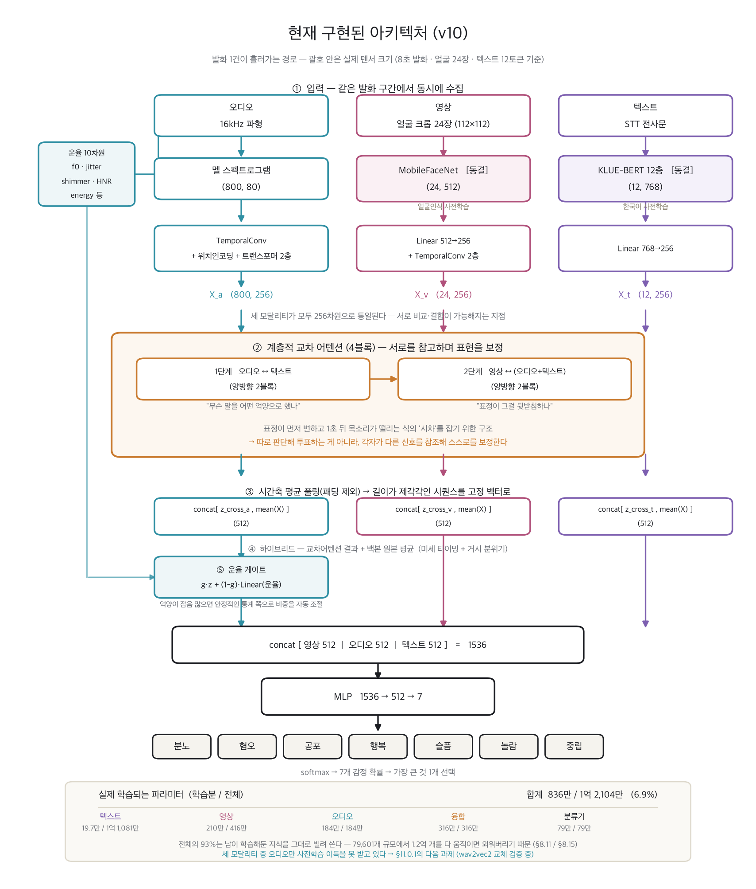
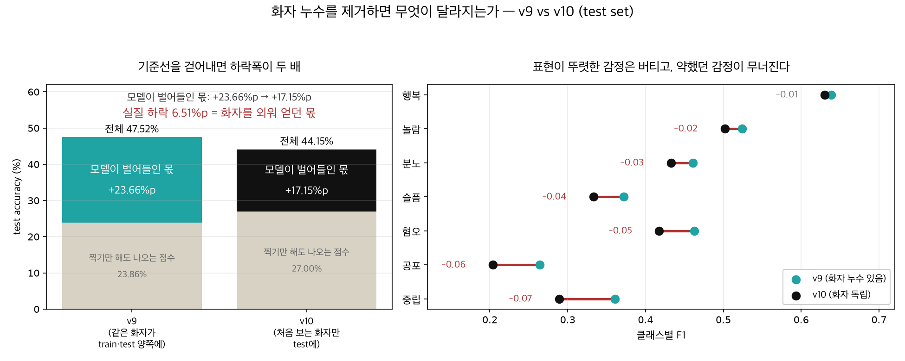
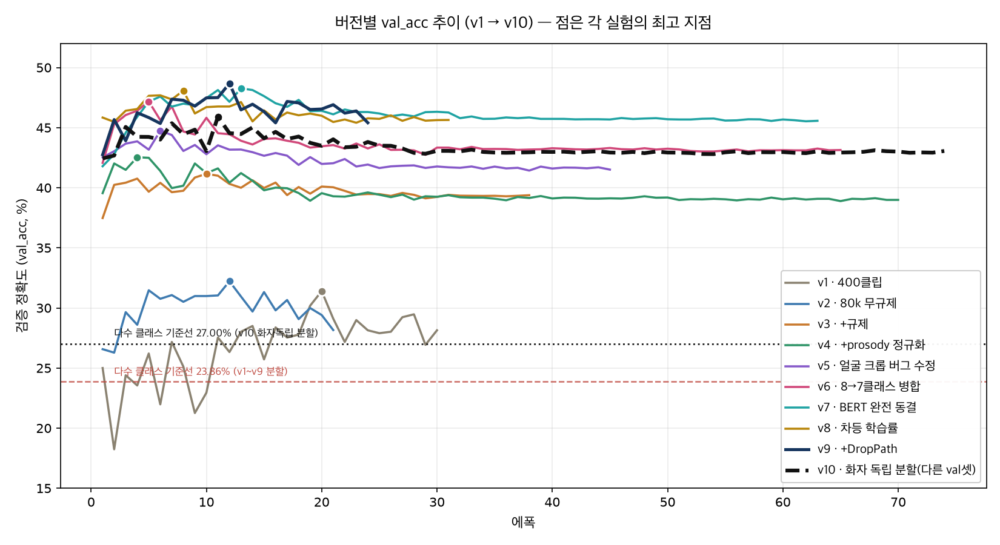
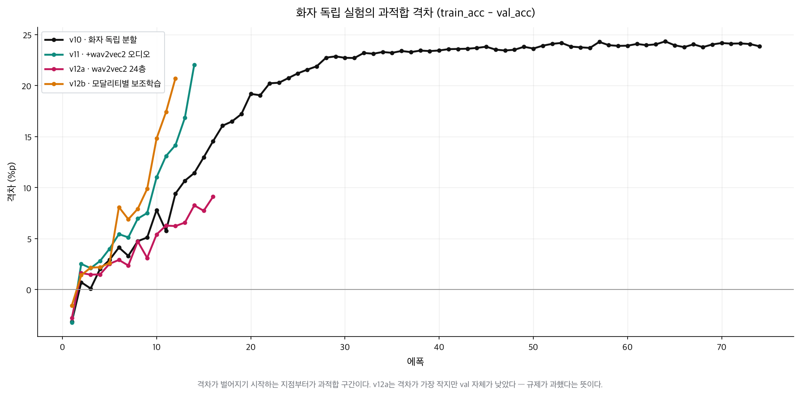

# 반려 로봇용 트리모달 감정인식 모델 — 통합 설계·진행 기록

이 문서는 이 프로젝트의 **단일 근거 기록(single source of truth)** 이다. 아래 다섯 개 기존 파일의 내용을 하나도 빠짐없이 통합하고, 시간순으로 "무엇을 왜 그렇게 했는지, 무엇을 왜 바꿨는지(과거엔 썼는데 왜 뺐는지 포함), 지금 무엇을 하고 있는지, 앞으로 뭘 할 것인지"를 기록한다. 이 문서 하나만 봐도 프로젝트 전체의 판단 근거를 재구성할 수 있는 것을 목표로 한다.

| 기존 파일 | 이 문서에서의 위치 |
|---|---|
| `multimodal_pipeline_v2.pdf` | 2장 (출발점 — 이중모달 구설계, 수식·평가프로토콜 전문 포함) |
| `감정인식_모델_설계_v3.md` / `.pdf` | 3장 (트리모달로의 전환, 전문 포함) |
| `진행_상황_요약.md` | 4장 (초기 구현·400클립 실험) |
| `모델_설명_요약.md` | 5장 (모델 입출력 설명) |
| `데이터_전처리_EDA_점검_및_근거.md` / `.pdf` | 7장 (데이터 품질 점검) |

6장 이후는 위 다섯 파일 어디에도 없던, 그 이후 실제로 일어난 일(80,122개 전체 재학습, 과적합과 규제 적용, prosody 정규화 실험 등)의 기록이다.

---

**목차**

[TOC]

---

## 1. 목적과 범위

- **최종 목적**: 반려 로봇이 카메라·마이크로 사용자의 감정을 실시간으로 추정하고, 이를 바탕으로 상호작용 방식을 결정한다.
- **모달리티 3종**: ① 얼굴 표정(영상), ② 음성 운율·피치(오디오, "어떻게 말했는가"), ③ 발화 텍스트(STT로 전사한 "무엇을 말했는가")
- **출력**: 발화 단위 **단일 감정 클래스** (하나의 융합 모델이 최종 결정)
- **목표 성능**: Accuracy **80–85%**
  - ⚠️ **[사후 정정 — 8.29절]** 이 목표는 화자 누수가 있던 조건을 전제로 잡은 값이라
    **subject-independent 7클래스에서는 도달 불가능하다.** 참고 수치조차 MELD 64.8%,
    IEMOCAP 74.3%이고 그것도 더 유리한 조건이다. **현재 목표는 60%**이며, 8.29절에서
    측정한 대로 **coarse 3클래스로 재매핑하면 재학습 없이 67.34%**가 나온다.
- **언어**: 한국어. 데이터셋·사전학습 모델 모두 한국어 우선 선정.
- **비목표**: 기존 `robot_project`의 규칙 기반 로직(낙상 감지·자세 피로도 추정 등)은 이번 설계 범위에서 제외한다(참고하지 않음). 순수 감정인식 모델 자체만 다룬다.

---

## 2. 출발점 — `multimodal_pipeline_v2` (이중모달 구설계, 전문)

이 프로젝트는 처음부터 트리모달로 설계된 게 아니라, 이전에 자체적으로 작성해둔 **오디오+영상 이중모달** 설계(`multimodal_pipeline_v2.pdf`, 개정판 v2 — v1 대비 분류기 차원 정합 교정·양방향 교차 어텐션·완전한 트랜스포머 블록화·평가 프로토콜 보강을 반영한 버전)에서 출발했다.

### 2.0 표기법 (v2 원문)

| 기호 | 의미 |
|---|---|
| `T_v` | 시각(비디오) 프레임(토큰) 수 |
| `T_a` | 청각(오디오) 프레임(토큰) 수 |
| `d_model` | 공통 임베딩 차원 |
| `h` | 어텐션 헤드 수 |
| `d_k, d_v` | 헤드당 Query/Key, Value 차원 (통상 d_model / h) |
| `N` | 교차 어텐션 블록 반복 수 |
| `C` | 감정 클래스 수 (v2 설계 C = 7) |
| `X_v, X_a` | 전처리 후 시각/청각 토큰 행렬 — [T_v × d_model], [T_a × d_model] |

### 2.1 개요 및 설계 범위 (v2 원문)

- 목적: 표정(시각)과 음성(청각)을 시간적으로 정밀 정합·융합하여 발화 구간의 감정을 분류한다.
- 모달리티: 이중모달(오디오 + 비주얼). **텍스트는 제외한다** (근거는 2.3.4).
- 라벨 공간: C = 7. Ekman 6 대 기본 감정(anger, disgust, fear, happiness, sadness, surprise) + neutral. RAVDESS·MELD 등 공개 코퍼스의 7클래스 구성과 호환.
- 산출: 각 발화 입력에 대한 7클래스 확률 분포.

### 2.2 End-to-End 아키텍처 (v2 원문)

```
① 입력
   시각(표정): 프레임 시퀀스
   청각(음성): 멜-스펙트로그램
        ▼
② 전처리 (모달리티별)
   Temporal Conv (국소 시간 구조 보존) + Positional Encoding (순서 정보 주입)
        ▼
③ 백본
   Visual Backbone → Visual Tokens X_v : [T_v × d_model]
   Audio Backbone  → Audio Tokens X_a : [T_a × d_model]
        ▼
④ 양방향 교차 어텐션
   방향 1 (V←A): Q = Visual, K/V = Audio → Context_v : [T_v × d_model]
   방향 2 (A←V): Q = Audio, K/V = Visual → Context_a : [T_a × d_model]
   각 방향 = Multi-Head Cross-Attention + Residual + LayerNorm + FFN (N회 반복)
        ▼
⑤ 풀링 (모두 [d_model] 벡터로 축약)
   z_cross_v = Pool over T_v (Context_v),  z_cross_a = Pool over T_a (Context_a)
   z_v = Mean over T_v (X_v),              z_a = Mean over T_a (X_a)
        ▼
⑥ 하이브리드 분류기
   z = concat[ z_cross_v, z_cross_a, z_v, z_a ] : [4·d_model]
   → MLP → Softmax → C=7 클래스 확률
```

설계 요지: ④에서 두 모달리티의 시차를 양방향으로 정합하고, ⑤에서 시퀀스를 고정 길이 벡터로 축약한 뒤, ⑥에서 미세 타이밍 단서(교차 어텐션)와 거시 분위기(단일 모달리티 평균)를 함께 결합한다.

### 2.3 설계 근거 (v2 원문 — 왜 이렇게 했는가)

**2.3.1 왜 교차 어텐션인가**: 감정 표현에는 감각 간 시차(asynchrony)가 존재한다(예: 입꼬리 변화가 먼저 나타나고 약 1초 뒤에 음성이 떨릴 수 있음). 동일 시간대만 묶는 후기 융합(late fusion)은 이 시차를 학습하지 못한다. 교차 어텐션은 "현재 표정 프레임을 판단할 때 전체 음성 구간 중 어디를 참조할지"를 모델이 스스로 가중하도록 한다. 이는 가변 샘플링레이트로 인한 비정렬(unaligned) 시퀀스를 명시적 정렬 없이 처리하는 MulT(Tsai et al., 2019) 계열의 핵심 메커니즘과 동일한 설계다.

**2.3.2 왜 양방향(bidirectional)인가**: 시차는 양방향으로 발생한다(표정이 먼저일 수도, 음성이 먼저일 수도 있다). **v1의 단방향 설계(Q=시각)는 "표정→음성 참조" 한 방향만 포착했는데, 이는 v2에서 고친 결함이다.** MulT 역시 이 때문에 모든 모달리티 쌍을 양쪽 방향으로 모델링한다. 따라서 V←A, A←V 두 방향을 모두 두어 근거와 구조를 일치시켰다.

**2.3.3 왜 하이브리드 융합인가**: 교차 어텐션만 사용하면 타이밍 연관성은 잘 포착하지만, 각 모달리티 고유의 거시 맥락(전반적 분위기)이 희석될 수 있다. 시공간이 정합된 교차 어텐션 출력과 각 단일 모달리티의 풀링 벡터를 함께 결합(concat)하여 미세 타이밍과 거시 분위기를 동시에 포착한다.

**2.3.4 왜 이중모달(텍스트 제외)인가**: (1) 실시간성 — 음성 인식(ASR) 전사 지연·오류를 배제한다. (2) 배포 단순성 — 전사 파이프라인이 불필요하다. (3) 대상 시나리오 — 표정·음성이 즉시 가용한 대면/영상 통화. 다만 텍스트를 추가한 삼중모달 확장 여지는 애블레이션 항목(2.6)으로 열어 두었다 — **이 여지가 3장에서 실제로 실행된 것이 지금의 트리모달 확장이다.**

### 2.4 Cross-Attention 수학적 모델링 (v2 원문 전문)

방향 1(V←A)을 기준으로 유도한다. 방향 2(A←V)는 시각·청각의 역할을 교환한 대칭 구조다.

**2.4.1 전처리 (Front-end)**
```
X_v = PosEnc( TemporalConv(시각 특징) ) : [T_v × d_model]
X_a = PosEnc( TemporalConv(청각 특징) ) : [T_a × d_model]
```
교차 어텐션은 순서 정보를 내장하지 않으므로, 위치 인코딩(Positional Encoding)으로 시간 순서를 주입하는 것이 필수다.

**2.4.2 특징 투영 (Linear Projection)**
```
Q = X_v · W_Q,  W_Q : [d_model × d_k] → Q : [T_v × d_k]
K = X_a · W_K,  W_K : [d_model × d_k] → K : [T_a × d_k]
V = X_a · W_V,  W_V : [d_model × d_v] → V : [T_a × d_v]
```

**2.4.3 어텐션 스코어와 가중치 (Scaled Dot-Product)**
```
Score = Q · Kᵀ → [T_v × d_k] · [d_k × T_a] = [T_v × T_a]
(마스킹) 패딩된 오디오 위치는 Softmax 이전에 −∞로 마스킹한다.
Attention = Softmax( Score / √(d_k) )
```
**[핵심]** Softmax는 반드시 오디오 축(T_a, 행 방향)으로 적용한다. 그래야 하나의 시각 프레임이 전체 오디오 프레임에 분배하는 가중치의 합이 1이 되도록 정규화된다.

**2.4.4 멀티헤드 (Multi-Head)**: h개의 헤드에서 위 연산을 병렬 수행한 뒤 concat하고, 출력 투영 `W_O : [h·d_v × d_model]`를 적용하여 [T_v × d_model]로 되돌린다.

**2.4.5 컨텍스트 융합 및 블록화 (Context Vector)**
```
Context_v = Attention · V → [T_v × T_a] · [T_a × d_v] = [T_v × d_v] (멀티헤드 후 [T_v × d_model])
```
완전한 트랜스포머 블록으로 감싼다(잔차 연결·정규화·FFN 포함, N회 반복 가능):
```
Z = LayerNorm( X_v + MHCA(Q=X_v, K/V=X_a) )
Context_v = LayerNorm( Z + FFN(Z) )
```

**2.4.6 풀링 및 결합 (v1 차원 결함 교정)**: **[중요 교정]** Context_v는 여전히 시퀀스 [T_v × d_model]이므로, 벡터인 단일 모달리티 풀링 피처와 그대로 concat할 수 없다 — **이것이 v1에 있었고 v2에서 고친 차원 정합 오류다.** 따라서 분류 직전 시간축 풀링을 명시한다.
```
z_cross_v = Pool over T_v (Context_v) : [d_model]  (평균 또는 어텐션 풀링)
z_cross_a = Pool over T_a (Context_a) : [d_model]
z_v = Mean over T_v (X_v) : [d_model],  z_a = Mean over T_a (X_a) : [d_model]
z = concat[ z_cross_v, z_cross_a, z_v, z_a ] : [4·d_model]
p = Softmax( MLP(z) ) : [C]
```
즉 모든 요소를 [d_model] 벡터로 축약한 뒤 결합하므로 차원이 정합된다.

### 2.5 강건성 설계 (v2 원문)

- **학습**: 모달리티 드롭아웃 — 일정 확률로 한 모달리티를 마스킹해, 단일 모달리티 열화에도 견디도록 학습한다.
- **추론**: 신뢰도 가중 융합 — 오디오 SNR·얼굴 검출 신뢰도 등으로 각 분기의 가중을 조절한다. 한 모달리티가 부재하면 해당 교차 방향과 풀링 항을 우회하고 가용 모달리티로 폴백한다.

### 2.6 평가 프로토콜 (v2 원문 — 데이터셋별 표준 지표)

**[원칙]** 데이터셋마다 커뮤니티 표준 지표를 사용하고, 변형(가중/비가중, 이진/다중)을 반드시 특정한다. 동일한 "정확도"라도 데이터셋·클래스·변형에 따라 값이 크게 달라진다.

| 데이터셋 | 과제 | 표준 지표 (변형 명시) |
|---|---|---|
| IEMOCAP | 범주 감정 | WA(가중정확도)와 UA(비가중정확도) 병기, 클래스 수 명시 |
| MELD | 대화 범주 감정 | weighted-F1 (심한 불균형 → macro 아님) |
| RAVDESS | 발화 감정 | WA(가중정확도) |
| CMU-MOSEI | 감정 / 감성 | Acc-2, Acc-7, weighted-F1, MAE, Corr 구분 보고 |
| Aff-Wild2 / AVEC | 차원(valence·arousal) | CCC (valence·arousal 평균) |

**베이스라인 & 애블레이션**: 베이스라인 — 단일 모달리티(시각 only, 청각 only), 후기 융합(late fusion). 애블레이션 — (a) 교차 어텐션 유무 (b) 하이브리드 concat 유무 (c) 단방향 vs 양방향 (d) 위치 인코딩 유무 (e) 풀링 방식(평균 vs 어텐션) **(f) 텍스트 추가 시 삼중모달 확장** ← 이 항목이 3장에서 실제로 실행됨.

**인용 원칙**: 성능 수치를 인용할 때는 서베이·리뷰의 요약표가 아니라 원 논문의 원문 표에서 지표 종류(WA/UA, Acc-2/Acc-7, weighted/macro 등)까지 확인해 인용한다.

### 2.7 가정 및 한계 (v2 원문)

- **가정**: 오디오·비디오가 대략 동일 발화 구간으로 세그먼트됨; 단일(주) 화자; 위치 인코딩으로 순서 보존.
- **한계**: 교차 어텐션의 계산량은 O(T_v·T_a)로 증가; 텍스트 미사용으로 어휘적 맥락 부재(→ 3장에서 해소); 실내/정면 위주 데이터에 편향 가능; 문화·개인차에 따른 표현 다양성은 별도 도메인 적응이 필요.

### 2.8 참고문헌 (v2 원문)

- Vaswani, A. et al. "Attention Is All You Need." NeurIPS 2017. — 스케일드 닷-프로덕트 및 멀티헤드 어텐션의 원전.
- Tsai, Y.-H. H. et al. "Multimodal Transformer for Unaligned Multimodal Language Sequences." ACL 2019, pp. 6558–6569. — 방향성 교차 어텐션 및 비정렬 시퀀스 융합.

### 2.9 왜 이 설계를 버리지 않고 확장했는가

v2의 교차 어텐션·하이브리드 융합·강건성 설계는 검증된 근거(MulT 논문)가 있어 3장에서 그대로 계승했다. 다만 실제 반려 로봇 배포를 구체화하면서 두 가지가 부족하다고 판단해 확장했다: ① 텍스트(STT) 없이는 "무슨 말을 했는지" 자체를 놓친다(2.6절에서 이미 애블레이션 항목으로 열어뒀던 부분), ② 오디오가 멜스펙트로그램만 있고 피치·떨림 같은 운율 정보가 없었다.

---

## 3. 트리모달 설계로의 전환 (`감정인식_모델_설계_v3`, 전문)

이 문서는 아래 세 자료를 검토한 뒤 작성한 신규 설계 명세다.

| 참고 자료 | 이 문서에 반영한 부분 | 반영하지 않은/수정한 부분 |
|---|---|---|
| Kollias et al., *ABAW 5th Challenge* (CVPR 2023) | Aff-Wild2/Hume-Reaction 규모의 벤치마크 구성 방식, CCC·F1 등 평가지표 정의 | 라벨 공간("other" 포함 8클래스 + 연속 VA)이 본 프로젝트의 이산 분류 체계와 불일치 → 데이터셋으로는 채택하지 않음 |
| `multimodal_pipeline_v2.pdf` (자체 설계, 2장) | 양방향 교차 어텐션, 차원 정합 교정, 강건성(모달리티 드롭아웃) 설계를 그대로 계승 | 이중모달(오디오+비주얼) 한정 설계였던 것을 **텍스트를 포함한 트리모달**로 확장. 음성 브랜치에 멜스펙트로그램만 있고 피치·운율 특징이 없던 부분을 보강 |
| Wu, Mi & Gao, *A Comprehensive Review of Multimodal Emotion Recognition* (Biomimetics, 2025) | 융합 전략 분류(early/late/hybrid/cross-attention), 데이터셋·지표 표, 챌린지(경량화·교차 코퍼스 일반화) | 서베이가 다루는 벤치마크(IEMOCAP, MELD, CMU-MOSEI)는 전부 영어 데이터 → 한국어 로봇 배포 환경과 언어가 맞지 않아 데이터셋 선정 기준으로만 참고 |

추가로 아래 자료를 신규 조사하여 반영했다: ETRI KEMDy19/20, AI Hub "멀티모달 영상" 데이터셋, AI Hub "감정 분류를 위한 대화 음성 데이터셋"(7클래스), SeolRoh의 Multi-Still_ETRI(경량 멀티모달 교차 어텐션+지식증류 선행 사례), 트리모달 융합 최신 성능 수치(HyFusER, "Feature After Feature" 등, 목표 정확도 현실성 검토용).

### 3.1 개정 — 실데이터 검증 후 클래스 체계 8종으로 확장

AI Hub 멀티모달 영상 데이터셋의 공식 데이터 설명서와 **실제 샘플(`2019-01-005.멀티모달영상_sample`, `clip_13`/`clip_30`)을 직접 다운로드해 라벨을 확인한 결과**, 이 데이터셋은 폴 에크먼의 **8종 감정 분류**(기쁨·슬픔·분노·놀람·공포·**경멸(contempt)**·혐오·중립)를 사용한다는 것을 확인했다. 애초 초안(2.6절 표기법에서 C=7)은 "Ekman 6 + 중립 = 7클래스"였으나, 영상이 포함된 유일한 진짜 트리모달 소스가 이 데이터셋이므로 정보 손실 없이 **8클래스로 확장**한다. 경멸과 혐오는 심리학적으로 구분되는 감정이라 병합하지 않는다. KEMDy19/20(7클래스, 경멸 없음)은 이 8클래스 체계 위에 문제없이 얹을 수 있다(해당 데이터에서는 "경멸" 라벨이 그냥 나오지 않을 뿐). 이하 본문의 "7클래스"는 모두 8클래스로 갱신되었다.

### 3.2 목적과 범위

1장과 동일 (반려 로봇 실시간 추정, 3모달, 단일 감정 클래스 출력, 목표 정확도 80–85%, 한국어 전제, `robot_project` 규칙기반 로직은 비목표).

### 3.3 데이터셋 선정

**3.3.1 오디오 + 텍스트: KEMDy19 / KEMDy20 (ETRI)**

| | KEMDy19 | KEMDy20 |
|---|---|---|
| 발화 성격 | 성우 40인의 대본 기반 연기 대화 (20세션) | 일반인의 자유발화 대화 |
| 라벨 | 7클래스 categorical: angry, sad, happy, disgust, fear, surprise, neutral (경멸 없음) | 동일 7클래스 + 각성/긍부정도(연속값) 병기 |
| 부가 신호 | ECG, EDA, 손목 피부온도 | EDA, IBI, 손목 피부온도 |
| 본 프로젝트 활용 | **1차 학습/검증 데이터로 채택.** 연기 데이터라 클래스 간 경계가 뚜렷해 목표 정확도(80–85%) 달성에 유리 | 자유발화 데이터로 **일반화 검증(2차 평가)** 용도로 사용 — 실제 로봇 사용 환경과 더 유사하므로 KEMDy19로 학습한 모델의 현실성 점검에 사용 |

→ KEMDy19/20은 7클래스(경멸 없음)이고 AI Hub 멀티모달 영상은 8클래스(경멸 포함)라 완전히 일치하지는 않는다. 3.1절의 결정에 따라 **8클래스로 통일**하고, KEMDy 데이터는 "경멸" 라벨이 등장하지 않는 부분집합으로 취급한다.

**3.3.2 영상(얼굴 표정)**: KEMDy19/20은 영상을 포함하지 않는다(오디오+텍스트+생체신호만). 두 가지 옵션 중 선택이 필요했다.

- **옵션 A (채택, 실사 확인 완료)**: AI Hub "멀티모달 영상" 데이터셋(aidata/137). 실제 대화 영상+음성+텍스트+감정 라벨이 동시에 존재해 진짜 트리모달 동기화 데이터를 얻을 수 있다. 실제 샘플(clip_13/30)을 다운로드해 JSON 구조까지 확인했으며, 인물 bounding box·발화 구간(프레임 단위)·모달리티별(이미지/음성/텍스트/멀티모달) 감정 라벨이 모두 포함되어 있어 `scripts/build_manifest_aihub.py`로 매니페스트 생성까지 검증됨. 단, 원본 라벨의 "혐오"가 "dislike"로 표기되어 있어 "disgust"로 맞추는 별칭 매핑이 필요(`labels.RAW_LABEL_ALIASES`).
- **옵션 B (대안, 미채택)**: 얼굴 표정은 언어에 크게 의존하지 않으므로, 범용 FER 데이터셋(AffectNet, RAF-DB 등)으로 비주얼 백본을 별도 사전학습한 뒤, KEMDy 기반 융합 모델에 특징 추출기로만 결합. 다만 이 경우 세 모달리티가 **같은 발화에서 동시에 수집된 것이 아니므로** 교차 어텐션의 시차 정합 효과가 제한적일 수 있음(3.11절 한계에 명시). → 옵션 A를 실사 확인했고 정상 동작함을 확인했으므로 채택을 확정. 옵션 B는 옵션 A 데이터 수급에 문제가 생길 경우의 폴백으로만 유지.

**3.3.3 클래스 통일 (8클래스)**: `분노(angry) · 혐오(disgust) · 공포(fear) · 행복(happy) · 슬픔(sad) · 놀람(surprise) · 경멸(contempt) · 중립(neutral)`. ABAW/Aff-Wild2의 "other" 포함 체계는 채택하지 않는다 — "other"에 대응하는 명확한 한국어 데이터가 없고, KEMDy/AI Hub 체계와도 맞지 않기 때문. 대신 AI Hub 데이터셋이 실제로 쓰는 에크먼 8종 분류(경멸 포함)를 표준으로 채택.

**3.3.4 라벨 신뢰성 — 검증된 데이터인가**: AI Hub는 데이터를 배포하는 정부(NIA) 플랫폼일 뿐, 실제 수집·어노테이션·검수 주체가 아니다. 공식 데이터 설명서 기준 실제 구축 주체와 검증 절차는 다음과 같다.

- **구축 주체**: (주)아크릴(주관), (주)테스트웍스(참여) — 2017~2019년 정부 지원 "인공지능 학습용 데이터" 구축 사업의 일환으로 제작
- **검증 절차**: ① 어노테이션 작업자가 4개 모달리티(이미지/음성/텍스트/멀티모달) 각각에 감정 라벨 부착 → ② **3자 다수결**로 라벨 정확성 검수(3명 중 2명 이상 동의해야 통과) → ③ 다수결로 판단이 어려운 경우 집단 지성을 통한 재검토 → ④ AI 모델에 실제로 학습시켜 학습 가능성 여부까지 확인 → ⑤ 통과분만 최종 데이터로 채택

즉 본 프로젝트가 정답(ground truth)으로 사용하는 `emotion.multimodal.emotion` 값은 어노테이터 한 명이 임의로 붙인 라벨이 아니라 **다수결 기반 검수를 통과한 라벨**이다. 다만 감정 인식 자체가 사람 간에도 100% 일치하지 않는 주관적 태스크이므로(3.9절 목표 정확도 논의 참고), "객관적으로 유일한 정답"이라기보다는 "검증 절차를 거친 합의된 라벨"로 이해하는 것이 정확하다.

### 3.4 표기법

| 기호 | 의미 |
|---|---|
| `T_v`, `T_a`, `T_t` | 시각/청각/텍스트 토큰(프레임) 수 |
| `d_model` | 공통 임베딩 차원 |
| `h` | 어텐션 헤드 수 |
| `C` | 감정 클래스 수 (본 설계 `C = 8`, 3.1/3.3.3 참고) |
| `X_v, X_a, X_t` | 전처리 후 각 모달리티 토큰 행렬 |
| `p_a` | 오디오 운율(prosody) 특징 벡터 (F0, jitter, shimmer, HNR 등) |

### 3.5 End-to-End 아키텍처

```
① 입력
   시각: 얼굴 크롭 프레임 시퀀스
   청각: 멜-스펙트로그램 + 운율 특징(F0/jitter/shimmer/HNR)
   텍스트: STT 전사문
        ▼
② 전처리(모달리티별)
   시각/청각: Temporal Conv + Positional Encoding   (v2 계승)
   운율: 발화 단위 통계 벡터 p_a (프레임 시퀀스 아님, 고정 길이)
   텍스트: 한국어 사전학습 언어모델 토크나이즈 + 임베딩
        ▼
③ 백본
   Visual Backbone   → X_v : [T_v × d_model]
   Audio Backbone    → X_a : [T_a × d_model]
   Text Backbone(KLUE-BERT/KoBERT류) → X_t : [T_t × d_model]
        ▼
④ 계층적 양방향 교차 어텐션 (3.6절)
        ▼
⑤ 풀링 (모두 [d_model] 벡터로 축약)
        ▼
⑥ 하이브리드 분류기 → MLP → Softmax → C=8 클래스 확률
```

`multimodal_pipeline_v2`와의 차이는 ③에 텍스트 백본이 추가된 점과, ①~②에 **운율 특징 벡터 `p_a`가 멜스펙트로그램과 별도 경로로 추가**된 점이다.

### 3.6 교차 어텐션 융합 설계 (3모달 확장)

**3.6.1 왜 3쌍 전체(V↔A, V↔T, A↔T)가 아니라 계층적 구조인가**: 모달리티가 2개(V, A)일 때는 양방향 1쌍(V←A, A←V)이면 충분했다(2장). 모달리티가 3개가 되면 이론적으로 3쌍×양방향=6개의 교차 어텐션 블록이 필요해 계산량이 급격히 늘고(`O(T_v·T_a) + O(T_v·T_t) + O(T_a·T_t)`), 실시간 로봇 추론에 부담이 된다. Multi-Still_ETRI 선행 사례 역시 동일한 이유로 지식증류를 통한 경량화를 채택했다. 본 설계는 다음 **2단계 계층적 융합**을 채택한다.

1. **1단계 (언어적 축 결합)**: 텍스트가 가장 명확한 의미 신호이므로, 오디오(청각) ↔ 텍스트를 먼저 양방향 교차 어텐션으로 결합해 `Context_a`, `Context_t`를 만든다.
2. **2단계 (표정 축 결합)**: 1단계 결과와 시각을 다시 양방향 교차 어텐션으로 결합한다: 시각 ↔ (오디오+텍스트 융합 표현).

이렇게 하면 어텐션 블록 수가 6개가 아닌 **4개**로 줄고, "무슨 말을(텍스트) 어떤 억양으로(오디오) 말했는가"를 먼저 정합한 뒤 "표정이 이를 뒷받침하는가"를 보는 순서가 되어 해석 가능성도 좋아진다.

**3.6.2 운율 벡터 `p_a`의 결합 방식**: `p_a`(F0 평균/표준편차, jitter, shimmer, HNR, 에너지, 발화 속도 — eGeMAPS 계열 통계 특징)는 시퀀스가 아니라 발화 단위 고정 벡터이므로 교차 어텐션에 넣지 않는다. 대신 풀링 벡터들과 **게이트 결합(gated fusion)** 한다:
```
g = Sigmoid( W_g · [z_cross_a ; p_a] )
z_audio_final = g ⊙ z_cross_a + (1-g) ⊙ Linear(p_a)
```
이 방식은 "음성 억양이 잡음이 많아 신뢰도가 낮을 때 텍스트/표정 쪽 비중을 자동으로 높인다"는 `multimodal_pipeline_v2`(2.5절)의 강건성 설계 철학과 일치한다.

**3.6.3 최종 결합**:
```
z = concat[ z_v_final, z_audio_final, z_t_final ] : [3·d_model 내외]
p = Softmax( MLP(z) ) : [C=8]
```

### 3.7 경량화 · 실시간 통합 전략

- **지식증류(Knowledge Distillation)**: Multi-Still_ETRI 사례를 따라, 오프라인에서 학습한 대형 교사(teacher) 모델의 출력을 경량 학생(student) 모델이 모사하도록 학습한다. 로봇에는 학생 모델만 탑재한다.
- **모델 경량화 후보**: 오디오/영상 백본을 MobileNet류·경량 CNN으로 교체, 텍스트 백본은 KoBERT의 distill 버전 사용.
- **파이프라인 분리**: 얼굴 크롭·운율 추출·STT는 각각 별도 스레드(기존 `robot_project`의 스레드 분리 아이디어는 구조적으로는 참고할 만하나, 융합 로직 자체는 규칙 기반이 아닌 본 설계의 학습된 모델로 완전히 대체한다).
- **현재 진행 상태**: 이 전략은 아직 착수 전이다 — 6장 이후는 전부 서버에서의 학습/검증 단계이며, 지식증류·경량화·양자화는 목표 정확도 근처에 도달한 뒤 시작할 계획이다(11장 다음 단계 참고).

### 3.8 학습 및 평가 프로토콜

**3.8.1 데이터 분할**: Subject-independent 분할(화자가 train/val/test 중 한 곳에만 등장) — ABAW·서베이 공통 권고사항을 계승.

> ⚠️ **[사후 정정 — 8.14절]** 이 원칙은 **설계 의도였을 뿐 실제로는 구현되지 않았다.** `split_manifest.py`는 clip_id 단위로만 분할하는데, AI Hub 데이터는 40클립 블록(원본 영상 1개) 안에서 같은 인물이 반복 등장하는 구조라 clip 단위 분할로는 화자가 분리되지 않는다. 실측 결과 test에 등장하는 화자 278명이 **전원 train에도 존재**한다. v1~v9의 모든 수치는 subject-independent가 아니라 clip-independent 조건에서 측정된 값이다. 자세한 내용과 대응은 8.14절 참고.

**3.8.2 평가지표**: Accuracy, weighted F1(클래스 불균형 대비), 클래스별 Confusion Matrix. 2차 검증: KEMDy20(자유발화)로 교차 코퍼스 일반화 성능 별도 보고.

**3.8.3 베이스라인 및 애블레이션**

| 단계 | 구성 |
|---|---|
| 베이스라인 1 | 단일 모달리티 (텍스트 only / 오디오 only / 영상 only) |
| 베이스라인 2 | 후기 융합(각 모달리티 독립 분류 후 평균) |
| 베이스라인 3 | `multimodal_pipeline_v2` 원안(오디오+영상, 텍스트 제외) |
| 제안 모델 | 본 설계의 트리모달 계층적 교차 어텐션 + 운율 게이트 결합 |
| 애블레이션 | (a) 운율 벡터 `p_a` 유무 (b) 계층적 순서(텍스트-오디오 우선 vs 표정 우선) (c) 지식증류 유무 |

**현재 진행 상태**: 베이스라인 1(단일 모달리티)은 8.7절에서 실행 완료 — 영상 브랜치가 사실상 다수 클래스 수준에 그친다는 중요한 결과를 얻었다. 베이스라인 2(후기 융합)·베이스라인 3(`multimodal_pipeline_v2` 원안)·애블레이션 항목들은 아직 미실행이다.

### 3.9 목표 정확도(80–85%) 근거 및 현실성 검토

최근 트리모달(음성+텍스트+영상) 융합 연구의 실측 수치는 데이터 성격에 따라 큰 편차를 보인다.

| 데이터 성격 | 대표 수치 | 시사점 |
|---|---|---|
| 자연스러운 대화체, 다중 화자, 클래스 불균형 (예: MELD) | Accuracy 약 64.8% | 본 프로젝트가 목표를 이 수준 데이터로 잡으면 80–85% 달성 어려움 |
| 상대적으로 통제된 대화 코퍼스 (예: IEMOCAP) | Accuracy 약 74.3% | 여전히 목표에 못 미침 |
| 연기/통제된 발화, 클래스 수 적음 | Face-Body-Text 등에서 83.75%, 오디오-텍스트 5클래스 약 83% 사례 보고 | **KEMDy19(연기 데이터)처럼 통제된 조건**이면 80–85%가 현실적 사정권. 단 본 설계는 8클래스(경멸 포함)로 확장했으므로 7클래스 기준 수치보다 약간 보수적으로 잡아야 함 |

**결론**: 목표 80–85%는 **KEMDy19(연기 대화) 기준으로는 현실적**이나, KEMDy20(자유발화)나 실제 로봇의 잡음 많은 환경까지 포함하면 낮아질 수 있다. 따라서 "1차 목표는 KEMDy19 테스트셋 80–85%, 2차로 KEMDy20/실환경에서의 성능 하락폭을 별도로 측정해 보고"하는 이원적 목표 설정을 권장한다.

### 3.10 강건성 설계 (결측·잡음 모달리티)

`multimodal_pipeline_v2`(2.5절)를 계승하되 3모달로 확장:

- **학습 시**: 모달리티 드롭아웃 — 세 모달리티 중 하나 또는 둘을 확률적으로 마스킹.
- **추론 시**: 신뢰도 가중 — 예) 조도가 낮으면 시각 가중치 하락, 배경 소음이 크면 오디오/운율 가중치 하락 (개념은 `robot_project`의 `_update_dynamic_weights`와 유사하나, **본 설계에서는 이 가중치 자체를 3.6.2절의 게이트처럼 학습된 파라미터로 대체**하고 사람이 짠 임계값 규칙에 의존하지 않는다).
- STT 실패(무음/잡음) 시 텍스트 브랜치를 우회하고 오디오+영상만으로 폴백.

### 3.11 가정 및 한계

- **가정**: 세 모달리티가 대략 동일 발화 구간에서 수집됨, 단일 화자, 한국어 발화.
- **한계 1 (도메인 갭)**: KEMDy19은 연기 데이터이므로 실제 사용자의 자연스러운 감정 표현과 차이가 있을 수 있음 — KEMDy20 및 실사용 로그로 2차 검증 필요(11장 다음 단계 참고, 아직 미착수).
- **한계 2 (영상 동기화)**: 3.3.2절 옵션 B(범용 FER + 별도 언어 데이터 결합)를 채택할 경우, 세 모달리티가 같은 순간에 수집된 것이 아니므로 교차 어텐션의 "시차 정합" 이점이 약화됨. (현재 옵션 A를 채택해 이 한계는 실질적으로 회피됨)
- **한계 3**: 계산량은 여전히 `O(T_v·T_t) + O(T_a·T_t)`로 증가 — 초저사양 임베디드 로봇에는 지식증류 이후 모델로도 추가 양자화(quantization)가 필요할 수 있음.

### 3.12 로봇 실시간 통합 파이프라인 (개념도)

```
카메라 → 얼굴 크롭 ─────────────┐
마이크 → VAD → [STT 브랜치] → 텍스트 ─┤→ 학습된 융합 모델 (단일 forward) → 감정 1개 + 확률분포
        └→ [운율 추출 브랜치] → p_a ─┘
```

기존 `robot_project`의 스레드 분리 구조(오디오 워커/메인 루프 분리)는 엔지니어링 패턴으로는 유효하나, 융합 판단 로직(`get_companion_interpretation`의 if/elif 규칙)은 본 설계의 학습된 분류기로 전량 대체된다. **현재 진행 상태**: 이 통합은 아직 착수하지 않았고, 지금은 서버에서 융합 모델 자체를 학습/검증하는 단계다.

### 3.13 실제로 구현된 현재 아키텍처 (v10 기준) — 설계도와 무엇이 같고 다른가

3.5절까지는 **구현 전에 그린 설계도**다. 그 뒤 8장의 실험을 거치며 여러 부분이 바뀌었으므로, 지금 서버에서 돌아가는 모델의 실제 모습을 실제 텐서 크기·파라미터 수와 함께 정리한다. 이 절은 "지금 이 모델이 사람의 감정을 어떻게 판단하는가"를 한 번에 읽을 수 있게 하는 것이 목적이다.

#### 3.13.1 전체 구조 (발화 1건이 흘러가는 경로)

아래는 8초 발화(얼굴 24프레임, 텍스트 12토큰) 하나를 넣었을 때의 실제 텐서 크기다.



#### 3.13.2 각 단계가 하는 일과 그렇게 만든 이유

| 단계 | 하는 일 | 왜 이렇게 했나 |
|---|---|---|
| ① 오디오 | 소리를 시간×주파수 그림(멜)으로, 말투를 통계 10개(운율)로 나눠서 뽑는다 | 멜은 "순간순간의 음색", 운율은 "발화 전체의 말투"로 성격이 달라 한 경로로 합칠 수 없다(7.1.2절) |
| ② 영상 | 얼굴만 잘라 사전학습 얼굴 모델에 통과 | 처음부터 학습한 CNN은 다수 클래스 수준에 그쳤고(8.7절), 그 원인이 "얼굴이 아니라 사람 전신을 넣고 있던 것"이었다(8.8절) |
| ③ 텍스트 | 한국어 BERT로 문맥 속 단어 의미 추출 | 이전 설계는 STT 텍스트를 아예 안 썼는데, "무슨 말을 했는가"를 놓치는 게 컸다(2.9절) |
| ④ 교차 어텐션 | 세 정보가 **서로를 참고**하며 표현을 보정 | 감정 표현엔 시차가 있다 — 표정이 먼저 변하고 1초 뒤 목소리가 떨릴 수 있어, 같은 시각끼리만 묶는 방식으로는 못 잡는다(2.3.1절) |
| ⑤ 풀링 | 길이가 제각각인 시퀀스를 고정 벡터로 축약 | 오디오 800·영상 24·텍스트 12로 길이가 다 달라, 이어붙이려면 먼저 길이를 없애야 한다(2.4.6절 차원 정합) |
| ⑥ 하이브리드 | 교차어텐션 결과에 **백본 원본 평균도 같이** 붙임 | 교차어텐션만 쓰면 타이밍은 잘 잡지만 각 모달리티 고유의 전반적 분위기가 희석된다(2.3.3절) |
| ⑦ 운율 게이트 | 운율 신뢰도에 따라 오디오 표현 비중을 자동 조절 | 운율은 시퀀스가 아니라 어텐션에 못 넣는다. 대신 "억양 신호가 잡음이 많으면 안정적인 통계치 쪽으로 기울게" 학습된 가중치로 섞는다(3.6.2절) |
| ⑧ 분류기 | 세 모달리티 최종 표현을 이어붙여 7개 확률 산출 | — |

#### 3.13.3 설계도(3.5절) 대비 실제로 달라진 것

| 항목 | 설계 당시 | 현재(v10) | 바뀐 이유 |
|---|---|---|---|
| 클래스 수 | 8 (경멸 포함) | **7** | 경멸이 혐오와 구분되지 않아 병합(8.10절) |
| 텍스트 백본 | 파인튜닝 | **완전 동결** | 표준보다 10배 높은 lr로 파인튜닝한 게 과적합 주범이었다(8.11절) |
| 영상 백본 | 처음부터 학습 | **사전학습 MobileFaceNet, 동결** | 처음부터 학습은 다수 클래스 수준에 그침(8.7~8.8절) |
| 교차어텐션 규제 | dropout만 | **+ DropPath 0.1** | BERT를 얼려도 남은 과적합의 다음 원인이 이 모듈이었다(8.15절) |
| 데이터 분할 | subject-independent(의도) | **subject-independent(실제 구현)** | 설계에는 있었으나 구현되지 않은 채였다 — v10에서 실제로 적용(8.14/8.17절) |

#### 3.13.4 파라미터로 본 "무엇을 배우고 무엇을 가져다 쓰는가"

| 모듈 | 전체 파라미터 | 그중 **학습되는** 것 |
|---|---|---|
| 텍스트(BERT + 투영) | 110,814,208 | **196,864** (투영층만) |
| 영상(MobileFaceNet + 투영 + 프론트엔드) | 4,164,096 | 2,104,576 |
| 오디오(멜 프론트엔드) | 1,838,080 | 1,838,080 (전부) |
| 융합(교차어텐션 4블록) | 3,159,040 | 3,159,040 (전부) |
| 분류기 | 790,535 | 790,535 (전부) |
| **합계** | **121,039,367** | **8,362,503 (6.9%)** |

**전체의 93%는 남이 학습해둔 지식을 그대로 빌려 쓰고, 실제로 우리가 학습하는 건 6.9%뿐이다.** 79,601개라는 데이터 규모에서 1.2억 개를 전부 움직이면 외워버리기 때문이며, 이 판단은 v7~v9 실험으로 검증됐다(8.11/8.15절).

또한 이 표는 **오디오만 사전학습 이득을 못 받고 있다**는 것도 보여준다 — 텍스트·영상은 대부분을 빌려 쓰는데 오디오는 184만 개를 전부 처음부터 배운다. 11.0.1절에서 이 지점을 다음 우선순위로 잡은 근거다.

#### 3.13.5 그래서 사람의 감정을 어떻게 판단하는가 — 구체적인 예

같은 문장 **"괜찮아"** 가 서로 다른 감정으로 판정되는 과정을 따라가면 이 구조가 왜 필요한지 드러난다.

**사례 A — 실제로 괜찮은 경우**
- 텍스트: "괜찮아" → BERT는 이 단어 자체로는 중립~긍정으로 본다
- 오디오: 피치가 평소보다 높고(f0_mean↑) 떨림이 적음(jitter↓), 음량 안정적
- 영상: 입꼬리가 올라간 프레임이 다수
- 교차 어텐션에서 **세 신호가 서로를 강화** → 행복 쪽 확률 상승

**사례 B — 안 괜찮은데 괜찮다고 하는 경우**
- 텍스트: 똑같이 "괜찮아" → **텍스트만으로는 A와 구별 불가**
- 오디오: 피치가 낮게 깔리고(f0_mean↓) 떨림이 큼(jitter↑), 발성 구간 비율 낮음(중간에 말이 끊김)
- 영상: 무표정, 시선 아래로
- 교차 어텐션에서 **텍스트가 말하는 것과 음성·표정이 어긋남을 포착** → 슬픔 쪽 확률 상승

여기서 핵심은 ④단계다. 세 모달리티를 **따로 판단해서 투표하는 게 아니라**, 각 모달리티가 다른 모달리티를 참조하며 자기 표현을 보정한다. "이 단어를 판단할 때 음성의 어느 구간을 볼 것인가"를 모델이 스스로 정하는 것이다.

실제로 데이터에서 가장 많이 반복되는 텍스트가 "왜?"(188회), "네."(136회) 같은 짧은 발화인데(8.16절 데이터 진단), **이들은 텍스트만으로는 감정 판별이 원천적으로 불가능**하다 — 화나서 "왜?"인지 놀라서 "왜?"인지는 목소리와 표정에만 있다. 이 부분집합에서의 정확도가 곧 "오디오·영상이 실제로 일을 하고 있는가"의 직접적 증거가 되며, 11.4절에 검증 항목으로 올려두었다.

#### 3.13.6 출력을 어떻게 읽어야 하는가

모델의 최종 출력은 **7개 감정에 대한 확률분포**이고, 그중 가장 큰 것 하나를 답으로 낸다(5.3절). 여기엔 두 가지 한계가 붙는다.

- **별도의 확신 임계값이 없다.** 모든 확률이 낮아 사실상 "모르겠다"인 경우에도 반드시 하나를 고른다. 로봇이 "애매하면 반응을 보류"하려면 신뢰도 보정(calibration) 검증이 선행돼야 하는데 아직 미착수다(10장).
- **감정은 원래 사람끼리도 일치하지 않는다.** 정답 라벨 자체가 3인 다수결로 만들어진 "합의된 라벨"이지 유일한 정답이 아니다(3.3.4절). 따라서 이 모델의 출력은 "확정된 감정"이 아니라 "관측된 신호로 볼 때 가장 그럴듯한 감정"으로 다뤄야 한다.

---

## 4. 초기 구현과 400클립 실험 (`진행_상황_요약`, 전문)

### 4.1 설계 단계 요약

기존 자료(ABAW 논문, `multimodal_pipeline_v2` 설계, MER 서베이 논문) 검토 후 신규 설계 명세(3장)를 작성. 한국어 환경 기준으로 KEMDy19/20(ETRI)과 AI Hub "멀티모달 영상"을 데이터 소스로 채택. **중요 수정**: AI Hub 공식 데이터 설명서를 실제로 확인한 결과 라벨 체계가 7클래스가 아니라 8클래스(경멸/contempt 포함)임을 발견 → 설계·코드 전체를 8클래스로 수정(3.1절).

### 4.2 코드 구현

`trimodal_emotion_model/` 코드베이스: 오디오(멜스펙트로그램+운율 벡터)/텍스트(KLUE-BERT)/영상(얼굴 프레임) 백본, 2단계 계층적 교차 어텐션(오디오↔텍스트 → 시각↔(오디오+텍스트)) + 운율 게이트 결합 + 하이브리드 분류기. 합성 텐서 스모크 테스트 통과 확인.

**스모크 테스트에 쓴 실제 데이터**: AI Hub "멀티모달 영상" 실제 샘플 2개 클립(전체 정식 데이터 다운로드 전 단계).

| 클립 | 상황 | 발화 수 |
|---|---|---|
| clip_13 | 카페에서 대화하는 오랜 친구 두 명 | 5건 |
| clip_30 | 카페, 아르바이트생과 손님 | 6건 |

발화 1건당 실제로 뽑아낸 것: 영상(인물 bounding box로 크롭한 얼굴 프레임 시퀀스, 112×112), 오디오(해당 발화 구간만 잘라낸 16kHz WAV), 텍스트(해당 구간 발화 스크립트), 라벨(8종 감정 중 하나, 데이터에 이미 사람이 붙여둔 정답). 이 11건은 "모델이 실제 데이터에서 죽지 않고 끝까지 도는지" 확인하는 **스모크 테스트용**이었고 본 학습에는 쓰지 않았다.

### 4.3 데이터 확보 과정

- ETRI Nanum(KEMDy19/20), AI Hub 모두 한때 서버 503 에러로 접근 불가 → 재시도로 해결
- AI Hub "멀티모달 영상" 샘플(2클립, clip_13/30) 다운로드 → 파이프라인 검증 후 삭제
- **실제 전체 데이터 확보(1차)**: AI Hub 정식 zip(5201-5600, 400클립, 8.2GB) 다운로드 및 압축 해제
  - 한글 파일명 인코딩 문제(cp949) → `ditto`로 해결
  - 클립별 폴더 구조(json+mp4 같이 있음)에 맞게 매니페스트 빌더(`scripts/build_manifest_aihub.py`) 수정
- CPU 사용량 문제로 처리 규모를 50클립 목표 → 실제로는 42클립(465 train/91 val/88 test 발화)에서 중단하고 진행 (이 규모는 이후 6장에서 전체 400클립/80,122개로 다시 확장됨)

### 4.4 학습 시도 (로컬 노트북)

- 1차 실행: **MPS(애플 GPU) 크래시** — `nn.TransformerEncoder`의 nested-tensor 최적화가 MPS에서 미구현 연산 호출 → `error.md`에 기록, `enable_nested_tensor=False`로 수정 후 재현 테스트 통과
- 2차 실행: 크래시는 해결됐으나 **1에폭에 3시간 이상 소요, 완료 못 함** → 사용자 판단으로 중단. 원인 추정: 오디오 피치 추출(librosa pyin)을 매 배치·매 에폭마다 원본에서 재계산 — 캐싱이 없어 병목

### 4.5 A100 서버로 이전

- 노트북(로컬)에서 GPU 학습이 비현실적으로 느려서, A100 80GB 서버(SSH 2단 접속: 중계서버→A100)를 확보
- 코드를 GitHub(`rlaaudrhks06/trimodal_emotion_model`, public repo)에 올려서 서버에서 clone → 실행하는 방식으로 전환
- 서버 CUDA 드라이버가 12.2까지만 지원 → 기본 `pip install torch`가 받은 더 최신 CUDA 빌드와 안 맞아 `--index-url .../cu121`로 재설치해서 해결
- `nn.TransformerEncoder`의 `enable_nested_tensor` MPS 이슈와 별개로, `num_workers>0` 사용 시 클로저 기반 `collate_fn`이 pickle 안 되는 문제 발견 → 클래스 기반으로 리팩터링해 해결(스포닝 방식 워커에서도 안전)
- CPU 제한 코드(`THROTTLE_CPU`)를 환경변수로 껐다 켰다 하도록 수정 — 노트북=기본 제한, 서버=기본 해제

### 4.6 실제 전체 데이터로 매니페스트/학습 (400클립)

- AI Hub 정식 zip 조각 `5201-5600`(400클립, 8.2GB) 서버에 확보 → `--resume` 옵션 추가해 와이파이 끊김 등 중단에도 이어서 처리 가능하게 함
- 최종 매니페스트: train 280클립/3,972발화, val 60클립/828발화, test 60클립/839발화
- **오디오 특징 캐싱 도입**: 멜스펙트로그램·운율 벡터·얼굴 프레임을 발화당 1회 계산해 `.npz`로 캐싱 → 이후 에폭은 캐시에서 로드(값은 100% 동일, 속도만 개선). 캐싱 전엔 1에폭에 3시간 이상 걸렸는데, 캐싱 후 30에폭 전체가 훨씬 빠르게 완주됨

### 4.7 학습 실험 결과 (400클립, 30에폭)

| 실험 | 최고 val_accuracy | test accuracy | test weighted F1 | 비고 |
|---|---|---|---|---|
| 1차: 가중치 없는 CrossEntropyLoss | 31.4% (20에폭) | 27.4% | 0.243 | train_acc 51%까지 상승(과적합 징후). 혐오·행복·놀람(다수 클래스) 위주로만 예측, **경멸은 단 한 번도 예측 안 함** |
| 2차: 클래스 가중치(1/count) 적용 | 21.0% (25에폭) | 20.4% | 0.170 | train_acc가 22%까지밖에 안 오름(학습 불안정). 슬픔 recall은 0.01→0.54로 개선됐지만 행복·공포가 오히려 붕괴. **경멸은 가중치 최고(4.29)를 줘도 여전히 0회 예측** |

**핵심 발견**: 8클래스 중 경멸(contempt, 학습 데이터 57개뿐)은 손실 가중치를 아무리 올려도 예측되지 않음 — 이는 손실 함수 문제가 아니라 **데이터 자체가 부족해서 모델이 그 클래스의 특징을 아예 학습하지 못한 것**으로 보인다. 가중치는 "이미 아는 걸 더 신경 쓰게" 할 뿐, "모르는 걸 알게" 만들지는 못한다.

**규모 인식**: 지금까지 쓴 400클립은 AI Hub 전체 데이터셋(6,000클립, 15개 zip 조각)의 **6.7%뿐**. 나머지 14개 조각(0001-0400 ~ 4801-5200, 5601-6000)이 아직 미확보 상태.

### 4.8 400클립 단계에서 검토됐던, 이후 기각/보류된 선택지

400클립 단계의 "다음 단계" 계획에는 **"경멸처럼 극소수 클래스는 데이터가 충분히 모일 때까지 7클래스로 축소하는 것도 고려"** 한다는 항목이 있었다. 이 선택지는 **채택되지 않았다** — 6장에서 데이터를 80,122개로 확장한 뒤 재확인한 결과 경멸 클래스가 train 세트에만 2,105개(전체의 3.76%)로 늘어나(7.2절 EDA 결과) 완전히 학습 불가능한 수준은 벗어났다고 판단해, 8클래스 체계를 그대로 유지하기로 했다. 즉 "7클래스 축소"는 실행되지 않고 데이터 규모 확장으로 대체됐다.

### 4.9 당시 현재 상태 및 다음 단계 (원문)

- 학습·평가 파이프라인은 A100에서 완전히 검증됨(캐싱, 클래스 가중치, GPU 인식 모두 정상 동작)
- 목표 정확도(80–85%)까지는 아직 크게 못 미침 — 데이터 규모 부족이 가장 유력한 원인으로 판단
- GitHub 저장소가 코드의 단일 소스 — 로컬/서버 어디서 수정해도 git push/pull로 동기화
- **다음 단계(원문)**: ① 나머지 14개 zip 조각 추가 다운로드(최우선) → **6장에서 실행 완료**, ② 가중치 없는 버전과 완화된 가중치(`1/sqrt(count)`) 재비교 → **8장에서 실행**, ③ 경멸 등 극소수 클래스 7클래스 축소 고려 → **4.8절에서 기각**, ④ 목표 정확도 대비 재검증 → **진행 중(11장)**

---

## 5. 모델 입출력 요약 (`모델_설명_요약`, 갱신)

### 5.1 원문 작성 시점의 데이터 상태

원문 작성 시점(4.2절의 스모크 테스트 단계)에는 실제로 파이프라인을 검증하는 데 쓴 데이터가 AI Hub "멀티모달 영상" 샘플 2개 클립(clip_13, clip_30, 총 11발화)뿐이었다. **지금은 6장의 80,122개 실데이터로 학습 중이며, 이 절 이하 평가지표·출력 형태 설명 자체는 그대로 유효하다.**

### 5.2 평가지표는 어떻게 계산되는가

`scripts/evaluate.py`가 아래 세 가지를 scikit-learn으로 계산한다.

- **Accuracy** = 맞게 예측한 발화 수 ÷ 전체 발화 수
- **Weighted F1** = 각 클래스의 F1(정밀도·재현율의 조화평균)을 구한 뒤, 클래스별 데이터 개수 비율로 가중 평균한 값. 데이터가 압도적으로 많은 클래스가 있을 때 Accuracy만 보면 생기는 착시(다수 클래스로만 찍어도 점수가 높아 보이는 현상)를 보완한다. **[갱신]** 8.10절의 7클래스 병합 이후 클래스 수는 7이다. 또한 weighted F1은 데이터 많은 클래스에 유리하므로, 소수 클래스 성능까지 보려면 클래스를 동등 취급하는 **macro F1**을 함께 봐야 한다(3중 앙상블 기준 weighted 0.4814 vs macro 0.45 — 8.13.3절).
- **Confusion Matrix** = 클래스 수 × 클래스 수 표(행 = 정답, 열 = 예측). 어떤 감정끼리 자주 헷갈리는지 눈으로 확인하는 용도다. 원래 8×8이었고 경멸↔혐오 혼동을 확인하는 데 쓰였는데, 그 결과가 8.10절의 7클래스 병합 근거가 되어 지금은 7×7이다.

### 5.3 최종 결과물은 어떤 형태로 나오는가

모델에 발화 하나(영상+오디오+텍스트)를 넣으면:

1. 7개 숫자(로짓) → softmax 적용 → **7개 감정 각각에 대한 확률**(합이 1)
   ```
   {분노: 0.02, 혐오: 0.09, 공포: 0.10, 행복: 0.05,
    슬픔: 0.03, 놀람: 0.61, 중립: 0.10}
   ```
   (순서는 `src/datasets/labels.py`의 `EMOTION_LABELS` 기준. **[갱신]** 원문 작성 시점엔 경멸을 포함한 8개였으나 8.10절에서 경멸을 혐오에 병합해 7개가 됐다.)
2. 이 중 **확률이 가장 높은 감정 하나**를 최종 예측 라벨로 사용(위 예시라면 "놀람"). 별도의 신뢰도 임계값 없이 단순 argmax이므로, 모든 확률이 낮아 모델이 사실상 "모르겠다"고 말하는 경우에도 반드시 하나를 고른다 — 로봇이 "애매하면 반응 보류" 같은 판단을 하려면 별도의 신뢰도 보정(calibration) 검증이 필요하며 아직 미착수다(11.4절).

**앙상블로 평가할 때**(8.12~8.13절)는 여러 모델이 각각 위 7개 확률을 내고, 이를 자리별로 산술평균한 뒤 최대값을 고른다. 다수결(모델당 1표)이 아니라 확률 평균이므로, 한 모델이 특정 감정에 강하게 확신하면 나머지 모델의 미지근한 반대 의견을 뒤집을 수 있다.

즉 모델의 출력은 **"확률분포 + 최종 라벨 1개"**까지다. 이 감정 결과를 받아서 로봇이 어떤 행동을 할지 정하는 부분(반응 매핑 등)은 이번 모델 설계 범위 밖이며, 3.7/3.12절에서 언급한 경량화·실시간 통합과 함께 별도로 다뤄야 할 다음 단계다.

---

## 6. 전체 데이터로 확장 (80,122개)

4.7절의 결론("400클립은 전체의 6.7%뿐, 데이터 규모 부족이 유력한 원인")에 따라, AI Hub 나머지 **14개 zip 조각을 전부 추가 확보**해 15개 청크(약 5,600개 클립, 80,122개 발화)로 데이터를 14배 늘렸다.

- **매니페스트 빌더 병렬화**: 단일 스레드로는 12시간에 2,152/5,200클립밖에 못 끝내는 속도(서버 16코어를 못 씀) → `ProcessPoolExecutor` 기반 클립 단위 병렬 처리로 전환(`_process_one_clip` 워커 함수, CSV 쓰기는 메인 프로세스만 담당), `--resume` 옵션으로 중단·재개 지원
- **train/val/test 분할**: `scripts/split_manifest.py`로 clip_id 단위 분할(같은 클립이 여러 발화로 쪼개져 train/val/test에 걸치지 않도록). 최종: train 56,001 / val 12,086 / test(별도, val-ratio 0.15/test-ratio 0.15)
  - ⚠️ **[사후 정정]** 당시 이 조치를 "3.8.1절 subject-independent 원칙 유지"라고 기록했으나 **이는 잘못된 판단이었다.** clip 단위 분할은 "같은 장면이 쪼개지는 것"만 막을 뿐 화자를 분리하지 못한다 — 근거와 실측은 **8.14절** 참고.
- **배치 크기 상향**: A100 80GB인데 batch_size=16일 땐 GPU 메모리 6.4GB(8%)만 사용 확인 → 128로 상향해 GPU 활용도 개선
- **데이터 무결성 확인**: `utt_id` 중복 0건, `scripts/diagnose_dataset.py`(SIGALRM 기반 타임아웃 스캐너)로 train/val 전체 스캔 결과 손상·멈춤 샘플 0건
- CP949로 인코딩된 JSON 2개 클립(`clip_1052`, `clip_2050`)은 영향 범위가 작아(2/5,200) 수정하지 않고 보류 중 — 수정 코드는 로컬에 작성해뒀으나 의도적으로 커밋/푸시하지 않음

---

## 7. 데이터 전처리 EDA 점검 (`데이터_전처리_EDA_점검_및_근거`, 전문 + 실제 진단 결과)

400→80k 확장 과정(6장)에서 파이프라인을 "돌아가게" 만드는 데 대부분의 시간을 쓰느라, 데이터 품질(전처리 근거, 이상치, 분포, 편향)에 대한 형식적 점검이 뒤로 밀려 있었다. 규제 적용 학습(8장)이 진행되는 동안 이를 점검했다.

### 7.1 모달리티별 현재 전처리 결정과 근거 (원문)

**7.1.1 오디오 — 멜스펙트로그램**: `librosa.feature.melspectrogram` → `power_to_db`(로그 스케일) → **발화 단위로** 평균 0·표준편차 1 정규화.

- **왜 로그 스케일인가**: 사람의 청각(dB)과 파워 스펙트로그램의 관계가 로그에 가깝고, 선형 파워 값은 큰 값(모음 등 에너지가 큰 구간)에 압도되어 작은 값(자음, 조용한 구간)의 정보가 묻힌다.
- **왜 전역(train set) 통계가 아니라 발화 단위(per-utterance) 정규화인가**: 장점 — 화자마다, 녹음 세션마다 마이크 게인·거리·배경소음이 달라 절대적인 음량이 다른데, 발화 단위 정규화는 이런 "녹음 조건 차이"를 제거하고 스펙트럼의 상대적 형태(감정에 따른 음색 변화)만 남긴다. 또한 train 통계를 별도로 fit해서 저장·관리할 필요가 없어 구현이 단순하고, train/val 통계가 다를 걱정(leakage)도 원천적으로 없다. **단점(트레이드오프로 인지하고 있어야 함)**: 만약 "더 크게 말하는 것 자체가 분노/기쁨의 신호"라면, 발화 단위 정규화는 그 절대 음량 정보를 지워버린다. 이 정보는 `prosody.py`의 `energy_mean`/`energy_std`(원시 RMS, 정규화 안 됨)로 일부 보완하고 있다.

**7.1.2 오디오 — 운율(prosody) 벡터**: 총 10차원을 **원본 스케일 그대로** 추출해서 `fusion/gated_prosody.py`의 `nn.Linear(prosody_dim, hybrid_dim)`에 그대로 넣고 있었다 — **당시 시점의 공백**. (7.2절에서 실측, 8.4절에서 정규화 적용 실험 진행 중)

**운율이란 무엇이고 왜 넣는가**: 텍스트가 "무엇을 말했는가"라면 운율은 **"어떻게 말했는가"** — 목소리의 높낮이·크기·떨림·속도 같은 말투 정보다. 같은 "괜찮아"라도 밝고 높은 톤이면 실제로 괜찮은 것이고, 낮게 잠긴 채 떨리면 반대다. 기존 `robot_project`가 STT로 텍스트만 뽑고 말투는 통째로 버렸던 것이 이 프로젝트 설계 변경의 핵심 동기였다(2.4절/3.1절).

**10개 차원 각각이 재는 것** (`src/features/prosody.py`의 `PROSODY_FEATURE_NAMES` 순서):

| # | 이름 | 무엇을 재나 | 감정과의 관계 |
|---|---|---|---|
| 1 | `f0_mean` | 기본 주파수(피치) 평균 — 목소리의 평균 높이(Hz) | 흥분·놀람에서 높아지고 슬픔·피로에서 낮아짐 |
| 2 | `f0_std` | 피치의 표준편차 — 억양이 얼마나 출렁이는가 | 단조로우면 무기력/중립, 기복이 크면 감정적 |
| 3 | `jitter_approx` | 연속된 피치 주기 간 미세 변동(주기 흔들림) | 긴장·공포·울먹임에서 커짐 |
| 4 | `shimmer_approx` | 연속 프레임 RMS 진폭의 미세 변동(음량 흔들림) | 목소리 떨림 — 감정적 동요의 지표 |
| 5 | `hnr_approx_db` | 조화음 대 비조화음 에너지비(dB) — 맑은 소리 vs 거친 소리 | 낮으면 쉰 목소리·거친 발성(분노, 울음) |
| 6 | `energy_mean` | RMS 진폭 평균 — 평균 음량 | 크면 분노·환호, 작으면 슬픔·위축 |
| 7 | `energy_std` | RMS 진폭 표준편차 — 음량 변화 폭 | 갑자기 커지는 패턴은 놀람·분노 신호 |
| 8 | `voiced_ratio` | 전체 프레임 중 실제 발성(유성음) 구간 비율 | 낮으면 말 사이 침묵이 많음 — 주저함·머뭇거림 |
| 9 | `duration_sec` | 발화 길이(초) | 짧게 툭 뱉는지, 길게 늘여 말하는지 |
| 10 | `zcr_mean` | 영교차율(zero-crossing rate) 평균 | 마찰음·거친 소리 성분의 지표 |

**멜스펙트로그램과의 역할 차이**: 둘 다 같은 오디오에서 나오지만 성격이 완전히 다르다. 멜스펙트로그램은 `[T_a, 80]`으로 **시간축이 살아있는 원시 신호에 가까운 표현**이고, 운율 벡터는 `[10]`으로 **발화 전체를 요약한, 사람이 설계한 통계 지표**다. 그래서 멜스펙트로그램은 오디오 백본 → 교차 어텐션으로 흘러가지만, 운율 벡터는 시퀀스가 아니라 교차 어텐션에 넣을 수 없어 게이트 결합으로 따로 처리한다(3.6.2절).

**구현상의 한계(인지하고 있는 트레이드오프)**: jitter/shimmer/HNR은 Praat(음성학 표준 도구)로 계산하는 것이 정석이지만, 이 프로젝트는 추가 시스템 의존성(Praat 바이너리)을 피하려고 librosa만으로 근사 계산한다 — 이름 뒤의 `_approx`가 그 표시다. 정밀도가 중요해지면 `praat-parselmouth` 또는 openSMILE의 eGeMAPS 세트로 교체하는 것이 다음 수순이다(3.6.2절 참고문헌).

**7.1.3 텍스트**: `klue/bert-base` 토크나이저로 서브워드 토큰화 → 정수 토큰 ID. 별도 스케일링 없음 — BERT는 사전학습 과정에서 이미 임베딩 레이어와 내부 LayerNorm이 값의 스케일을 자체적으로 관리하도록 학습돼 있다. 토큰 ID 자체는 "값의 크기"가 아니라 "어떤 단어인지"를 가리키는 색인(index)이라, 정수 크기 비교가 의미 없다.

**7.1.4 영상 — 얼굴 프레임**: 픽셀 값을 0~255에서 0~1로만 나눔(`/255.0`). ImageNet 평균/표준편차 빼기 같은 추가 정규화는 안 함 — `FrameCNN`은 사전학습 가중치(ResNet 등)를 쓰지 않고 처음부터(from scratch) 학습하므로, ImageNet 통계에 반드시 맞출 필요가 없다. 대신 첫 conv 직후 `BatchNorm2d`가 활성값 스케일을 학습 중에 자체적으로 정규화한다.

**7.1.5 라벨 인코딩**: 문자열 → `LABEL_TO_IDX`로 0~7 정수 인덱스(원-핫 아님) — PyTorch `CrossEntropyLoss`는 원-핫이 아니라 정수 클래스 인덱스를 직접 받도록 설계돼 있다(내부적으로 log-softmax+NLL 계산 시 정답 클래스 위치만 골라냄). 상호 배타적 단일 라벨 분류에서 원-핫으로 직접 만드는 건 불필요한 메모리·연산 낭비다.

**7.1.6 클래스 불균형 대응**: `1/sqrt(count)`(평균 1로 정규화). `1/count`를 먼저 시도했으나 소수 클래스(경멸 등) 보정이 너무 강해 학습이 불안정해짐(train_acc 22% 정체, 4.7절 2차 실험)을 직접 관찰 → 데이터가 80,122개로 늘고 불균형 비율도 완화(16배→6.35배)된 상태라 더 완만한 `1/sqrt(count)`로 재시도.

### 7.2 아직 확인하지 않았던 것 (EDA 공백, 원문)과 이후 실제 진단 결과

| 항목 | 왜 중요한가 | 당시 상태 | **실제 진단 결과 (`eda_report.py`, `compute_prosody_stats.py`)** |
|---|---|---|---|
| 결측치 | 빈 텍스트(STT 실패), 무음 오디오, 얼굴 검출 실패로 빈 프레임 디렉터리가 섞여 있으면 학습에 잡음이 됨 | `diagnose_dataset.py`는 "멈춤/에러"만 검사, "값은 있지만 비어있는" 경우는 미검사 | **빈 텍스트 0개, 빈/누락 얼굴 프레임 0개 — 깨끗함** |
| 이상치(Outlier) | 극단값이 섞여 있으면 prosody 정규화의 평균/표준편차 자체가 왜곡됨 | IQR 기반 점검 안 함 | **IQR 기준 1.5~7.5%(항목별 상이) — 클리핑 대상으로 반영** |
| 분포/왜도(Skew) | f0, energy, hnr 등은 한쪽으로 치우친 분포일 가능성이 높음 | 확인 안 함 | **f0_mean(3.81), f0_std(4.57), energy_mean(2.57), energy_std(2.01), voiced_ratio(-1.25), zcr_mean(1.82) — 6개 항목 "치우침 큼"(\|skew\|>1)** |
| 라벨 밸런스 (train/val/test 간) | val_acc가 "우연히 쉬운 분포" 때문에 좋게/나쁘게 나올 수 있음 | train 개수만 확인, val/test 미확인 | **train/val/test 전 클래스 1%p 이내 차이(예: disgust 23.86/23.69/23.18) — 문제 없음** |
| 화자/세션 편향 | 특정 화자·세션이 특정 감정에 쏠려 있으면 모델이 "감정"이 아니라 "그 사람"을 학습해버릴 위험(confound) | 확인 안 함(clip_id 단위 split으로 직접적 리키지만 방지된 상태) | **80% 이상 한 감정에 쏠린 화자 없음 — 뚜렷한 confound 없음. disgust 비중이 대부분 화자에서 높게 보이는 건 disgust가 전체 최다 클래스(23.86%)이기 때문이지 화자 편향이 아님.** ⚠️ **[사후 정정 — 8.14절]** 이 결과를 근거로 당시 "모델이 화자를 외운다는 가설은 기각"이라고 결론냈으나, `eda_report.py`가 검사한 것은 **"특정 화자가 특정 감정에 쏠려 있는가"(confound)**뿐이고 **"같은 화자가 train과 test에 동시에 존재하는가"(leakage)**는 검사하지 않았다. 서로 다른 질문이므로 이 결과로 화자 암기 가능성을 배제할 수 없다 — 실제로 8.14절에서 화자 누수가 확인됐다 |
| 오디오 길이·텍스트 길이 분포 | 상한을 얼마나 넘는지(정보 손실 규모) | 확인 안 함 | **텍스트: 평균 7어절, 64토큰 상한 초과 위험 0.2% — 문제 없음. 오디오: 평균 4.1초, 7.5초 이상(8초 상한 근접) 11.9% — 발화 10개 중 1개꼴로 뒷부분이 잘렸을 가능성 있음** |

### 7.3 prosody 벡터 스케일 실측치 (`compute_prosody_stats.py`, train 56,001개)

| 특징 | 평균 | 표준편차 | 왜도 | 이상치 비율 |
|---|---|---|---|---|
| f0_mean | 195.16 | 72.41 | 3.81 | 1.5% |
| f0_std | 56.35 | 32.21 | 4.57 | 2.7% |
| jitter_approx | 0.051 | 0.019 | 0.57 | 2.9% |
| shimmer_approx | 0.157 | 0.028 | 0.75 | 2.8% |
| hnr_approx_db | -0.85 | 4.06 | -0.63 | 2.7% |
| energy_mean | 0.028 | 0.018 | 2.57 | 7.5% |
| energy_std | 0.024 | 0.016 | 2.01 | 6.4% |
| voiced_ratio | 0.709 | 0.167 | -1.25 | 3.7% |
| duration_sec | 4.12 | 2.10 | 0.48 | 0.0% |
| zcr_mean | 0.105 | 0.026 | 1.82 | 5.5% |

`f0_mean`(195)과 `jitter_approx`(0.05)가 거의 4,000배 스케일 차이 — 정규화 없이 같은 Linear 층에 들어가면 값이 큰 피처가 그래디언트를 지배해 작은 값(jitter/shimmer — 목소리 떨림, 감정과 밀접) 신호가 묻힐 위험이 컸다.

**실측 결과를 7.1.2절의 의미와 대조해보면** 이 위험이 추상적인 우려가 아니었음이 드러난다. 스케일이 가장 큰 두 항목(`f0_mean` 195, `f0_std` 56)은 "목소리 높이"라는 하나의 축을 재는 반면, 스케일이 100~4,000배 작은 `jitter_approx`(0.051)·`shimmer_approx`(0.157)·`zcr_mean`(0.105)은 각각 떨림·음량 흔들림·거친 소리라는 **서로 다른 독립적인 감정 단서**다. 즉 정규화가 없으면 모델이 사실상 "피치 높낮이"만 보고 나머지 단서 세 가지를 무시하는 상태에 가까웠다는 뜻이다. 8.4절에서 z-score 정규화를 적용하자 test accuracy가 41.16%→42.54%로 개선되고 최고점 도달도 10에폭→4에폭으로 빨라진 것은 이 해석과 일관된다.

한편 왜도(skew)가 큰 항목들(`f0_mean` 3.81, `f0_std` 4.57, `energy_mean` 2.57)은 z-score 정규화만으로는 완전히 해결되지 않는다 — 평균·표준편차를 맞춰도 분포의 비대칭 자체는 남기 때문이다. 로그 변환이나 Yeo-Johnson 같은 왜도 보정은 아직 적용하지 않았고, 우선순위 낮은 후속 과제로 남아있다(11.4절).

### 7.4 왜 지금까지 이걸 못 했는가 (원문 — 현실적인 근거)

- **일정/자원 제약**: 400클립 파일럿 → A100 서버 이전 → 15개 청크(약 5,600개 클립) 추가 다운로드 → 매니페스트 병렬화 → 80,122개 전체 재학습까지, 파이프라인 자체를 "돌아가게" 만드는 데 대부분의 시간을 썼다. 형식적 EDA는 "돌아가는 게 확인된 다음"으로 미룬 것이지, 필요 없다고 판단한 게 아니다.
- **이미 확인한 것과의 우선순위 차이**: 데이터 무결성(중복 0건, 손상/멈춤 샘플 0건)은 "학습이 아예 실패하는가"를 막는 필수 최소 검증이라 먼저 했고, 분포·이상치·편향 분석은 "학습은 되는데 성능이 왜 이 수준인가"를 설명하는 다음 단계 검증이라 순서상 뒤로 밀렸다.

### 7.5 적용 계획 (우선순위, 갱신됨)

1. **prosody z-score 정규화**(train-only fit, IQR 클리핑 포함) — 근거 명확·구현 비용 낮음. **8.4절에서 A/B 비교 실행 중**
2. 왜도 보정(log/Yeo-Johnson) — 스케일링 효과를 먼저 확인한 뒤, 별도 변수로 분리해 추가 실험(한 번에 여러 변수를 바꾸면 어떤 게 효과였는지 구분 못 하므로 아직 미적용)
3. `max_audio_seconds`(현재 8초) 상향 검토 — 11.9% 잘림 이슈, 다만 배치당 메모리/연산량 증가와 트레이드오프
4. 결측치·라벨 밸런스·화자 confound — 진단 결과 모두 깨끗해 **추가 조치 불필요로 결론**

---

## 8. 80,122개 재학습과 과적합 대응

### 8.1 v2 — 규제 없는 첫 재학습

80,122개 데이터, `1/sqrt(count)` 가중치, batch_size=128, epochs=100, 규제 추가 없음(dropout 등 초기값 그대로).

- **12에폭에서 val_acc 32.2%(최고)** 도달 — 400클립 때의 최고 기록(31.4%)을 이미 근소하게 넘음
- 이후 val_acc가 12에폭 기록을 못 넘고 val_loss가 계속 상승 — train_acc는 꾸준히 오름 → **과적합 확인**
- 보존: `archived_runs/checkpoint_v2_best/`(val_acc 32.2%)

### 8.2 원인 분석과 규제 설계

모델 코드를 전수 점검해 규제가 빠진 지점을 확인했다.

| 위치 | 문제(과거엔 이렇게만 돼 있었음) | 조치(왜 바꿨는지) |
|---|---|---|
| `FrameCNN`(얼굴 CNN, from scratch) | Dropout 전무(BatchNorm뿐) | `Dropout2d` 추가 — 사전학습 없이 처음부터 학습하는 CNN에 규제가 전혀 없던 게 가장 눈에 띄는 공백 |
| `TemporalConvFrontend`(오디오/영상) | conv 출력에 dropout 없음(TransformerEncoderLayer 내부 dropout만 있었음) | conv 뒤 dropout 추가, 강도 0.1→0.2 |
| 교차 어텐션(`cross_attn_dropout`) | 0.1 | 0.2로 상향 |
| `HybridClassifier` | 0.2 | 0.35로 상향(3모달 concat이라 용량 큼) |
| `TextBackbone`(BERT, 1.1억 파라미터) | **전체 파인튜닝** — 커스텀 소형 모듈보다 훨씬 큰 용량으로 데이터를 암기하기 쉬움 | 하위 8/12층+embeddings **동결**(상위 4층만 미세조정) → 학습 파라미터 119M→37.5M로 대폭 감소. BERT 내부 hidden/attention dropout도 0.1→0.2 |
| `modality_dropout_prob` | 0.15 | 0.25로 상향 |
| `weight_decay` | 0.01 | 0.05로 상향 |
| 손실 함수 | label smoothing 없음 | `label_smoothing=0.1` 추가(train loss만, val은 그대로 — 실제 분포 기준 지표 유지) |
| 학습률 | 고정 | `ReduceLROnPlateau`(val_loss 3에폭 정체 시 반으로 감소) 추가 |

### 8.3 v3 — 규제 적용 재학습

위 규제를 전부 적용해 처음부터 재학습.

- **1에폭 만에 val_acc 37.48%** — v2의 전체 최고 기록(32.2%, 12에폭 소요)을 1에폭 만에 돌파. val_acc(37.48%) > train_acc(31.38%) 역전 현상 확인 — 학습 시엔 모달리티 드롭아웃 등으로 일부러 불리한 조건에서 평가되고, 검증 시엔 dropout이 꺼진 온전한 모델로 평가되기 때문(정상적인 현상, 버그 아님)
- **10에폭에서 val_acc 41.16%(최고)** 도달
- 이후 lr 스케줄러가 여러 차례 작동(2e-4 → 1e-4 → 5e-5 → 2.5e-5 → 1.25e-5 → ... → 지정한 최솟값 `min_lr=1e-6`까지 도달)했음에도 val_acc는 회복되지 못하고 39%대에서 오르내림. train_acc는 70%를 넘어서까지 계속 상승 — **과적합이 재개된 것으로 판단**
- **결론(실측으로 확인)**: lr을 낮추는 건 "학습이 불안정해서 못 찾는 문제"엔 도움이 되지만, 지금 관찰된 패턴(lr을 낮췄는데도 train만 더 빠르게 오르고 val은 그대로/악화)은 그 경우가 아니라 **모델이 데이터를 정교하게 암기하는 중**이라는 신호 — lr 조정만으로는 과적합의 근본 해법이 아니다.
- 약 38~39에폭에서 중단 결정(100에폭까지 다 돌릴 계획이었으나 회복 기미가 없어 조기 종료). 보존: `archived_runs/checkpoint_v3_best/`(10에폭, val_acc 41.16%), `archived_runs/checkpoint_v3_20epoch/`(20에폭 스냅샷), `archived_runs/checkpoint_v3_train.log`

### 8.4 v4 — prosody 정규화 A/B 비교 (완료)

7.5절 적용 계획의 1순위(prosody z-score 정규화)를 실제로 적용해 v3와 비교하는 실험. 방법론상 "한 번에 하나씩 바꿔서 비교"하기 위해, 규제 설정(8.2절)은 v3와 완전히 동일하게 두고 **prosody 정규화 유무만** 다르게 설정했다.

- `scripts/compute_prosody_stats.py`로 train 세트에서만 IQR 클리핑 경계 + 평균/표준편차 계산(7.3절 표) → `data/prosody_stats_train.json` 저장. 오디오를 다시 읽지 않고 이미 있는 feature_cache의 prosody 값을 재사용해서 계산이 빠름.
- `src/datasets/manifest_dataset.py`에 `prosody_stats_path` 옵션 추가 — 주어지면 IQR 클리핑 후 z-score 정규화, **없으면(기본값) 기존과 완전히 동일하게 동작**(하위호환 보장 — v3까지의 실험이 이 변경으로 영향받지 않게 하기 위함). feature_cache는 항상 원본 그대로 유지하고 읽을 때만 변환하므로, 캐시를 무효화할 필요가 없다.
- `configs/config_prosody_norm.yaml`: v3와 동일 설정 + `prosody_stats_path` 지정, `checkpoint_dir`을 `checkpoints_prosody_norm`으로 분리해 v3와 안 겹치게 함
- **진단 순서**: 정규화를 적용하기 전에 `scripts/eda_report.py`로 라벨 밸런스·화자 confound·결측치·길이 분포부터 먼저 확인(7.2절 표) — "확인 후 실제로 문제가 있는 것만 반영"하는 원칙에 따라, 문제가 없다고 나온 항목(라벨 밸런스, 화자 confound, 결측치)은 손대지 않고 prosody 정규화만 우선 적용
- **결과**: 처음부터 `lr=2.00e-04`로 새로 시작(v3의 감소된 lr을 이어받지 않는 완전히 독립된 실험). **4에폭 만에 val_acc 42.54%(최고)** 도달 — v3의 전체 최고 기록(41.16%, 10에폭 소요)을 더 적은 에폭으로 넘어섬. 하지만 이후 v3와 동일한 패턴이 재발했다: lr 스케줄러가 여러 차례 더 작동해 `min_lr=1e-6`(설정한 최솟값)까지 도달했음에도 val_acc는 회복되지 못하고 39%대에서 정체, train_acc는 70에폭 무렵 86%대까지 상승. lr이 바닥까지 떨어진 채로 20에폭 넘게 정체돼 더 돌려도 얻을 게 없다고 판단해 70에폭에서 중단.
- **결론**: prosody 정규화는 **방향은 맞았다** — 같은 규제 조건에서 최고 성능을 더 높이고(41.16%→42.54%, +1.38%p) 더 빨리 도달하게(10에폭→4에폭) 만들었다. 다만 **과적합 자체를 막지는 못했다** — §7.2에서 "왜 이렇게 과적합이 심한가"의 답을 데이터 품질(스케일·이상치·화자편향 등)에서 찾으려 했던 가설은 부분적으로만 맞았고, 근본 원인은 여전히 **모델 용량 대비 데이터 규모**(또는 아직 손대지 않은 다른 구조적 요인)에 있는 것으로 보인다. 보존: `archived_runs/checkpoint_v4_best/`(4에폭, val_acc 42.54%), `archived_runs/checkpoint_v4_20epoch/`(20/40/60에폭 스냅샷), `archived_runs/checkpoint_v4_train.log`

### 8.5 테스트셋 평가 (혼동 행렬)

v4가 지금까지 최고 기록이라, `scripts/evaluate.py`로 **처음으로 test.csv(12,034발화) 평가**를 실행했다(그 전까지는 val_acc만 계속 봤음). 평가 시 `--config configs/config_prosody_norm.yaml`을 반드시 지정해야 한다 — v4는 prosody 정규화를 켜고 학습했으니 평가 때도 같은 전처리를 써야 값이 맞는다.

**결과**: Accuracy 41.08%, Weighted F1 0.3982 — val_acc(42.54%)와 큰 차이 없어 val 지표 자체는 신뢰할 만했음을 재확인.

| 클래스 | precision | recall | support |
|---|---|---|---|
| angry | 0.40 | 0.52 | 1122 |
| disgust | 0.45 | 0.33 | 2789 |
| fear | 0.24 | 0.27 | 834 |
| happy | 0.48 | 0.58 | 2422 |
| sad | 0.38 | 0.26 | 1222 |
| surprise | 0.44 | 0.61 | 1704 |
| **contempt** | **0.14** | **0.04** | 426 |
| neutral | 0.32 | 0.27 | 1515 |

**가장 심각한 문제 — 경멸(contempt)**: recall 4%(426개 중 18개만 정답). 혼동 행렬을 보면 경멸의 27.5%(117/426)가 **혐오로 오분류**된다 — 맞춘 것보다 6배 이상 많다. 400클립 시절(4.7절)엔 "학습 데이터 자체가 57개뿐이라 아예 예측을 안 함"이었는데, 지금은 train에만 2,105개(7.3절)가 있는데도 여전히 거의 못 맞힌다. **데이터 부족이 아니라, 지금 쓰는 특징(운율/표정/텍스트)만으로는 경멸과 혐오를 구분하기 어렵다**는 뜻으로 해석된다 — 3.3.3절에서 "병합하지 않는다"고 정했던 결정을 재검토할 근거가 됐다.

그 외: 행복(58%)·놀람(61%)은 상대적으로 잘 맞고, 슬픔·공포·중립(26~27%)은 여러 클래스로 고르게 흩어짐. 전반적으로 최다 클래스(혐오)로 쏠리는 잔여 편향도 보임.

### 8.6 코드 재검토와 버그 수정

v4까지의 결과를 바탕으로 다음 실험(베이스라인)을 준비하며 코드 전체를 다시 훑었다.

**발견한 실제 버그 (src/model.py)**: `_maybe_drop_modalities`가 "오디오" 모달리티를 드롭할 때 `mel_spec`만 0으로 만들고 `prosody_vec`(F0/jitter/shimmer 등)은 그대로 두고 있었다. 설계상 오디오 모달리티는 멜스펙트로그램 + 운율의 합(§3.5)이므로, 운율을 안 지우면 "마이크가 완전히 죽은 상황"을 학습시키려던 모달리티 드롭아웃의 목적이 절반만 작동한 셈이다. `prosody_vec`도 함께 0이 되도록 수정했다. **이 수정은 v4 학습 완료 이후에 이뤄져서, 지금까지의 v1~v4 결과에는 이 버그가 그대로 반영돼 있다** — 향후 재학습부터 적용된다.

**그 외 정리(동작 변화 없음)**: `evaluate.py`의 batch_size 하드코딩(16→config값)으로 평가 속도 개선, 8클래스 확장 이후 남아있던 "C=7" 표기 정리(`classifier.py`, `config.py`), KEMDy용으로 쓰다 만 채 한 번도 완성/사용되지 않은 `scripts/build_manifest_template.py` 삭제.

### 8.7 베이스라인 1 실행: 단일 모달리티

3.8.3절에 계획만 돼 있고 실행된 적 없던 베이스라인 1을 실행했다. 목적: "지금 성능 정체가 데이터 부족 때문인지, 특정 모달리티(특히 사전학습 없는 영상 브랜치)가 원래 약해서인지"를 가르는 것.

- `src/model_single_modality.py`(`SingleModalityModel`): 교차 어텐션 없이 해당 모달리티 백본 → 평균 풀링 → MLP 분류기로 끝나는 가장 단순한 구조. 오디오만 예외적으로 prosody_vec을 같이 씀(오디오 모달리티 자체가 멜스펙트로그램+운율의 합이므로).
- `scripts/train_single_modality.py --modality {audio,visual,text}`: `scripts/train.py`의 `run_epoch`/`compute_class_weights`를 그대로 재사용(같은 키워드 인자로 호출되도록 설계). v1~v4와 안 헷갈리게 `checkpoints_baseline_{modality}`로 이름 분리(버전 번호 없음), 이후 `archived_runs/baseline_{modality}_best`로 정리.
- 각 30에폭 기준 결과:

| | 최고 val_acc | 에폭 |
|---|---|---|
| 영상 단독 | 24.03% | 2 (이후 계속 하락, 30에폭엔 21.42%) |
| 오디오 단독 | 33.14% | 16 |
| 텍스트 단독 | 39.54% | - |
| **v4 (트리모달)** | **42.54%** | 4 |

**핵심 발견**: **영상 브랜치는 사실상 다수 클래스(혐오, 전체의 23.86%) 수준에 그친다** — "무조건 혐오"라고만 찍어도 나오는 점수와 거의 같고, 학습을 오래 시킬수록 오히려 더 나빠진다(과적합이 아니라 애초에 배울 게 별로 없어서 노이즈에 끌려가는 패턴). 사전학습 가중치 없이 처음부터 학습하는 소형 CNN(3.3.2절에서 이미 한계로 지적됐던 부분)이 원인으로 보인다. 텍스트가 압도적 주력이고 오디오가 중간, 영상은 거의 기여가 없다.

다만 트리모달(42.54%)이 텍스트 단독(39.54%)보다 3%p 높다는 점은 — 영상이 단독으로는 쓸모없어 보여도 융합 과정에서 오디오와 함께 약간의 보완 정보는 주고 있다는 뜻이라, 완전히 무의미하진 않다. 다만 투자 대비 기여가 가장 작은 부분인 건 분명하다.

**결론**: 지금까지 시도한 개선(데이터 확장 6장, 규제 강화 8.2절, prosody 정규화 8.4절)은 전부 텍스트/오디오 쪽 최적화였고, 성능 정체의 가장 큰 원인 후보는 **사전학습 없는 영상 백본**으로 좁혀졌다. 8.5절의 경멸-혐오 혼동 문제와 함께, 다음 우선순위로 이어진다(11장).

### 8.8 영상 백본 교체 두 차례 실패와 근본 원인 발견 — "얼굴" crop이 사실은 "인물(person)" bbox였다

8.7절 결론에 따라 영상 백본을 사전학습 모델로 교체하는 작업에 들어갔다. 그런데 서로 다른 두 사전학습 백본이 **연속으로 똑같이 실패**했고, 그 이유를 추적하는 과정에서 8.7절부터 이어져 온 "영상 브랜치가 약하다"는 문제의 **진짜 원인**을 발견했다 — 백본 문제가 아니라 애초에 얼굴 이미지를 넣고 있지 않았다.

#### 8.8.1 1차 시도 — ImageNet 사전학습 MobileNetV3-Small

torchvision의 `mobilenet_v3_small`(ImageNet 사전학습)로 `FrameCNN`을 교체, 13개 블록 중 하위 9개 동결(BERT의 8/12층 동결과 같은 비율). `src/config.py`에 `visual_freeze_layers` 필드를 신설해 파인튜닝 여부를 토글 가능하게 함.

결과: **개선 없음(val_acc ~23.89%)**, 오히려 처음부터 학습하는 소형 CNN(24.03%)보다도 더 빨리 과적합했다(epoch 5~6부터 train_acc만 치솟음). 폐기하고 다른 방향을 조사하기로 함 — ImageNet은 일반 사물 사진이라 얼굴 도메인과 거리가 있고, MobileNetV3는 224 사전학습인데 우리 크롭은 112라는 해상도 불일치도 의심됨.

#### 8.8.2 2차 시도 — 얼굴 인식 전용 사전학습 MobileFaceNet (emotiefflib)

실시간 감정인식 특화 사전학습 모델을 조사한 뒤, `emotiefflib`(옛 HSEmotion, Savchenko et al.) 패키지의 `mbf_va_mtl` 체크포인트로 교체했다:

- MobileFaceNet 백본, **얼굴 인식 데이터로 사전학습** + valence-arousal 멀티태스크 파인튜닝(감정 관련 특징을 이미 담고 있음)
- **112×112 네이티브 해상도**로 사전학습돼 우리 크롭 크기와 정확히 일치 — 리사이즈 자체가 불필요해 1차 시도의 해상도 불일치 문제를 원천 차단
- 백본 전체 동결(`nn.Module.train()`을 오버라이드해 상위 모델이 `.train()`이어도 백본만 강제로 `.eval()` 유지 — BatchNorm 러닝 통계가 우리 데이터로 오염되지 않게 함), 512차원 임베딩 위에 작은 `Linear` projection만 학습

결과: **또 개선 없음** — val_acc 23.89% @ epoch 3, 이후 27개 에폭 동안 train_acc만 계속 올라 최종 76.56%까지 치솟았다(val은 그대로). 동결된 사전학습 백본을 썼는데도 오히려 **가장 빨리, 가장 이른 에폭(3)에 과적합이 시작**됐다는 게 이상 신호였다.

#### 8.8.3 근본 원인 발견 — 얼굴이 아니라 사람 전신을 넣고 있었다

두 번의 서로 다른 사전학습 백본이 똑같이 실패한 게 이상해서, 실제 크롭 이미지를 눈으로 직접 확인하는 진단 스크립트(`scripts/inspect_face_crops.py`)를 만들어 train manifest에서 클래스당 3개씩 무작위 샘플링해 봤다. 결과는 예상 밖이었다 — "얼굴" 프레임이라던 이미지가 실제로는 **책상에 앉아 있거나 서 있는 사람의 전신**이었고, 112×112로 리사이즈된 안에서 얼굴은 전체의 10~15%밖에 안 되는 작은 영역이었다.

원인은 `scripts/build_manifest_aihub.py`의 원본 주석에 이미 적혀 있었다:

```python
# JSON 핵심 구조:
#     data[frame_key][obj_key] = {
#         "person_id", "xtl","ytl","xbr","ybr",   # 인물 bounding box (해당 프레임 순간)
```

AI Hub의 "멀티모달 영상(상황,행동)" 데이터셋은 **얼굴이 아니라 사람 전체를 추적하는 bbox만 제공**하는데, 이걸 그대로 잘라서 `face_frames_dir`이라는 이름으로 저장해 온 것이다. 랜드마크 기반 정렬은커녕, 애초에 얼굴 영역조차 아니었다.

**이게 8.7절부터 지금까지 시각 모달리티가 3연속(처음부터 학습하는 소형 CNN → MobileNetV3 → MobileFaceNet) 똑같이 실패한 진짜 원인이다.** 어떤 사전학습 얼굴 인식 백본을 갖다 써도 소용없었던 이유가 설명된다 — 백본에게 얼굴을 준 적이 없었기 때문이다.

> **[이미지 제거됨]** 원래 여기에 수정 전/후 비교 이미지가 있었다. AI Hub 이용정책이
> **"제공자의 승인 없이 제3자에게 제공·양도·대여·판매 또는 사용 허가를 할 수 없다"** 고
> 규정하므로, 저장소를 공개하려면 원본 프레임에서 파생된 이미지를 담을 수 없다. 실제
> 사람의 얼굴이 식별 가능한 상태였고 미성년자도 포함돼 있었다.
>
> 대신 말로 옮기면 이렇다. **BEFORE**(인물 bbox 그대로 자름): 사람 전신이 들어와 얼굴이
> 프레임의 10%도 안 되고, 앉아 있거나 옆을 보는 자세가 그대로 담긴다. **AFTER**(mediapipe
> 재검출+정렬): 얼굴이 프레임을 거의 채우고 눈 위치가 수평으로 맞춰진다.
>
> 재현하려면 원본 데이터가 있는 환경에서 `scripts/inspect_face_crops.py`를 돌리면 된다.

#### 8.8.4 수정 — mediapipe 기반 실제 얼굴 재검출 + 정렬

person bbox 영역 안에서 실제 얼굴을 다시 찾아 정렬하는 파이프라인을 새로 만들었다:

- **`src/features/face_align.py`**: person bbox로 잘라낸 영역 안에서 mediapipe Face Detector로 실제 얼굴을 검출하고, 두 눈 keypoint를 연결한 선이 수평이 되도록 회전(similarity transform)시킨 뒤, 얼굴 bbox 기준(여유 40%)으로 크롭 → 지정 크기로 리사이즈. mediapipe가 1.0.0부터 레거시 `mp.solutions` API를 완전히 제거해서(`dir(mp)`가 `['Image','ImageFormat','tasks']`뿐) 신규 Tasks API(`FaceDetector`)로 작성했고, `.tflite` 모델 파일은 최초 실행 시 자동 다운로드해 캐싱(`ensure_face_detector_model`).
- **`scripts/refix_face_crops.py`**: 매니페스트 CSV·오디오·텍스트·라벨은 이미 정상이므로 그대로 두고, 같은 utt_id의 `face_frames_dir` 안 이미지 파일만 재생성해 덮어쓴다. `build_manifest_aihub.py`와 동일하게 클립 단위 `ProcessPoolExecutor` 병렬 처리. 얼굴을 한 프레임도 못 찾은 발화는 기존(잘못된) 크롭을 그대로 남겨 파이프라인이 깨지지 않게 함.
- 5개 클립으로 먼저 검증(70개 발화, 미검출 0건) → 실제 이미지 확인(얼굴이 프레임을 채우는 클로즈업, 눈 정렬 정상 — 위 그림) → 전체 5,200개 클립으로 확대 실행(nohup 백그라운드, 약 21~22시간 소요).
- 결과: **5,200/5,200 클립 처리 완료, 73,965개 발화 재생성 성공, 518개는 얼굴 검출 자체 실패**(원본 데이터는 있으나 프레임 내내 얼굴이 안 잡힘).

#### 8.8.5 예상 밖 발견 — 원본 비디오 400클립이 서버에서 소실됨

재검출 실패 발화를 매니페스트에서 제외하려고 정확한 실패 목록을 뽑는 과정에서, **매니페스트에 참조된 고유 clip_id는 5,597개인데 실제 raw-dir(`18.멀티모달영상`)엔 클립 폴더가 5,200개뿐**이라는 걸 발견했다. **400개 클립의 원본 비디오·JSON 원본 파일이 서버에 전혀 남아있지 않다.**

원인은 이후 raw-dir 폴더 목록(`ls`)을 직접 확인해 명확해졌다 — AI Hub 배치는 400클립 단위 zip으로 나뉘어 있고(`0001-0400`, `0401-0800`, ..., `4801-5200-수정본`), 서버엔 이 13개 배치(0001~5200, 5,200클립)만 있고 **`5201-5600` 배치 하나가 통째로 없다**. 즉 원인 불명의 산발적 손실이 아니라, AI Hub `5201-5600` zip 하나를 애초에 안 받았거나 이후 지운 것 — 이 배치 하나만 재다운로드하면 400클립(약 5,639개 발화, 전체의 7%)을 온전히 복구할 수 있다(11장 3번 참고). 이 400개 클립에 속한 발화는 원본이 없어 재검출 시도 자체가 불가능하다.

결과적으로 매니페스트에서 제외해야 할 대상은 두 그룹의 합이다:

| 그룹 | 개수 | 원인 |
|---|---|---|
| 얼굴 검출 실패 | 518 | 원본 데이터는 있음, 프레임 전체에서 얼굴을 못 찾음 |
| 원본 비디오 소실 | ~5,639 (400클립) | raw-dir에 비디오/JSON 자체가 없어 재검출 시도 불가 |
| **합계** | **6,157** (전체 80,121개 발화의 7.7%) | 둘 다 결과적으로 "옛 전신 크롭이 그대로 남아있다"는 점은 같음 |

`scripts/exclude_failed_faces.py`로 두 그룹 전체(6,157개)를 train/val/test 매니페스트에서 제외했다(원본은 `.bak`로 백업):

| 매니페스트 | 이전 | 이후 | 제외 |
|---|---|---|---|
| train | 56,001 | 51,968 | 4,033 |
| val | 12,086 | 10,999 | 1,087 |
| test | 12,034 | 10,997 | 1,037 |

전체 재처리 후, `data/feature_cache`를 삭제했다 — 이 캐시가 남아있으면 얼굴 crop을 다시 만들어도 학습 시 옛(전신 크롭 기준으로 계산된) 캐시를 그대로 불러다 쓰기 때문에 반드시 필요한 절차였다.

#### 8.8.6 검증 — 시각 단독 베이스라인 재학습 (진행 중)

수정된 얼굴 크롭으로 시각 단독 베이스라인(`config_visual_pretrained.yaml`, MobileFaceNet 백본 동결)을 다시 학습했다. 30에폭 전체 결과:

| 에폭 | train_acc | val_acc |
|---|---|---|
| 1 | 29.2% | 29.5% |
| 5 | 33.3% | 33.1% |
| 16 | 38.4% | **35.59%**(최고) |
| 30(마지막) | 46.5% | 32.1% |

**val_acc가 다수 클래스 수준(23.86%)을 확실히 넘어 16에폭에서 35.59%까지 올랐다.** 8.7절부터 세 번의 실패(24.03%, ~23.89%, 23.89%)를 관통했던 "person bbox" 진단이 옳았음이 실증됐다. 16에폭 이후로는 train_acc만 46.5%까지 계속 오르고 val_acc는 32%대로 도로 내려가는 전형적 과적합이 나타났다 — 동결된 사전학습 백본이어도 그 뒤의 `TemporalConvFrontend`(약 2백만 파라미터, 무규제)가 여전히 암기하고 있을 가능성.

**8.8절 정리**: 영상 브랜치 실패의 원인은 백본 선택(사전학습 유무, 도메인, 해상도)이 전혀 아니었다. 데이터 파이프라인 최상류(얼굴 크롭 추출 단계)의 라벨링 실수였고, 이를 고치자마자 세 번의 백본 실험 내내 넘지 못했던 다수 클래스 벽을 곧바로 넘었다. 다만 이 과정에서 전체 데이터의 7.7%(6,157개 발화, 400클립)를 원본 데이터 소실로 영구히 잃었다는 새로운 제약이 생겼다(8.9절에서 이 중 대부분을 복구).

### 8.9 5201-5600 배치 복구와 트리모달 v5 재학습

8.8.5절에서 발견한 400클립 소실의 원인을 raw-dir 폴더 목록에서 직접 확인했다 — AI Hub 배치는 400클립 단위 zip으로 나뉘어 있고(`0001-0400`, ..., `4801-5200-수정본`), 서버엔 이 13개 배치만 있고 `5201-5600` 배치 **하나가 통째로** 없었다. 산발적 손실이 아니라 이 zip 하나를 안 받았거나 나중에 지운 것이었다.

**복구 절차**:
1. AI Hub에서 `5201-5600.zip`을 다시 받음(1GB 단위로 분할된 파트 파일들을 `cat`으로 재조립 후 압축 해제 — AI Hub 대용량 다운로드의 표준 방식).
2. 이 기회에 `scripts/build_manifest_aihub.py`의 얼굴 추출 로직 자체를 mediapipe 재검출+정렬 방식으로 교체했다 — 이제 새로 추가되는 배치는 처음부터 올바른 얼굴 크롭으로 뽑혀서, `refix_face_crops.py` 같은 사후 보정이 필요 없다. (겸사겸사 `build_manifest_aihub.py`와 `refix_face_crops.py`가 거의 동일하게 갖고 있던 프레임 샘플링+검출+저장 루프를 `src/features/face_align.py`의 `extract_aligned_frames()` 하나로 통합해 중복도 제거했다.)
3. `--raw-dir`을 `5201-5600-수정본` 폴더 하나로 한정해 이 배치만 처리 — 기존 5,200클립 데이터는 전혀 건드리지 않음(별도 출력 CSV, 공유하는 `data/processed_full`도 utt_id가 겹치지 않아 안전).
4. 결과: **400클립 중 5,637개 발화 재생성 성공, 2개만 검출/추출 실패.**
5. `scripts/split_manifest.py`로 이 배치만 다시 clip 단위 무작위 분할(val/test 각 15%) 후, 기존 train/val/test.csv에 append. 최종 규모: train 55,920 / val 11,840 / test 11,841 (**합계 79,601개**, 원본 80,121개 대비 영구 손실 520개=0.65%만 남음).
6. `find -newer`(mediapipe 모델 다운로드 시각을 기준점으로) 기반 검증으로, 최종 매니페스트의 79,601개 발화 **전부**가 person bbox가 아닌 실제 정렬된 얼굴 크롭을 쓰고 있음을 확인.

**v5 트리모달 재학습**: `config_visual_pretrained.yaml`(v4와 동일한 규제+prosody 정규화 레시피)로 위 79,601개 데이터 + 수정된 영상 백본으로 전체 트리모달을 재학습했다. 45에폭까지 진행, **최고 val_acc 44.74%(6에폭)**, 이후 과적합 재발(lr이 스케줄러에 의해 5차례 감소해 1e-6대까지 내려갔지만 회복 안 됨)로 6에폭 기록을 넘어서지 못해 45에폭에서 중단.

테스트셋 평가(6에폭 체크포인트 기준):

| | v4(person bbox 버그 있음) | **v5(버그 수정+데이터 복구)** |
|---|---|---|
| Test Accuracy | 41.08% | **44.13%**(+3.05pp) |
| Weighted F1 | 0.3982 | **0.4330** |

클래스별로도 전반적으로 개선됐다(특히 happy: F1 대략 0.52→0.62). 다만 **contempt는 여전히 가장 약한 클래스**다 — recall이 4%→8%로 두 배 늘었지만(정답 18개→34개), 431개 중 131개(30.4%)가 여전히 disgust로 오분류된다. 8.5절의 contempt/disgust 혼동 문제는 영상 백본을 고쳐도 해소되지 않았다 — 이제 "영상 브랜치 문제 때문"이라는 가설은 배제할 수 있고, 11장의 8클래스→7클래스 재검토가 더 유력한 다음 후보가 됐다.

**8.9절 정리**: person bbox 버그 수정(8.8절)이 실제 트리모달 성능 향상(v4 대비 test +3.05pp)으로 이어짐이 최종 확인됐다. 동시에 데이터 소실(400클립)의 대부분(5,637/5,639)을 복구해 데이터 규모도 거의 원상 복구했다(80,121→79,601, 99.35%). 목표 정확도(80–85%)까지는 아직 크게 못 미치며, 남은 과적합(6에폭 이후 재발)과 contempt/disgust 혼동이 다음 과제다.

### 8.10 8클래스 → 7클래스 병합과 v6

8.9절에서 person bbox 버그를 고친 뒤에도 contempt/disgust 혼동은 그대로였다(recall 8%, 30.4%가 disgust로 오분류) — 영상 브랜치 문제라는 가설이 배제됐으므로, 11장 1순위였던 8→7클래스 병합(경멸을 혐오에 흡수)을 실행했다.

**구현**: 매니페스트 CSV는 건드리지 않고 코드 레이어에서 처리했다.
- `src/datasets/labels.py`: `EMOTION_LABELS`를 7개로 축소, `RAW_LABEL_ALIASES`(원본 표기 차이용, 예: dislike→disgust)와 별도로 `LABEL_MERGE`(의도적 클래스 병합용, contempt→disgust)를 신설, 둘을 순서대로 적용하는 `normalize_label()` 헬퍼 추가.
- `manifest_dataset.py`, `build_manifest_aihub.py`: 라벨 인덱싱/정규화 시점에 `normalize_label()` 적용 — 기존 CSV의 "contempt" 문자열이 로드 시점에 자동으로 disgust로 흡수된다.
- `scripts/train.py`의 `compute_class_weights`도 같은 정규화가 빠져있던 버그를 발견해 같이 수정했다(안 고쳤으면 contempt 행이 클래스 가중치 계산에서 통째로 누락될 뻔했음).
- `configs/config_7class.yaml` 신설(v5와 동일 레시피 + `num_classes: 7`), 기존 v1~v5 설정 파일들은 재현성을 위해 8클래스 그대로 보존.
- 학습 시작 직후 클래스 가중치 로그에서 disgust count가 13,393→15,490(+2,097, 정확히 이전 contempt count와 일치)로 늘어난 걸 확인해 병합이 코드상 정확히 작동함을 검증했다.

**v6 학습 결과**: `config_7class.yaml`로 트리모달 재학습, **최고 val_acc 47.18%(5에폭)** — v5(44.74%, 6에폭)보다 높음. 이후 60에폭 연속 갱신 없이 65에폭까지 진행되다가(lr 1e-6까지 감소, train_acc 89%대) 중단.

테스트셋 평가(5에폭 체크포인트 기준):

| | v5(8클래스) | **v6(7클래스)** |
|---|---|---|
| Test Accuracy | 44.13% | **46.29%**(+2.16pp) |
| Weighted F1 | 0.4330 | **0.4558** |

disgust의 support가 2,719→3,150(정확히 +431, 옛 contempt 표본 수와 일치)로 늘었고 precision(0.46→0.50)·recall(0.35→0.45) 둘 다 개선됐다 — 병합이 실제로 유효한 선택이었음이 확인됐다. fear·neutral은 소폭 하락했지만 전체적으로는 뚜렷한 개선이다.

**부가 실험 — 과적합 체크포인트와의 비교**: 같은 학습의 65에폭 지점(20에폭 스냅샷 중 60에폭, train_acc 89.15%)도 테스트셋에 돌려봤다. 결과 accuracy 42.96%/weighted F1 0.4285로, 5에폭 체크포인트(46.29%/0.4558)보다 명확히 나빴다(−3.33pp) — angry, happy, surprise 등 대부분 클래스에서 하락. **val_acc 기준으로 최고 체크포인트를 선택하는 현재 방식이 실제로 유효하다는 걸 직접 검증**했다 — train_acc가 높다고 test 성능이 좋아지는 게 아니라, 오히려 암기가 덜 된 초반 지점이 처음 보는 데이터에 더 잘 일반화된다.

**8.10절 정리**: 7클래스 병합으로 v5 대비 test +2.16pp 추가 개선(v4 대비 누적 +5.21pp). 11장 1순위 항목이 완료됐고, v1~v6 전부 특정 에폭(4~16 부근) 이후 val_acc가 정체/하락하는 동일 패턴이 6번 연속 재발한 것도 재확인됐다 — 다음 과제는 이 과적합 자체의 근본 원인(모델 용량이 79,601개 데이터 규모에 비해 과함, 특히 텍스트/BERT 쪽 용량)을 줄이는 것.

### 8.11 과적합 근본 원인 조사와 v7 — BERT 완전 동결

v1~v6 전부 특정 에폭(4~16 부근) 이후 val_acc가 정체·하락하고 train_acc만 계속 오르는 동일 패턴이 6번 연속 재발했다(9.2절 그래프). 데이터 확장·규제 강화·prosody 정규화·영상 백본 수정·클래스 병합까지 다 해봤는데도 안 풀려서, 이번엔 근본 원인을 코드 재검토 + 논문/웹 조사로 찾아본 뒤 실험했다.

#### 8.11.1 코드 재검토에서 찾은 것 — 단일 학습률

`src/model.py`, `src/fusion/*.py`, `src/models/*.py`를 전부 다시 읽었다. 구조 자체(계층적 교차 어텐션 4블록, 운율 게이트 결합, 하이브리드 분류기)는 설계 문서(3장)와 일치했지만, `scripts/train.py`의 옵티마이저 설정에서 지금까지 아무도 건드리지 않은 지점을 발견했다:

```python
optimizer = torch.optim.AdamW(model.parameters(), lr=train_cfg["lr"], weight_decay=train_cfg["weight_decay"])
```

**모델 전체 파라미터(BERT 상위 4개 층 포함)에 단일 학습률(2e-4)을 쓴다.** 이게 사전학습된 BERT 층과 처음부터 초기화되는 크로스어텐션/분류기/오디오·영상 프론트엔드를 완전히 똑같은 속도로 업데이트한다는 뜻이다.

#### 8.11.2 논문·웹 조사

- **BERT 파인튜닝은 통상 lr 2e-5 수준을 쓴다** — 우리가 쓰는 2e-4는 이보다 10배 높다. "차등 학습률(discriminative fine-tuning)": 상위 층엔 상대적으로 높은 lr, 하위 층엔 낮은 lr을 주는 게 표준 관행이며, 층별로 점점 낮추는 방식이 과적합 완화·일반화 향상에 도움이 된다는 연구가 다수([Advanced Techniques for Fine-tuning Transformers](https://towardsdatascience.com/advanced-techniques-for-fine-tuning-transformers-82e4e61e16e/), [Layer-Wise Learning Rate Optimization](https://dl.acm.org/doi/10.1145/3689827)).
- **우리가 설계 근거로 삼은 MulT(Tsai et al., 2.4절/12장 참고문헌 2번) 논문은 애초에 텍스트 인코더를 파인튜닝하지 않는다** — 학습되지 않는 고정 GloVe 임베딩(300차원)을 쓴다. 게다가 그 논문 자체 트랜스포머의 hidden size는 40(우리는 256, 6.4배)이고, CMU-MOSEI 기준 배치 16·lr 1e-3·20에폭으로 우리보다 훨씬 작은 모델을 학습한다([Multimodal Transformer for Unaligned Multimodal Language Sequences](https://arxiv.org/pdf/1906.00295)). 즉 우리는 원본 논문에는 없던 "대형 사전학습 언어모델 파인튜닝" 리스크를 자체적으로 떠안은 것이다.
- **텍스트 인코더(BERT)는 낮은 lr(예: 2e-5), MLP 등 새로 학습하는 모듈은 그보다 훨씬 높은 lr(예: 5e-4)을 쓰는 차등 lr이 유사한 멀티모달 감정인식 구조에서 표준 관행**이라는 게 확인된다([Jointly Fine-Tuning "BERT-like" Self Supervised Models](https://arxiv.org/pdf/2008.06682)).
- 비슷한 한국어 감정인식 사례(RoBERTa-large + MELD)에서는 24개 층 중 16개를 얼렸을 때(=33% 미세조정) 8개만 얼릴 때보다 성능이 좋았다([HyFusER](https://doi.org/10.3390/app15031053) 관련 조사). 다만 우리 klue/bert-base는 총 12층이라 지금 `text_freeze_layers=8`도 이미 동일 비율(33% 미세조정)이라, "더 얼려야 한다"는 근거는 처음 판단했던 것만큼 강하지 않다 — 층 수가 다른 모델 간 비교는 비율로 환산해야 함을 재확인.

#### 8.11.3 진단 실험 설계 — BERT 완전 동결(v7)

가장 싸고 빠르게 검증할 수 있는 방법: `text_freeze_layers`를 8에서 **12(klue/bert-base 전체 층 수)**로 올려서 BERT를 MulT의 GloVe처럼 완전히 고정된 특징 추출기로 쓴다. `src/models/text_backbone.py`의 동결 로직(`self.bert.encoder.layer[:freeze_layers]`)이 `freeze_layers`가 전체 층 수와 같아도 정상 동작하므로 **코드 수정 없이 config 파일 하나(`config_bert_frozen.yaml`)만으로 테스트 가능**했다. v6 레시피에서 이 값만 바꾸고 나머지는 전부 동일.

#### 8.11.4 v7 결과

63에폭까지 진행(lr이 스케줄러 최솟값 1e-6까지 도달해 더 이상 의미 있는 변화가 없어 중단), **최고 val_acc 48.27%(13에폭)** — v6(47.18%, 5에폭)보다 높고, 정점에 도달하는 데도 더 오래 걸렸다(더 완만하게 개선).

가장 뚜렷한 차이는 9.2절 train/val 격차 그래프에서 보인다 — **v7의 최종 train_acc는 68.99%로, v4~v6(86~89%)보다 훨씬 낮다.** 격차도 23.4pt로 v4/v5/v6(46~48pt)의 절반 수준이다. BERT를 얼리자 모델이 훈련 데이터를 외우는 속도 자체가 확 느려진 것이 직접 확인된다.

테스트셋 평가(13에폭 체크포인트 기준):

| | v6(BERT 파인튜닝) | **v7(BERT 완전 동결)** |
|---|---|---|
| Test Accuracy | 46.29% | **46.74%**(+0.45pp) |
| Weighted F1 | 0.4558 | **0.4637** |
| 최종 train_acc | 89.15% | **68.99%** |
| train/val 격차 | 46.1pt | **23.4pt** |

정확도는 근소하게 개선됐지만, **BERT를 전혀 파인튜닝하지 않았는데도 성능이 떨어지지 않았다**는 게 핵심이다. 클래스별로는 fear(recall 0.24→0.32), neutral(recall 0.23→0.35)이 뚜렷이 개선됐고, disgust는 precision이 올랐지만(0.50→0.54) recall은 내려갔다(0.45→0.37, contempt 흡수 재현이 약간 덜 됨).

**8.11절 정리**: "BERT 상위 층을 커스텀 모듈과 같은(그리고 표준보다 10배 높은) 학습률로 파인튜닝하는 것"이 6번 연속 재발한 과적합의 주요 원인 중 하나였음이 확인됐다. 이 정도 데이터 규모(79,601개)에서는 BERT를 굳이 파인튜닝할 필요가 없었다는 뜻이기도 하다 — 동결하면 학습도 더 빠르고(trainable 파라미터 감소) 더 안전하다. 다만 격차가 완전히 0이 된 건 아니라서(23.4pt 남음), 남은 과적합의 다음 용의자는 크로스어텐션 융합 모듈과 오디오/영상 프론트엔드(합쳐서 파라미터 약 600만 개, dropout 외 규제 거의 없음)로 좁혀졌다(11장). 그래프는 9.2절 참고.

---

### 8.12 A단계(재학습 불필요) 실험 — SWA 실패, 체크포인트 앙상블로 신기록

11.1절에서 정리한 A단계(재학습 없이 기존 체크포인트만으로 검증) 두 가지를 순서대로 시도했다. `scripts/swa_average.py`, `scripts/evaluate_ensemble.py` 두 스크립트를 새로 작성해 서버에서 실행.

**A-1. SWA(체크포인트 가중치 평균) — 실패**: v7의 `checkpoint_epoch40.pt`(val 45.73%) · `checkpoint_epoch60.pt`(val 45.68%) · `best_model.pt`(13에폭, val 48.27%) 세 개를 파라미터별로 평균해 평가한 결과 **test acc 46.52%, weighted F1 0.4628** — v7 단독 최고 기록(46.74%/0.4637)보다 오히려 소폭 하락했다. 원인은 명확하다: `checkpoint_interval=20`이라 20에폭 단위 스냅샷만 남아 있는데, 40·60에폭은 이미 최고점(13에폭)을 한참 지나 과적합이 진행된 지점이라 평균에 끌려 내려갔다. SWA는 "성능이 안정적으로 정체된 구간"의 스냅샷을 평균할 때 효과가 있다는 전제(12장 17번)를 이 프로젝트의 체크포인트 저장 간격이 만족하지 못한 것 — 더 촘촘한 간격(예: 5에폭마다)으로 최고점 근방 스냅샷을 다시 모아야 재시도 여지가 있다.

**A-2. 체크포인트 앙상블(v6+v7) — 성공, 새 최고 기록**: 서로 다른 실험인 v6(BERT 부분 파인튜닝)과 v7(BERT 완전 동결)의 test-set softmax 확률을 평균해 예측한 결과 **test acc 47.95%, weighted F1 0.4741** — v7 단독(46.74%/0.4637) 대비 **+1.21pp / +0.0104**, 이 시점 기준 전체 최고 기록(이후 8.13.3절의 3중 앙상블 48.50%로 갱신됨). A-1과 달리 성공한 이유는 두 모델이 서로 다른 지점에서 틀리는 정도가 충분했기 때문으로 보인다 — v6은 BERT를 계속 파인튜닝해 텍스트 신호에 더 특화된 반면 v7은 BERT를 고정해 크로스어텐션·오디오/영상 쪽에 상대적으로 더 의존하게 학습됐을 가능성이 높아, 오분류 패턴이 겹치지 않고 서로 보완했다. 클래스별로는 happy(recall 0.66→0.70), angry(precision 0.45→0.49)가 개선됐고 neutral은 recall이 오히려 떨어졌다(0.34→0.29, v6 쪽으로 좀 더 보수적으로 쏠림).

| | v7 단독(8.11절) | **v6+v7 앙상블** |
|---|---|---|
| Test Accuracy | 46.74% | **47.95%**(+1.21pp) |
| Weighted F1 | 0.4637 | **0.4741** |

**8.12절 정리**: 재학습 없이 기존 체크포인트만 조합해도(A-2) v7 단독보다 확실히 나은 결과를 얻을 수 있음을 확인했다 — 이 시점 기준 최고 test accuracy(47.95%)·weighted F1(0.4741) 기록이며, 이후 v8을 더한 3중 앙상블이 48.50%로 갱신했다(8.13.3절). 다만 앙상블은 추론 비용이 모델 수만큼 커지므로(로봇 실시간 통합 시 고려 필요, 3.7절/3.12절), 최종 배포용은 아니고 "지금 가진 재료로 어디까지 갈 수 있는지"를 확인하는 상한선 참고 자료로 취급한다. 다음은 11.2절(B단계 — 차등 학습률 등 재학습 필요한 레시피 변경)로 이어간다.

---

### 8.13 B단계 첫 실험 — v8(차등 학습률)과 3중 앙상블

11.2절 B단계의 첫 항목인 차등 학습률(discriminative LR)을 v8로 실행했다.

#### 8.13.1 구현

`scripts/train.py`의 옵티마이저를 param group 두 개로 분리했다 — BERT 파라미터(`text_backbone.bert.*`)는 `train.bert_lr`(2e-5, 표준 BERT 파인튜닝 lr), 나머지 전부(크로스어텐션·분류기·오디오/영상 프론트엔드)는 기존 `lr`(2e-4)을 그대로 쓴다. `bert_lr`을 config에 안 주면 기존과 완전히 동일한 단일 lr로 동작하므로 v1~v7 재현성에는 영향이 없다. `text_freeze_layers`는 v6과 같은 8로 되돌려(상위 4개 층 미세조정 유지), "동결(v7) vs 저lr 미세조정(v8)"을 직접 비교하는 설계다.

로그의 `lr=`은 메인(비-BERT) 그룹 값을 그대로 유지하고 BERT 쪽은 같은 줄에 `bert_lr=`로 덧붙였다 — `parse_training_log.py`의 기존 정규식과 버전 간 CSV 호환성을 깨지 않기 위해서다.

부수적으로 이 시점에 학습 안정성/재현성 항목 두 개도 함께 보강했다(둘 다 지금까지 아예 없었음): **gradient clipping**(`clip_grad_norm_`, `max_norm=1.0`)과 **seed 고정**(`--seed`, 기본 42 — `torch.manual_seed`/`random.seed`/`cuda.manual_seed_all`). 특히 후자는 v6~v8이 0.2~1%p 차이로 경쟁하는 상황에서 "설정 변경 효과인지 실행 간 노이즈인지" 구분할 수 없던 문제에 대한 최소한의 대응이다(다만 v8 자체는 이 커밋 이전에 시작돼 seed 고정 없이 돌았다).

#### 8.13.2 결과 — val과 test가 엇갈림

31에폭에서 중단(lr이 2.5e-5까지 내려갔는데도 8에폭 이후 최고 기록 갱신이 없어 조기 종료).

| | v7(BERT 완전 동결) | v8(차등 lr) |
|---|---|---|
| 최고 val_acc | **48.27%**(13에폭) | 48.08%(8에폭) |
| **Test Accuracy** | 46.74% | **47.22%** |
| **Weighted F1** | 0.4637 | **0.4707** |
| macro F1 | - | 0.44 |
| 학습 가능 파라미터 | **8,362,503개** | 36,713,991개(4.4배) |
| train/val 격차 | 23.4pt(63에폭 시점) | 29.0pt(31에폭 시점, 아직 상승 중) |

**val에서는 v7이 0.19pp 앞서는데 test에서는 v8이 0.48pp 앞선다.** 즉 두 방식은 정확도상 사실상 동급이고, 어느 쪽이 "더 낫다"고 단정할 근거가 이 실험만으로는 부족하다(seed 고정 전이라 실행 간 노이즈 폭을 모르는 것도 한몫한다).

다만 **실무적으로는 v7(완전 동결)이 우위**다 — 같은 성능을 내면서 학습 가능 파라미터가 4.4분의 1이고, 과적합 진행 속도도 훨씬 느리다(v8은 31에폭 만에 격차 29pt에 도달했고 train_acc가 여전히 상승 중이었다; v7은 63에폭에 걸쳐 23.4pt에서 안정). 학습 시간도 짧다. 따라서 **이후 실험의 기준선은 v7 레시피로 확정**한다.

클래스별로 보면 둘의 강점이 뚜렷이 갈린다 — v8은 neutral recall이 0.43으로 v7(0.35)·v6(0.23)보다 크게 높고 angry precision도 0.52로 최고인 반면, fear recall은 0.21로 v7(0.32)보다 나쁘다. 이 상보성이 다음 앙상블 결과로 이어진다.

#### 8.13.3 3중 앙상블 — 새 최고 기록

v6·v7·v8 세 모델의 test-set softmax 확률을 평균했다.

| | v8 단독 | v6+v7 | **v6+v7+v8** |
|---|---|---|---|
| Test Accuracy | 47.22% | 47.95% | **48.50%** |
| Weighted F1 | 0.4707 | 0.4741 | **0.4814** |
| macro F1 | 0.44 | 0.44 | **0.45** |

**48.50% / weighted F1 0.4814로 프로젝트 전체 최고 기록을 다시 경신했다.** 주목할 점은 weighted F1뿐 아니라 **macro F1도 0.44→0.45로 올랐다는 것** — 데이터 많은 클래스 덕만 본 게 아니라 소수 클래스까지 고르게 개선됐다는 뜻이다. 8.13.2에서 확인한 v7(fear 강세)·v8(neutral 강세)의 상보성이 실제로 작동한 것으로 보인다.

**8.13절 정리**: B단계 첫 항목인 차등 학습률은 "v7을 명확히 이기는 단일 모델"을 만들지는 못했지만, (1) 동결이 저lr 미세조정보다 실무적으로 우수하다는 판단 근거를 제공했고, (2) v7과 상보적인 앙상블 재료를 하나 더 확보해 최고 기록을 47.95%→48.50%로 끌어올렸다. 다음은 v7 레시피를 기준선으로 삼아 남은 과적합(23.4pt)의 다음 용의자인 크로스어텐션 융합 모듈에 DropPath를 적용하는 v9다(11.2절 5번).

---

### 8.14 화자 누수(speaker leakage) 발견 — v1~v9 전체 수치의 해석 정정

기본기 재점검(gradient clipping·seed 고정을 추가하던 흐름, 8.13.1절) 중 데이터 분할 방식을 다시 검증하다가, **설계 문서(3.8.1절)가 명시한 subject-independent 분할이 실제로는 구현된 적이 없다**는 사실을 발견했다. 이 프로젝트에서 person bbox 버그(8.8절) 다음으로 영향 범위가 큰 문제다.

#### 8.14.1 어떻게 발견했는가 — 단계별 추적

`utt_id`는 `{clip_id}_{person_id}_{start}_{end}` 형식이고, `split_manifest.py`는 이 중 `clip_id`만 보고 분할한다. person_id가 무엇을 가리키는지 한 번도 확인한 적이 없다는 걸 깨닫고 매니페스트를 직접 조사했다.

| 확인 항목 | 실측 결과 | 해석 |
|---|---|---|
| split별 person_id 종류 수 | train 280 / val 278 / test 278 | 거의 모든 화자가 세 split 전부에 존재 |
| **train ∩ test person_id** | **278개** | **test 화자 전원이 train에도 있음 — 처음 보는 화자가 0명** |
| person_id 값 분포 | 상위 20위가 `90, 89, 84, 83, 65...`로 328~257개씩 평평 | 클립 내부 번호(1,2,3...)라면 `1`·`2`가 압도적 1·2위여야 하는데 아예 없음 → 클립 내부 번호가 아님 |
| person_id 하나당 등장 클립 수 | 최대 36개 (3,937개 중 1% 미만) | 특정 구간에만 국한됨 |
| **person_id별 실제 클립 목록** | `114` → 클립 **2241~2280** / `90` → 클립 **1761~1800** | **정확히 40클립 연속 블록, 서로 겹치지 않음** |

결정적인 것은 마지막 행이다. 클립 번호가 완벽히 연속된 40개 구간이고 person_id마다 구간이 배타적이라는 것은, **AI Hub 데이터가 40클립 단위 블록(= 원본 영상 1편)으로 묶여 있고 person_id는 그 블록에 등장하는 특정 인물에게 전역적으로 고유하게 부여된 번호**임을 뜻한다. 즉 `person_id=114`는 클립 2241~2280에만 나오는 **한 명의 실제 사람**이다.

#### 8.14.2 왜 clip 단위 분할로는 막지 못했는가

`split_manifest.py`는 3,937개 클립을 무작위로 섞어 70/15/15로 나눈다. 그런데 person 114가 등장하는 클립 2241~2280(36개)이 이 과정에서 train·val·test로 흩어진다 — 확률적으로 대략 25개가 train, 5~6개씩이 val/test에 들어간다. 결과적으로 **같은 사람의 얼굴과 목소리가 학습에도, 평가에도 들어간다.**

clip 단위 분할이 막아준 것은 "같은 장면의 발화들이 train/test에 쪼개져 배경·맥락이 새는 것"이었고, 이것 자체는 유효한 조치다. 다만 그것을 **subject-independent와 동일시한 것이 오류**였다(6장 기록 정정). KEMDy19처럼 세션=화자가 일대일 대응하는 데이터셋에서는 세션 단위 분할이 곧 화자 분할이지만, AI Hub 멀티모달 영상은 한 인물이 여러 클립에 걸쳐 등장하는 구조라 이 등식이 성립하지 않는다.

#### 8.14.3 무엇을 의미하는가

모델이 감정의 일반적 표현 방식이 아니라 **"이 사람은 화날 때 이런 얼굴·목소리를 낸다"는 개인별 패턴을 외워도 test에서 점수를 받을 수 있다.** 그런데 이 프로젝트의 최종 목적은 반려 로봇이 **처음 만나는 사용자**의 감정을 읽는 것이므로(1장), 실제 배포 조건과 평가 조건이 어긋난다.

따라서 **v1~v9의 모든 수치(현재 최고 기록인 3중 앙상블 test 48.50% 포함)는 "clip-independent 조건에서의 성능"으로 읽어야 하며, subject-independent 조건에서는 이보다 낮을 것으로 예상된다.** 얼마나 낮아질지는 현재 split으로는 추정조차 불가능하다 — test에 처음 보는 화자가 단 한 명도 없어서 비교 대상 자체가 없기 때문이다.

한편 **지금까지의 개선들이 무의미해지는 것은 아니다.** v5(얼굴 크롭 버그 수정)·v6(클래스 병합)·v7(BERT 동결) 등은 모두 동일한 분할 조건에서 비교했으므로 **버전 간 상대적 개선의 방향성은 그대로 유효하다.** 달라지는 것은 절대 수치의 해석이다.

#### 8.14.4 수정 비용

다행히 비용은 크지 않다. **feature cache(멜스펙트로그램·운율·얼굴 프레임)는 발화 단위로 저장돼 있어 분할 방식과 무관하므로 그대로 재사용된다** — 무거운 전처리를 다시 할 필요 없이 매니페스트만 다시 나누고 학습만 돌리면 된다(v7 레시피 기준 약 7시간).

구체적인 재분할·재평가 절차는 **11.0절**에 정리했으며, 우선순위 최상단으로 올렸다. 착수는 v9 학습 종료 후(현재 GPU 점유 중).

---

### 8.15 v9 — 크로스어텐션 DropPath, 그리고 SWA 최종 결론

11.2절 B단계의 남은 항목인 DropPath(stochastic depth)를 v7 레시피 위에 적용했다.

#### 8.15.1 구현

`src/models/common.py`에 `DropPath` 모듈을 새로 만들고, `CrossAttentionBlock`의 어텐션·FFN 두 residual 분기에 각각 걸었다. dropout이 "뉴런 일부"를 끄는 것과 달리 DropPath는 **샘플 단위로 곁가지 전체를 0으로 만들어** 그 샘플에 대해 해당 블록을 사실상 항등함수로 만든다. eval에서는 완전히 통과(항등)하고, 학습 중 살아남은 경로는 1/(1-p)로 스케일을 보정해 기댓값을 유지한다.

config 키 `model.cross_attn_drop_path`는 기본값 0.0이라 미지정 시 v1~v8과 완전히 동일하게 동작한다(하위호환). 파라미터 개수도 변하지 않는다 — 학습 파라미터가 없는 순수 규제 장치다. 값은 0.1로 시작했다(DeiT 등에서 이 정도 깊이에 쓰는 보수적 값).

부수적으로 `checkpoint_interval`을 20 → **5**로 좁혔다. v7·v8 모두 최고점이 8~13에폭인데 20 간격으로는 그 근방 스냅샷을 하나도 못 잡아서 SWA가 실패했기 때문이다(8.12절 A-1).

#### 8.15.2 결과 — 최고점과 과적합을 동시에 개선

24에폭에서 중단(lr이 세 번 깎여 1.25e-5까지 내려갔는데 12에폭 이후 갱신 없음).

| | v7 | v8 | **v9** |
|---|---|---|---|
| 최고 val_acc | 48.27%(13에폭) | 48.08%(8에폭) | **48.69%(12에폭)** |
| **Test Accuracy** | 46.74% | 47.22% | **47.52%** |
| **Weighted F1** | 0.4637 | 0.4707 | **0.4719** |
| macro F1 | — | 0.4400 | **0.4404** |
| 21에폭 시점 train/val 격차 | 18.21pt | 25.84pt | **16.22pt** |

**val·test 양쪽에서 모두 1위**다. v8이 val·test에서 순위가 엇갈렸던 것과 달리 v9는 일관되게 앞선다. 같은 에폭에서 비교하면 차이가 더 뚜렷하다 — 7에폭 시점 격차가 v6 8.06pt, v8 3.59pt, v7 1.23pt인데 v9는 **0.52pt**로 가장 작으면서 val_acc는 가장 높았다.

11.2절에서 "남은 과적합의 다음 용의자는 크로스어텐션 융합 모듈(약 316만 파라미터, dropout 외 규제 없음)"이라고 지목한 판단이 실증된 셈이다.

#### 8.15.3 SWA 재시도 — 최종적으로 효과 없음으로 결론

이번엔 최고점(12에폭)을 스냅샷 10·15가 정확히 감싸고 있어 8.12절 A-1의 실패 원인이 해소된 상태였다. epoch10 · epoch15 · best 세 개를 평균한 결과:

| | v9 단독 | v9 SWA |
|---|---|---|
| Test Accuracy | **47.52%** | 47.39% |
| Weighted F1 | 0.4719 | **0.4732** |
| macro F1 | 0.4404 | **0.4437** |

정확도는 0.13pp 내려가고 F1은 조금 올랐다. 클래스별로는 분노 recall 0.44→0.47, 공포 f1 0.26→0.27로 약한 클래스가 나아진 대신 행복 recall이 0.69→0.64로 떨어졌다 — 전체적으로 좀 더 고르게 퍼진 결과다. v7 때(-0.22pp, F1도 하락)보다는 나아졌지만 채택할 만한 이득은 아니다.

**두 차례 시도(조건이 나쁠 때, 조건을 갖췄을 때) 모두 무효였으므로 SWA는 이 프로젝트에서 효과 없음으로 결론짓는다.** 이에 따라 중간 스냅샷을 보관할 주된 이유가 사라져 전부 삭제했다(9장).

#### 8.15.4 4중 앙상블 — 최고 기록 갱신

| | v9 단독 | v6+v7+v8 | **v6+v7+v8+v9** |
|---|---|---|---|
| Test Accuracy | 47.52% | 48.50% | **48.69%** |
| Weighted F1 | 0.4719 | 0.4814 | **0.4834** |
| macro F1 | 0.4404 | 0.4500 | **0.4515** |

세 지표가 모두 올랐다. 다만 모델을 추가할 때의 개선폭은 줄고 있다(3중 +0.55pp → 4중 +0.19pp) — 네 모델이 공유하는 오류(특히 공포 클래스, f1 0.27로 여전히 최하위)가 앙상블로는 해소되지 않는다는 뜻이다.

**8.15절 정리**: DropPath는 B단계 항목 중 유일하게 최고점과 과적합을 동시에 개선했고, v9가 현재 최고 단일 모델이다. 다만 이 수치들은 전부 clip-independent 조건에서 측정된 것이라(8.14절), 다음 단계인 화자 독립 재학습(11.0절) 결과가 나와야 실제 성능을 알 수 있다.

---

### 8.16 v10 학습 전 전수 점검 — 잠재 사고 5건

7시간짜리 재학습을 걸기 전에 코드·데이터를 처음부터 다시 훑었다. 결과적으로 **그대로 돌렸으면 결과가 무의미해졌을 문제 1건과, 기록이 사실과 달랐던 문제 2건**을 포함해 5건을 수정했다.

#### 8.16.1 🔴 평가 대상 데이터를 잘못 집는 함정

모든 config에 `train.test_manifest`가 선언돼 있는데 **어떤 코드도 이 값을 읽지 않았다.** `evaluate.py`·`evaluate_ensemble.py`는 `--manifest`를 필수 인자로 받았기 때문이다.

문제는 v10 평가 시나리오다 — `--manifest data/manifests_si/test.csv`를 빠뜨리면 명령이 실패하는 게 아니라 **v10이 학습에 쓴 화자가 들어있는 옛 test셋(`data/manifests/test.csv`)으로 평가되면서 에러 없이 그럴듯한 수치가 나온다.** 화자 누수를 잡으려던 작업 전체가 조용히 무의미해지는 종류의 사고이고, 숫자만 봐서는 알아챌 수 없다.

→ `--manifest`를 선택 인자로 바꾸고 **config의 `test_manifest`를 기본값으로 연결**했다. 이제 `--config configs/config_speaker_independent.yaml`만 주면 자동으로 `data/manifests_si/test.csv`를 쓴다(실행해 확인함). 죽은 설정을 살려 쓴 것이라 새로 만든 코드는 없다.

#### 8.16.2 BERT pooler 미동결 — 파라미터 집계가 허수였음

`TextBackbone`의 동결 로직이 embeddings와 encoder layer만 얼리고 **pooler(590,592개)를 빠뜨리고 있었다.** forward는 `last_hidden_state`만 쓰고 `pooler_output`은 버리므로 gradient가 `None`이라 실제로 학습되진 않았지만(따라서 v1~v9 결과 자체는 영향 없음), `requires_grad=True`로 남아 "학습 가능 파라미터" 집계와 옵티마이저 param group에 잡혔다.

→ 동결 대상에 추가. **정정된 수치는 아래와 같다**(9장·10장 등 문서 전반에 반영):

| | 기존 기록 | 실제 |
|---|---|---|
| v7~v9(BERT 완전 동결) 학습 가능 파라미터 | 8,953,095개 | **8,362,503개** |
| v6·v8(상위 4개 층 미세조정) | 37,304,583개 | **36,713,991개** |
| v7 대비 v8의 배수 | 4.2배 | **4.4배** |

`state_dict` 키는 그대로라 기존 체크포인트 로딩·앙상블 평가에는 영향이 없다. 매 배치 768×768 행렬곱을 계산해 버리는 낭비도 함께 사라졌다.

#### 8.16.3 클래스 분포 미검증 — 비교가 오염될 뻔

분할 단위가 클립 3,937개에서 화자그룹 138개로 줄면서, 무작위 배정만으로 클래스 비율이 흔들릴 여지가 커졌다. 이걸 확인하지 않으면 v9 대비 v10의 성능 차이가 *화자 누수 제거* 때문인지 *테스트셋이 쉬워/어려워진 것* 때문인지 구분할 수 없다.

→ `split_manifest.py --verify`에 split별 클래스 비율 비교와 **다수 클래스 기준선**을 출력하도록 추가했다.

#### 8.16.4 검증 도구가 모델과 다른 라벨을 보고 있었음

위 분포 검증을 처음 돌렸을 때 `contempt`가 별도 클래스(3.73%)로 찍혔다. 매니페스트 CSV에는 원본 라벨이 그대로 남아있고 병합은 로드 시점에 이뤄지기 때문인데(8.10절 설계 그대로), **검증 도구가 그 병합을 반영하지 않아 모델이 실제로 마주하는 분포와 다른 숫자를 보고 있었다.** 실제 disgust 비율은 보고된 23.52%가 아니라 27.25%(train)였다.

→ `normalize_label`(이미 있는 함수)을 거치도록 수정.

#### 8.16.5 분할 시드 선택 — 기준선이 6%p 치솟는 문제

수정된 검증으로 다시 보니 기본 시드(42)의 클래스 편차가 4.12%p였고, 무엇보다 **test의 다수 클래스 기준선이 30.04%**로 기존 분할(23.86%)보다 6%p 이상 높았다. "무조건 혐오만 찍기"의 점수가 그만큼 올라간 것이라, v10 정확도를 v9와 견줄 때 해석이 크게 흐려진다.

분할은 몇 초면 끝나므로 **학습 전에 라벨 분포만 보고**(성능은 일절 보지 않고) 시드 5개를 비교했다 — 층화 분할(stratified split)과 같은 취지이며 test 엿보기가 아니다.

| seed | 42 | 1 | 7 | **2026** | 777 |
|---|---|---|---|---|---|
| 클래스 최대 편차 | 4.12%p | 2.91%p | 2.59%p | **2.30%p** | 2.66%p |
| test 다수 클래스 기준선 | 30.04% | 27.26% | 28.79% | **27.00%** | 26.91% |

**seed 2026 채택.** 최종 분할은 화자 중복 0명, 클래스 편차 2.30%p, **val·test 다수 클래스 기준선이 둘 다 정확히 27.00%**로 두 세트의 난이도가 잘 맞았다 — val 기준으로 고른 체크포인트가 test에서도 같은 조건을 만난다는 뜻이라 모델 선택이 신뢰할 만하다.

#### 8.16.6 누수 경로 전수 확인

수정을 마친 뒤 데이터가 모델에 닿는 모든 경로를 다시 훑었다.

| 경로 | 결과 |
|---|---|
| 화자 중복 | ✅ 0명(8.16.5절) |
| prosody 정규화 통계 | ✅ 새 train 56,694개로 재계산(`prosody_stats_train_si.json`) |
| feature_cache | ✅ 발화 단위 저장이라 split과 무관, 교차 오염 없음 |
| 멜스펙트로그램 정규화 | ✅ 발화 단위(전역 통계 미사용, 7.1.1절) |
| 클래스 가중치 | ✅ train 매니페스트에서만 계산 |
| 토크나이저 | ✅ 사전학습, fit 과정 없음 |
| 모델 선택(val 기준) | ✅ val도 test와 화자 분리됨 |

**8.16절 정리**: 이번 점검의 교훈은 "**조용히 틀리는 코드가 가장 위험하다**"는 것이다. 8.16.1은 에러도 경고도 없이 잘못된 데이터로 평가하고, 8.16.2·8.16.4는 사실과 다른 숫자를 문서에 남기고 있었다. 셋 다 결과물만 봐서는 이상을 눈치챌 수 없는 종류였다. 수정은 전부 기존 코드에 최소한으로 얹었고(동결 루프 2줄, verify 함수에 블록 하나, argparse 기본값 연결, 시드 탐색은 셸 한 줄) 새 스크립트나 추상화는 만들지 않았다.

---

### 8.17 v10 — 화자 독립 조건에서의 실제 성능

11.0절 계획대로 화자 독립 분할(seed 2026)로 v9와 **완전히 동일한 레시피**를 재학습했다. 이 프로젝트에서 처음으로, 모델이 **한 번도 본 적 없는 사람 40명**을 대상으로 측정한 숫자다.

74에폭까지 진행(최고는 11에폭, 이후 갱신 없이 lr이 바닥까지 하강).

#### 8.17.1 결과

| | v9 (clip-independent) | **v10 (subject-independent)** |
|---|---|---|
| 최고 val_acc | 48.69%(12에폭) | 45.91%(11에폭) |
| **Test Accuracy** | 47.52% | **44.15%** |
| 다수 클래스 기준선 | 23.86% | 27.00% |
| **기준선 대비 상승폭** | **+23.66%p** | **+17.15%p** |
| Weighted F1 | 0.4719 | 0.4384 |
| macro F1 | 0.4404 | 0.4012 |



**겉보기 정확도는 3.37%p 떨어졌지만, 기준선이 3.14%p 올라간 것을 감안한 실질 하락은 6.51%p다.** 이 값이 "화자를 외워서 얻고 있던 몫"의 가장 직접적인 추정치다.

두 조건은 test set 구성 자체가 다르므로(11,841개/화자 278명 → 11,464개/화자 40명) 엄밀히 통제된 비교는 아니다. 기준선 대비 상승폭으로 보는 것은 그 차이를 최대한 상쇄하려는 보정이며, 완벽한 통제는 아니라는 점을 함께 읽어야 한다.

#### 8.17.2 어느 감정이 무너졌는가 — 해석이 되는 패턴

| 감정 | v9 F1 | v10 F1 | 변화 |
|---|---|---|---|
| happy | 0.64 | 0.63 | −0.01 |
| surprise | 0.52 | 0.50 | −0.02 |
| angry | 0.46 | 0.43 | −0.03 |
| disgust | 0.46 | 0.42 | −0.04 |
| sad | 0.37 | 0.33 | −0.04 |
| **fear** | 0.26 | **0.20** | **−0.06** |
| **neutral** | 0.36 | **0.29** | **−0.07** |

**표현이 뚜렷한 감정(행복·놀람)은 거의 안 떨어지고, 원래 약했던 감정(공포·중립)이 가장 크게 무너졌다.** 활짝 웃는 표정이나 눈이 커지는 반응은 사람이 달라도 형태가 비슷하지만, "이 사람 특유의 무표정"이나 "이 사람이 긴장했을 때의 목소리"는 개인차가 크다 — 그동안 그 부분을 화자별로 외워서 버티고 있었다는 뜻이다. macro F1이 0.4404 → 0.4012로 크게 떨어진 것도 같은 현상의 다른 표현이다.

이 패턴은 8.14절의 진단이 옳았다는 독립적인 증거이기도 하다. 단순히 "테스트셋이 어려워져서" 전 클래스가 고르게 떨어진 게 아니라, **화자 개인화 단서에 의존하던 클래스만 선택적으로 무너졌기 때문이다.**

#### 8.17.3 무엇이 유효하고 무엇이 바뀌는가

- **지금까지의 개선 방향은 유효하다.** v5(얼굴 크롭 버그)·v6(클래스 병합)·v7(BERT 동결)·v9(DropPath)는 전부 동일한 분할 조건에서 비교했으므로 상대적 개선의 결론은 그대로다.
- **절대 수치의 기준이 바뀐다.** 이제부터 이 프로젝트의 성능은 **test 44.15% / 기준선 대비 +17.15%p**이며, 목표(80~85%)와의 거리는 이전에 보이던 것보다 훨씬 멀다.
- **기존 체크포인트(v1~v9)는 새 조건 측정에 재사용할 수 없다.** 이미 학습 과정에서 새 test 화자들을 봤기 때문이다. 앙상블 등 추가 실험도 화자 독립 조건에서 새로 학습한 모델로만 구성해야 의미가 있다.

**8.17절 정리**: 이 실험의 산출물은 "성능이 떨어졌다"가 아니라 **"처음으로 믿을 수 있는 숫자를 얻었다"**이다. 6.51%p라는 값 자체가 기록할 가치가 있는 측정 결과이며, 앞으로의 개선은 이 기준선 위에서 쌓인다.

---

### 8.18 오디오 백본 wav2vec2 교체 준비 — 조사와 구현

11.0.1절에서 새 기준선(v10) 위의 1순위로 잡은 항목이다. 세 모달리티 중 오디오만 사전학습 없이 처음부터 학습하고 있고 단일 성능도 가장 낮았는데(멜 기준 33.14%, 8.7절), **화자 독립 조건에서는 화자 개인화 단서에 기댈 수 없으므로 모달리티 자체의 표현력이 더 중요해졌다** — 이 항목의 기대 이득이 v10 이전보다 커졌다.

#### 8.18.1 모델 선택 — 한국어 ASR 모델을 쓰면 안 된다

"한국어 wav2vec2"로 검색하면 나오는 모델들(`kresnik/wav2vec2-large-xlsr-korean`, `42MARU/ko-spelling-wav2vec2-conformer` 등)은 **전부 ASR(음성인식)용으로 파인튜닝된 것**이고, 감정인식에는 오히려 불리하다.

> ASR로 파인튜닝한 wav2vec 2.0이 자기지도 학습만 한 모델보다 SER 성능이 **나빴다** — 파인튜닝이 감정인식에 유용한 정보를 임베딩에서 제거하기 때문 ([Emotion Recognition from Speech Using Wav2vec 2.0 Embeddings](https://arxiv.org/pdf/2104.03502))

원리적으로 당연하다 — ASR의 목표는 "누가 어떤 감정으로 말했든 같은 글자"를 뽑는 것이라, 화자·감정 정보를 **의도적으로 지우도록** 학습된다. 우리에게 필요한 건 정확히 그 지워진 정보다.

따라서 **SSL(자기지도)만 거친 다국어 모델 `facebook/wav2vec2-large-xlsr-53`**(3.17억 파라미터, 24층, hidden 1024, 한국어 포함 53개 언어)을 채택했다.

#### 8.18.2 층 선택 — 마지막 층이 아니다

같은 계열 조사에서 일관되게 나오는 두 번째 지침:

> SER 과제에서는 SSL 모델의 **중간 층** 표현이 더 높은 성능을 내는 경우가 많다 / 여러 층의 정보를 결합하면 인코더 출력만 쓰는 것보다 결과가 개선됐다

`last_hidden_state`를 그대로 쓰면 안 된다는 뜻이라, `audio.w2v_layer` config 키로 층을 지정하도록 만들었다(0=임베딩 출력, 1~24=각 트랜스포머 층, 음수 인덱스 지원). 기본값 12는 24층의 중간이며, 실제로 어느 층이 좋은지는 실험으로 정할 변수다.

#### 8.18.3 구현 방침

- **동결 기본**: v7(BERT 완전 동결)에서 확인한 교훈 그대로. 3.17억 파라미터를 이 데이터 규모로 파인튜닝하면 과적합이 커진다. `freeze=True`면 `no_grad`로 감싸 메모리·속도도 아낀다. 실제 학습 가능 파라미터는 250만 개(전체 3.18억 중)뿐이다.
- **캐시를 건드리지 않는다**: wav2vec2는 멜이 아니라 원본 파형을 받는데, `build_manifest_aihub.py`가 이미 16kHz mono로 저장해둬서 `soundfile`로 바로 읽으면 리샘플링이 없다. 파형까지 캐시하면 발화당 256KB가 더 늘고, 층을 바꿔가며 실험하기에도 매번 읽는 편이 유연하다.
- **하위호환**: `audio.backbone` 기본값이 `"mel"`이라 기존 config는 전부 그대로 동작한다(v1~v10 재현성 유지). `run_epoch`도 배치에 파형이 있을 때만 넘기므로 트리모달 경로는 영향받지 않는다.
- **먼저 오디오 단독으로 검증**: 트리모달 전체 재학습은 7시간이므로, 훨씬 빠른 단일 모달리티 베이스라인으로 "이 교체가 실제로 오디오 브랜치를 개선하는가"만 먼저 확인한다(`configs/config_audio_w2v.yaml`).

#### 8.18.5 A/B 결과 — 결정적

§8.7의 멜 33.14%는 clip-independent 분할에서 잰 값이라 화자 독립 분할의 wav2vec2와 직접 비교할 수 없다. 화자 누수 건에서 배운 대로 **비교 조건을 흐린 채 결론내지 않기 위해**, 같은 분할·같은 seed(42)·같은 하이퍼파라미터에서 **백본만 바꿔** 대조군을 따로 돌렸다(`configs/config_audio_mel.yaml` — 두 config의 차이가 `audio.backbone`과 체크포인트 경로뿐임을 프로그램으로 검증).

| 오디오 단독 (화자 독립 분할, 기준선 27.00%) | 최고 val | **기준선 대비** | 에폭당 시간 | 파라미터 |
|---|---|---|---|---|
| 멜 (기존) | 31.74% | **+4.74%p** | 2.0분 | 184만 (전부 학습) |
| **wav2vec2** | **39.48%** | **+12.48%p** | 16.2분 | 3.18억 (학습 250만) |

**기준선 대비 상승폭이 2.6배다.** 절대값으로도 +7.74%p인데, 이 프로젝트에서 단일 변경으로 이만한 개선은 없었다(v5 얼굴 크롭 버그 수정이 test +3.05pp, v6 클래스 병합이 +2.16pp). 오디오 브랜치는 그동안 기준선을 겨우 넘는 수준이었고, 이제야 실질적 기여자가 될 조건을 갖췄다.

**덤으로 얻은 검증**: 같은 멜 모델을 두 분할에서 비교하면 8.17절의 화자 누수 결론이 오디오 단독에서도 재현된다.

| 멜 오디오 단독 | 최고 val | 기준선 대비 |
|---|---|---|
| clip-independent (8.7절) | 33.14% | +9.28%p |
| speaker-independent (여기) | 31.74% | **+4.74%p** |

화자 누수를 제거하자 **상승폭 4.54%p를 잃었다.** 트리모달에서 측정한 6.51%p(8.17절)와 방향·규모가 일관되므로, 그 결론이 독립적인 실험에서 재확인된 셈이다.

**비용도 명확히 해둔다**: wav2vec2는 8배 느리고(2.0분 → 16.2분/에폭) 파라미터가 172배다. 동결이라 학습 파라미터는 거의 안 늘지만 추론 비용은 실제로 늘어나므로, 로봇 탑재(3.7절)와는 상충한다 — 정확도 목표에 근접한 뒤 경량화 단계에서 재검토해야 할 트레이드오프다.

#### 8.18.4 구현 중 잡은 버그 2건

둘 다 **에러 없이 조용히 품질을 떨어뜨리는** 종류였다.

**① XLSR-53이 요구하는 입력 정규화 누락.** 이 모델의 feature extractor 설정은 `do_normalize=True` — 파형을 평균 0·분산 1로 정규화한 입력을 전제한다. 원본 파형을 그대로 넣고 있었다. 정규화를 추가하되 **반드시 패딩을 제외한 유효 구간에서만 통계를 낸다** — 0으로 채운 부분까지 평균/분산에 넣으면 짧은 발화일수록 통계가 0쪽으로 끌려가, 같은 발화라도 배치 구성에 따라 입력이 달라진다.

**② 백본 내부 프론트엔드에 패딩 마스크 미전달.** 프레임 마스크를 백본 호출 *이후*에 계산하고 있어서, 백본 안의 `TemporalConvFrontend` 트랜스포머가 패딩 위치까지 어텐션하며 유효 구간 출력을 오염시켰다. 결과적으로 **같은 발화가 어떤 길이의 발화와 같은 배치에 담이느냐에 따라 다른 값**을 냈다(3초 발화 단독 vs 8초까지 패딩한 경우 로짓 최대 차이 0.093). 매 에폭 배치가 새로 섞이므로 학습 내내 입력이 흔들렸을 것이다.

wav2vec2의 conv 스트라이드를 아는 건 백본뿐이므로 **마스크 생성을 백본이 소유하도록** 정리했다(`frame_padding_mask`). 호출부가 잊어버려도 `forward`가 내부에서 만들어 쓴다.

| | 최대 로짓 차이 |
|---|---|
| 초기 구현 | 0.093 |
| ①(입력 정규화) 적용 | 0.082 |
| ②(패딩 마스크) 적용 | **0.0006** |

참고로 기존 멜 경로에서 같은 검사를 하면 차이가 0.000065로 원래 문제가 없었다 — 멜은 프론트엔드 바깥에서 마스크를 제대로 넘기고 있었고, 평균 풀링이 패딩을 걸러주기 때문이다.

---

### 8.19 feature_cache 용량 최적화 — 227GB 확보

wav2vec2 특징 캐시를 검토하다가 기존 캐시가 비정상적으로 크다는 걸 발견했다. **303GB 중 93%가 얼굴 프레임**이었는데, 원본 픽셀은 0~255 정수인데도 0~1 float32로 저장하고 있어 픽셀 하나가 1바이트 대신 4바이트를 쓰고 있었다.

| | 발화당 | 전체(79,601개) |
|---|---|---|
| frames float32 (기존) | 3,528 KB | 약 287 GB |
| frames uint8 (변경) | 882 KB | 약 72 GB |
| mel float32 | 250 KB | 약 19 GB |

uint8로 저장하고 0~1 변환은 읽는 시점에 하면 **값은 완전히 동일하면서 캐시가 302.8GB → 75.7GB로 줄어든다(227GB 확보).**

캐시를 지우고 재생성하지 않은 이유는 prosody 추출(`librosa.pyin`)이 매우 느려서 79,601개를 다시 계산하면 몇 시간이 걸리기 때문이다. `scripts/shrink_feature_cache.py`가 mel/prosody는 그대로 두고 frames만 변환해 덮어쓴다 — 임시파일+rename으로 원자적이고, 이미 uint8인 파일은 건너뛰어 중단 후 재실행해도 안전하며, `--dry-run`으로 예상 절감량을 먼저 확인할 수 있다.

**검증**: 원본 픽셀 왕복 무손실(`uint8 → float32/255 → round → uint8`이 정확히 복원), 학습에 들어가는 최종 텐서 오차 0.0, 재실행 시 건너뜀 확인. 읽는 쪽은 dtype으로 분기해 옛 캐시(float32)와 새 캐시(uint8)가 섞여 있어도 안전하다.

**실행 결과**: 79,601개 전부 변환, **실패 0건**, 약 33분 소요.

| | 이전 | 이후 |
|---|---|---|
| feature_cache | 302.8 GB | **83.1 GB** |
| 디스크 여유(/data 590GB) | 95 GB (84% 사용) | **약 300 GB** |

**227GB를 확보했다.** 이 작업을 먼저 한 덕분에 wav2vec2 실험을 디스크 걱정 없이 진행할 수 있었고, v11에서 체크포인트가 0.45GB → 1.63GB로 커진 것도 문제가 되지 않았다.

---

### 8.20 v11 준비와 전체 코드 점검 — "조용히 틀리는" 버그 8건 정리

wav2vec2를 트리모달에 통합하기 전(v11), 그리고 v10 학습 전에 각각 코드 전수 점검을 했다. 두 차례에서 잡은 것들을 모아보니 **공통점이 뚜렷했다: 전부 에러 없이 동작하면서 결과만 조용히 망가뜨리는 유형**이었다. 실행이 실패해주면 바로 알아채는데, 이런 것들은 그럴듯한 숫자가 나오기 때문에 결과를 믿고 넘어가게 된다.

#### 8.20.1 이 프로젝트에서 나온 "조용히 틀리는" 버그 전체 목록

| # | 무엇이 | 왜 안 보였나 | 어디서 |
|---|---|---|---|
| 1 | 얼굴 크롭이 사실 사람 전신이었음 | 학습은 정상 진행, 정확도만 낮게 나옴 → "백본 문제"로 3번 오진 | 8.8절 |
| 2 | 모달리티 드롭아웃이 운율을 안 지움 | 드롭아웃이 절반만 작동, 로그로는 구분 불가 | 8.6절 |
| 3 | 클래스 가중치가 contempt를 못 셈 | 병합 후 라벨 문자열이 남아 있어 카운트에서 누락 | 8.10절 |
| 4 | **화자 누수** — 설계엔 있고 구현엔 없던 subject-independent 분할 | 정확도가 오히려 좋게 나옴 | 8.14절 |
| 5 | `--manifest` 없이 평가하면 옛 test셋 사용 | 에러 없이 그럴듯한 수치 산출 | 8.16.1절 |
| 6 | BERT pooler 미동결 | 학습은 안 되는데 파라미터 집계에는 잡힘 | 8.16.2절 |
| 7 | 기본 config가 8클래스인 채 방치 | `--config` 없이 돌리면 첫 배치에서 크래시(이건 요란하게 실패한 편) | 8.16절 이후 |
| 8 | **wav2vec2 경로에서 모달리티 드롭아웃 무효** | 멜만 지우고 파형은 그대로 → 소리가 계속 들어감 | 아래 8.20.3 |

**2번과 8번이 같은 버그의 재발**이라는 점이 특히 시사적이다. "오디오 모달리티를 끈다"는 것이 무엇을 지우는지가 코드 여러 곳에 흩어져 있어서, 입력 경로가 하나 늘 때마다 같은 실수가 반복된다.

#### 8.20.2 v10 이후 전체 코드 점검 (4,037줄, 44개 파일)

`ponytail-audit`으로 죽은 코드를, 직접 읽기로 정합성을 훑었다.

**수정한 것**

- **기본 `configs/config.yaml`이 8클래스인 채 남아 있었다.** `labels.py`는 8.10절에서 7클래스가 됐으므로, `--config` 없이 `python scripts/train.py`를 돌리면 클래스 가중치(7개)와 로짓(8개)이 안 맞아 `RuntimeError`로 죽는다. 7클래스로 정정.
- **`inspect_predictions.py`도 `--manifest`가 필수**여서 8.16.1절과 같은 함정이 남아 있었다. config 기본값 연결.
- **`train_single_modality.py`에 seed 고정이 없었다.** `set_seed`를 `train.py`의 `main()`에만 넣어서, 베이스라인은 매번 다른 초기값으로 돌고 있었다. 바로 다음에 할 "멜 vs wav2vec2" 비교가 노이즈에 묻힐 뻔했다. (gradient clipping은 `run_epoch` 안에 있어 이미 적용 중이었다.)

**제거한 죽은 코드**

- **config의 `labels:` 목록**: 어느 코드도 읽지 않는데 3개 config가 8클래스 목록을 들고 있어 실제 라벨 체계와 모순된 상태였다. 라벨의 단일 출처는 `labels.py`이므로 config에서 완전히 제거해 어긋날 여지를 없앴다.
- `move_batch_to_device`가 4개 파일에 중복(3개는 바이트 단위로 동일) → 한 곳만 남김.
- 출력 로직을 `eval_report.py`로 옮긴 뒤 남은 미사용 import 2건.

**남기되 표시한 것**: `config_prosody_norm.yaml`(v4)·`config_visual_pretrained.yaml`(v5)은 7클래스 고정 때문에 지금 코드로 실행되지 않는다. 지우면 기록이 사라지므로 헤더에 "재현하려면 config가 아니라 `labels.py`의 `LABEL_MERGE`를 되돌려야 한다"고 명시했다.

#### 8.20.3 v11(트리모달 + wav2vec2) 통합 중 잡은 것

**① 모달리티 드롭아웃이 wav2vec2 경로에서 무효였다** — 오디오를 끌 때 멜과 운율만 0으로 만드는데, wav2vec2는 파형을 읽으므로 **소리가 그대로 들어간다.** 8.6절에서 고쳤던 "운율만 안 지워지던 버그"와 정확히 같은 유형이 입력 경로가 하나 늘면서 재발했다. 멜·운율·파형이 항상 함께 꺼지도록 고치고, 세 입력이 같은 샘플에서 동시에 0이 되는지 검증했다.

**② 앙상블이 mel+wav2vec2 혼합을 처리하지 못했다** — `evaluate_ensemble.py`가 **첫 번째 config만 보고** 파형 적재 여부를 정했다. v10(mel)을 먼저 쓰면 파형이 안 실려 뒤의 v11이 크래시한다. v11이 끝나고 앙상블을 돌리려는 바로 그 순간 터지는 구조였다. 하나라도 wav2vec2면 싣도록 수정.

**③ 체크포인트 덮어쓰기** — `train_single_modality.py`가 config의 `checkpoint_dir`를 무시하고 `checkpoints_baseline_{modality}`로 하드코딩하고 있었다. 그래서 오디오 멜 대조군이 **wav2vec2 베이스라인의 체크포인트를 조용히 덮어썼다**(11MB짜리 멜 모델이 1.27GB짜리 wav2vec2 모델 자리에 남았다). 성능 수치는 로그에 있어 결론은 영향받지 않았지만, 체크포인트는 복구 불가다.

**④ 체크포인트 용량 낭비** — 파라미터가 1.21억 → 4.37억이 되며 체크포인트가 0.45GB → 1.63GB가 됐다. 5에폭 간격이면 40에폭에 스냅샷만 13GB이고 **그중 10.6GB는 매번 동일하게 저장되는 동결 wav2vec2 가중치**다. 스냅샷의 주 용도였던 SWA가 무효로 결론난 상태(8.15.3절)라 간격을 20으로 넓혀 3.3GB로 줄였다.

**⑤ 비교 조건 오염(자체 발견)** — v11 config에서 메모리를 걱정해 `batch_size`를 128 → 64로 낮췄는데, 이러면 에폭당 옵티마이저 스텝이 443 → 886으로 2배가 되어 "wav2vec2 효과"와 "배치 크기 효과"가 섞인다. 1에폭 결과(41.29% vs v10 42.44%)를 해석할 수 없는 상태였다. 메모리 추정을 다시 해보니 A100 80GB에 여유가 충분해서(어텐션 층당 약 0.6GB, 동결이라 활성값도 안 쌓임) **1에폭만 돌린 시점에 중단하고 128로 되돌려 재시작**했다. 13시간을 흐린 조건으로 돌리는 것보다 20분 손실이 낫다.

**검증 방법**: 가짜 wav·얼굴·매니페스트를 만들어 데이터셋 → collate → forward → backward → step을 실제로 한 바퀴 돌렸다. 파형 8초 절단과 길이별 마스크(`[128000, 51200, 17600, 80000]`), 프레임 uint8→float32 변환, 그리고 **그래디언트가 의도한 곳에만 흐르는지**(wav2vec2 본체 0개, proj·frontend는 정상)를 확인했다.

#### 8.20.4 배운 것

이 프로젝트에서 가장 큰 개선들(v5 얼굴 버그, v7 BERT 동결, v10 화자 독립, v11 wav2vec2)은 **새로운 아이디어를 넣어서가 아니라 잘못된 것을 찾아내서** 얻었다. 그리고 그 잘못들은 거의 예외 없이 조용히 틀리는 종류였다.

실무적으로 효과가 있었던 습관 세 가지:

1. **긴 학습 전에 전수 점검을 한다.** v10 전 5건, v11 전 5건을 잡았다. 7~13시간짜리 실행에서 20~30분의 점검은 명백히 남는 장사다.
2. **설계 문서와 코드를 대조한다.** 화자 누수(8.14절)는 "설계엔 있는데 구현엔 없던" 것이라, 코드만 봐서는 영원히 못 찾을 종류였다.
3. **비교하려면 변수를 하나만 바꾼다.** 멜 vs wav2vec2도, v10 vs v11도 대조군을 따로 만들거나 재시작해서 조건을 맞췄다. 이 원칙을 지키지 않았던 것이 바로 화자 누수를 몇 달간 못 본 이유이기도 하다.

---

### 8.21 v11 — wav2vec2 오디오 백본의 실제 성능

v10(멜)에서 **오디오 백본만** wav2vec2로 바꿔 재학습했다. 나머지는 전부 동일하게 두어 변수를 하나만 바꿨다.

**학습 경과** (기준선 27.00%):

| ep | v10 val | v11 val | v11 train | v11 격차 |
|---|---|---|---|---|
| 5 | 44.23% | 45.24% | 49.24% | 4.00pt |
| 7 | 45.37% | 46.22% | 51.34% | 5.12pt |
| **9** | 44.83% | **46.80%** | 54.31% | 7.51pt |
| 11 | **45.91%** | 44.23% | 57.33% | 13.10pt |
| 13 | 44.47% | 43.80% | 60.64% | 16.84pt |
| 14 | 45.02% | 43.99% | 66.05% | 22.06pt |

**9에폭에서 정점**이었다. v10이 74에폭을 돌아 얻은 45.91%를 **9에폭 만에** 넘었다. 이후 val_loss가 5에폭 연속 상승했고, 13에폭에서 스케줄러가 lr을 반감했지만 14에폭 val_loss가 오히려 최악(1.59)이 되어 15에폭에서 중단했다.

**최종 test 결과** (11,464개, 기준선 27.00%):

| | v10 (멜) | **v11 (wav2vec2)** | 차이 |
|---|---|---|---|
| 정확도 | 44.15% | **46.19%** | **+2.04%p** |
| 가중 F1 | 0.4384 | 0.4575 | +0.0191 |
| macro F1 | 0.4012 | 0.4190 | +0.0178 |
| 기준선 대비 | +17.15%p | **+19.19%p** | |

**클래스별 F1이 7개 중 6개 상승, 하나도 하락하지 않았다.** 중립 +0.051, 혐오 +0.033이 가장 컸다. macro F1이 함께 오른 것이 중요하다 — 소수 클래스를 희생해 얻은 점수가 아니다.

**val→test 낙폭도 개선됐다**: v10 −1.76%p → v11 **−0.61%p**. val 기준으로 고른 체크포인트가 test에서도 유지된다는 뜻이며, §8.10의 "val 최고점을 고른다"는 규칙이 화자 독립 조건에서도 유효함이 확인됐다.

**오분류 패턴** — 상위 5개 중 4개가 "→ 혐오"였다:

| 정답 → 예측 | 비율 |
|---|---|
| 분노 → 혐오 | 35.4% (341/963) |
| 중립 → 행복 | 26.8% (397/1,483) |
| 슬픔 → 혐오 | 25.5% (301/1,179) |
| 공포 → 혐오 | 23.9% (162/679) |
| 중립 → 혐오 | 17.5% (259/1,483) |

혐오는 test의 27%를 차지하는 최다 클래스이자 경멸이 병합된 클래스다(§8.10). 애매한 부정 감정의 흡수처가 되고 있다.

**v10+v11 앙상블은 46.37%로 +0.18%p에 그쳤다.** 11,464개 중 21개 차이이고, 정확도 표준오차(0.47%p)의 0.39배라 노이즈와 구분되지 않는다. 두 모델이 오디오 백본만 다르고 텍스트·영상 브랜치가 동일해 다양성이 낮은 것이 원인이다. 추론 비용이 2배인데 이득이 없어 **v11 단독을 대표 성능으로 쓴다.**

---

### 8.22 표현 프로빙 — 과적합의 정체를 숫자로 규명

v11의 train 66% / test 46%(격차 20pt)가 "화자를 외운 탓"이라는 설명은 그동안 추측이었다. 이를 측정으로 바꿨다.

**방법**: 학습된 표현을 고정한 채 그 위에 **선형 분류기 하나만** 얹어, 그 벡터로 감정과 화자 신원을 각각 얼마나 맞힐 수 있는지 잰다(Alian & Bengio 2016). 비선형 프로브를 쓰면 "표현에 정보가 있어서"와 "프로브가 똑똑해서"가 구분되지 않으므로 선형으로 제한한다.

도구: `scripts/extract_embeddings.py`(forward hook으로 `src/model.py` 수정 없이 4종 벡터 추출), `scripts/probe_embeddings.py`.

**결과 1 — 표현의 대부분이 감정이 아니다** (test 11,464개, 화자 40명)

클래스 수가 달라 절대 정확도는 비교할 수 없으므로 `(정확도−우연)/(1−우연)`으로 정규화했다:

| 표현 | 감정 | 화자 | 배수 |
|---|---:|---:|---:|
| 시각 `z_v` | 25.3% | 81.0% | 3.20× |
| 오디오 `z_a` | 24.0% | 74.4% | 3.10× |
| 텍스트 `z_t` | 23.6% | 69.0% | 2.92× |
| 최종 `h` | 24.1% | 71.0% | 2.94× |

**세 브랜치 전부, 감정보다 화자를 약 3배 잘 담고 있다.**

다만 test 화자 40명은 train에 한 명도 없다(화자 독립 분할). 모델이 이 사람들을 외운 게 아니다. 결정적 단서는 **텍스트 브랜치도 화자를 69% 담고 있다**는 점이다 — 전사문에는 목소리도 얼굴도 없다. AI Hub 데이터는 `person_id` 하나가 40클립 블록 하나(원본 영상 한 편)이므로, 모델이 담고 있는 것은 "누구인가"가 아니라 **"어느 촬영 회차인가"**다. 배경·조명·어휘·주제가 통째로 묶여 있다.

**결과 2 — 화자 변이가 실제로 방해한다**

화자를 고정한 채 감정을 프로빙하면 얼굴·목소리·배경이 상수가 되어 남는 변이가 감정뿐이 된다. 다만 표본이 1/40로 줄어(11,464 → 화자당 약 287개) 그것만으로 성능이 떨어지므로, **화자를 섞은 채 같은 표본 수만 쓰는 대조군**을 반드시 함께 돌려야 한다.

| 표현 | 전체 | 화자내 | 크기맞춘 대조 | 차이 |
|---|---:|---:|---:|---:|
| 시각 | 25.3% | 14.9% | 10.3% | +4.6%p |
| 오디오 | 24.0% | 15.0% | 12.2% | +2.8%p |
| 텍스트 | 23.7% | 18.2% | 9.0% | +9.2%p |
| **최종 `h`** | 24.1% | **19.7%** | 8.7% | **+11.0%p (2.26배)** |

**같은 데이터 양에서 화자만 고정했더니 감정 신호가 2.26배가 됐다.** 표본 축소로 잃은 15.4%p 중 71%를 회수한 셈이다.

**결과 3 — 그런데 화자 평균을 빼도 안 좋아진다**

화자별 평균 벡터를 빼고(평균은 프로브 학습셋에서만 추정) 재프로빙:

| 표현 | 감정 원본 | 정규화 후 | 변화 |
|---|---:|---:|---:|
| 시각 | 45.47% | 42.99% | −2.47%p |
| 오디오 | 44.51% | 42.73% | −1.77%p |
| 텍스트 | 44.27% | 43.14% | −1.13%p |
| 최종 `h` | 44.62% | 44.48% | −0.15%p |

**네 개 전부 음수다.** 화자 정확도는 3.5%(우연)로 떨어져 뺄셈은 확실히 실행됐다.

**두 결과를 합치면 화자 차이의 정체가 나온다.** 화자 고정(브랜치마다 자기 분류 경계를 가짐)은 2.26배 올렸는데, 화자 평균 제거(위치만 옮기고 경계는 하나)는 안 올렸다. 즉 **화자 차이는 "위치"가 아니라 "방향"에 있다** — 사람마다 감정을 표현하는 축 자체가 다르다. 어떤 사람은 화나면 목소리가 커지고 어떤 사람은 조용해진다.

이 때문에 **적대적 학습(gradient reversal)의 기대치가 낮아졌다.** 선형 판별기가 읽는 것은 주로 평균인데, 평균을 뺀 순간 이미 화자가 우연 수준이고 그래도 감정은 안 올랐다.

**방법론 검증**: 두 지표 모두 정답을 아는 인공 데이터로 먼저 확인했다. 화자 고정 지표는 오프셋이 큰 세계에서 +22.0%p, 없는 세계에서 +0.0%p를 냈다. 평균 제거 지표는 평행이동 세계에서 +7.1%p(강)/+3.9%p(약), 회전 세계에서 −0.2%p, 무영향 세계에서 −0.4%p를 냈다 — 크기에 비례해 감지하고 회전은 정확히 구분한다.

---

### 8.23 라벨 자체를 측정하다 — 과제의 상한은 어디인가

"목표 80~85%가 애초에 가능한 숫자인가"를 추측이 아니라 데이터로 쟀다.

**AI Hub 원본은 발화마다 감정 라벨을 네 개 갖고 있다** — `image`(영상만 보고), `sound`(소리만 듣고), `text`(전사문만 읽고), `multimodal`(전부 종합). 우리는 `multimodal`만 정답으로 써왔다.

로컬에 있는 5201-5600 배치 5,637개 발화를 전수 집계했다(`normalize_label` 적용, 즉 dislike→disgust, contempt→disgust 병합 후):

| 라벨 | 종합 라벨과 일치 |
|---|---|
| **소리** | **77.35%** |
| **영상** | **41.69%** |
| **텍스트** | **30.87%** |
| 넷 다 일치 | **10.20%** |

**넷이 전부 일치하는 경우가 10.20%뿐이다.** 감정 라벨링이 얼마나 모호한 과제인지 보여주는 직접 수치다.

클래스별로 보면 차이가 더 극명하다:

| 정답(종합) | 개수 | 소리 일치 | 영상 일치 | 텍스트 일치 | v11 recall |
|---|---:|---:|---:|---:|---:|
| 분노 | 432 | 81.7% | **29.2%** | 20.4% | 44.4% |
| 혐오 | 1,383 | 76.2% | 68.6% | **15.8%** | 42.9% |
| 공포 | 502 | 64.7% | **24.5%** | 24.3% | 24.0% |
| 행복 | 1,288 | 75.4% | 57.4% | 36.6% | 69.0% |
| 슬픔 | 632 | 76.3% | **16.5%** | 41.1% | 31.3% |
| 놀람 | 997 | 85.1% | **28.2%** | 27.3% | 52.9% |
| 중립 | 403 | 81.1% | **6.9%** | 76.7% | 31.0% |

**소리는 어느 클래스든 65~85%로 일정한 반면 영상은 7~69%로 널뛴다.** 가장 극단적인 것이 중립이다 — 정답이 "중립"인 발화 403개 중 영상만 본 사람도 중립이라고 한 것은 **6.9%(28개)뿐**이다.

**이것이 v1~v11 과적합의 근본 원인으로 보인다.** 우리는 영상 브랜치에게 "이 얼굴을 보고 중립이라고 답하라"고 요구해왔는데, 그 얼굴을 본 사람은 93% 확률로 중립이 아니라고 했다. 화면에 그 답의 근거가 없으므로 남는 방법은 외우는 것뿐이고, 실제로 8.22절 프로빙이 그것을 관측했다.

**각 모달리티의 상한과 우리 현황**:

| 브랜치 | 현재 | 상한 | 남은 여지 |
|---|---:|---:|---:|
| 영상 (MobileFaceNet) | 35.59% | 41.69% | **6.10%p** |
| **오디오 (wav2vec2)** | 39.48% | 77.35% | **37.87%p** |

**영상은 이미 천장 근처다.** 백본을 세 번(소형 CNN → MobileNetV3 → MobileFaceNet) 갈아치우며 가장 많은 시간을 쓴 곳인데 남은 여지가 6%p뿐이다. **오디오에 6배의 여지가 있고, v11에서 처음 제대로 손댔다.**

**목표 80~85%는 비현실적이지 않다.** 라벨의 77%가 소리로 결정된다면, 소리를 사람만큼 잘 듣는 모델은 77% 근처까지 갈 수 있다.

**전체 규모 재측정**: 위는 로컬에 있던 5201-5600 배치(5,637개, 전체의 7%) 기준이다. 이후 서버에서 원본 5,600클립 전체(78,848개 발화 수집, 매니페스트 매칭률 98.3~99.0%)로 다시 집계했다:

| 라벨 | 표본 5,637개 | **전체 79,601개** |
|---|---|---|
| 소리 | 77.35% | **73.10~74.27%** |
| 영상 | 41.69% | **40.24~41.23%** |
| 텍스트 | 30.87% | **33.61~34.51%** |

소리가 약 3%p 낮아지고 텍스트가 약 3%p 높아졌지만 **크기 순서와 결론은 동일하다**. 이후 서술의 "77%"는 전체 기준으로는 **약 74%**로 읽으면 된다. 브랜치별 상한도 소리 74.27%(test 기준)로 조정되지만, 오디오에 남은 여지가 영상의 6배라는 결론은 바뀌지 않는다.

**이 분석의 한계**: 네 라벨을 같은 작업자가 매겼을 가능성이 높다. 그렇다면 "소리 77% 일치"는 독립적인 사람의 정확도가 아니라 **그 작업자의 종합 판단이 소리에 얼마나 끌려갔는지**를 재는 값이다. 다만 "정답의 정보가 어느 모달리티에 있는가"라는 우리 관심사에는 어느 해석이든 결론이 같다. 또한 이 집계는 전체의 7%(5,637개) 표본이다.

---

### 8.24 wav2vec2 층 선택 — 일반론이 우리 데이터에서 뒤집히다

`config`의 `w2v_layer: 12`는 "SER에서는 마지막 층보다 중간 층이 낫다"는 일반론만 보고 정한 값이고 우리 데이터에서 검증한 적이 없었다.

**전체 학습을 층마다 반복하지 않았다.** wav2vec2는 동결이라 순전파만 하면 되고, `output_hidden_states=True`면 **한 번의 순전파로 25개 층 표현이 전부 나온다.** 데이터를 한 번 훑고 층별로 선형 프로브만 갈아끼웠다(`scripts/sweep_w2v_layers.py`). 전체 학습 1회가 약 4시간인데 이 방식은 층 7개를 비교한다.

**1차 측정이 잘못된 결론을 낼 뻔했다.** val 4,000개·`max_iter=1000`으로 돌렸더니 상승폭이 +1.57~3.75%p, 표준편차 0.55~1.10%p로 "층 간 차이 없음"이 나왔다. 그런데 로그에 `ConvergenceWarning`이 여러 번 떠 있었다 — 프로브가 덜 학습된 상태로 채점되고 있었고, 그것이 층 간 차이를 눌렀다.

**2차 측정** (val 전체 11,443개, `max_iter=5000`, 분할 시드 5회 반복):

| 층 | 상승폭 | ±sd |
|---|---:|---:|
| 0 | **+7.54%p** | 0.69 |
| 4 | +6.20%p | 0.21 |
| 8 | +6.90%p | 0.63 |
| **12** | **+5.70%p** | 0.34 ← 기존 설정, **최하위** |
| 16 | +6.83%p | 0.33 |
| 20 | +7.24%p | 0.84 |
| **24** | **+8.39%p** | 0.81 ← 최고 |

**상승폭이 전반적으로 2배 이상 커지고 표준편차는 절반으로 줄었다.** 24층이 12층보다 +2.69%p 높고, 이는 반복 간 표준편차(0.81%p)의 2배를 넘어 유의하다.

**패턴이 U자형이다.** 0층(7.54%p)과 24층(8.39%p)이 높고 12층이 가장 낮다. 0층은 CNN 특징 추출기 출력, 즉 원시 음향 정보다. 중간 층은 음소·언어 정보에 특화되어 감정이 오히려 지워지는 것으로 보인다. **"SER은 중간 층이 낫다"는 전제가 우리 데이터에선 정확히 반대였다.**

**부수 발견**: 시간 평균한 특징의 최고 상승폭이 +8.39%p인데, 학습된 오디오 단독 모델은 +12.48%p다. 프론트엔드(트랜스포머 2층)가 프로브보다 훨씬 많은 정보를 뽑아낸다는 뜻이며, **감정이 시간 평균이 아니라 시간적 변화에 들어 있음**을 시사한다. 층 선택보다 시간 모델링이 더 중요할 수 있다.

**교훈**: 일반론을 자기 데이터에서 검증해야 한다. 그리고 프로브가 수렴했는지 반드시 확인해야 한다 — 덜 학습된 프로브는 차이를 지운다. 스크립트에 수렴 실패 횟수 집계를 추가했다.

---

### 8.25 기존 로봇 코드(`robot_project`) 점검

이 프로젝트의 최종 목적지인 기존 실시간 로봇 코드를 검토했다(약 450줄, 3파일).

**기술 판단이 좋았던 부분**: MediaPipe 연산을 메인 루프에서 하고 브레인엔 결과만 넘기는 구조(멀티스레드 세그폴트 회피), STT를 별도 스레드로 분리, 지수이동평균 기반 적응형 VAD, 환경(조도·소음)에 따른 센서 신뢰도 조정 발상.

**그러나 화면에 사실이 아닌 것을 표시하고 있었다.**

1. **신뢰도 매트릭스가 판단에 쓰이지 않는다.** 최종 감정을 정하는 유일한 줄이 `final_emotion = face_emo if v_w >= 0.25 or text_emo == '-' else text_emo`인데, 밝기별로 계산하면 **완전한 암흑(밝기 0)에서만** 텍스트를 쓴다. `audio_weight`는 화면에 표시되지만 판단에 **한 번도** 쓰이지 않는다.
2. **피로도가 10초 만에 최대가 된다.** jitter가 2~15px면 매 프레임 `+0.35`인데, 30fps면 초당 +10.5점이라 9.5초에 100점에 도달한다. 스케일이 100배쯤 어긋나 있다.
3. **README가 없는 기능을 설명한다.** "Face=='Happy' → ΔEnergy=+0.3" 같은 규칙이 적혀 있으나 `core.py`에 해당 코드가 0줄이다. `energy_score = 100 - fatigue_score` 한 줄이 전부다.
4. **텍스트 감정 라벨 순서가 추측이다.** 모델의 `config.id2label`을 읽지 않고 하드코딩해서, 실제 순서가 다르면 모든 텍스트 감정이 조용히 틀린다.
5. **조용한 실패 5곳** — 특히 시각 모델 로딩 실패 시 매 프레임 `"Neutral", 100.0`이 반환되어, 모델이 안 떠 있어도 화면엔 "Neutral 100%"가 뜬다.

**`emotion_model.h5`를 우리 데이터로 실제 평가했다** (AI Hub 644발화, 전처리는 `core.py`와 동일하게 맞춤):

| | 정확도 |
|---|---|
| `emotion_model.h5` | **17.55%** |
| 다수 클래스만 찍기 | 26.24% |
| **차이** | **−8.70%p** |

**무작위보다 못하다.** 혐오와 놀람은 644개 내내 **한 번도 예측하지 않았다**(FER2013은 혐오 표본이 극히 적다). 우리 데이터는 혐오가 26%로 최다 클래스라 최악의 조합이다. 우리가 만든 것 중 가장 나빴던 소형 CNN(24.03%)보다도 낮다.

다만 이는 그 모델이 나쁘게 만들어져서가 아니라 **다른 과제용**이기 때문이다. 우리 정답은 영상만 본 사람과 41.69%만 일치하므로(§8.23), 얼굴 표정 분류기가 완벽해도 이 정답으로는 42% 근처가 천장이다.

**통합 계획**: 실시간 루프·카메라·HUD·포즈/낙상 감지·VAD·Whisper STT는 살리고, 48×48 표정 CNN과 텍스트 감정 BERT와 규칙 기반 융합은 트리모달 모델로 교체한다. 피로도와 신뢰도 매트릭스는 재설계한다. 그리고 **현재 로봇 코드는 오디오 감정을 아예 쓰지 않는다**(STT로 글자만 뽑고 목소리 톤은 버림) — §8.23에 따르면 가장 중요한 신호를 안 쓰고 있었던 셈이다.


---

### 8.26 v12a — 층 24 실패, 그리고 프로브가 학습을 예측하지 못한다는 발견

8.24절의 층 스윕에서 24층이 12층보다 프로브 상승폭 +2.69%p로 유의하게 앞섰기에, v11에서 `w2v_layer`만 12→24로 바꿔 재학습했다(`configs/config_v12a_layer24.yaml`).

**결과는 반대였다.**

| | v11 (12층) | v12a (24층) |
|---|---|---|
| 최고 val | **46.80%** @9에폭 | 45.35% @9에폭 |
| 최저 val_loss | **1.4208** | 1.4630 |
| lr 반감 횟수(16에폭까지) | 1회 | **2회** |

**16에폭 중 14에폭에서 v12a가 뒤졌다.** 정점(9에폭)도 v11보다 1.45%p 낮았다.

**다만 과적합은 확연히 적었다:**

| ep | v11 격차 | v12a 격차 |
|---|---|---|
| 9 | 7.51pt | **3.11pt** |
| 14 | 22.06pt | **8.26pt** |

24층은 **절반 이하로만 외운다.** 그런데 val이 따라오지 않았다. 즉 외우기 어려운 표현이면서 쓸 만한 신호도 적다.

**이 실험의 진짜 소득은 방법론 교훈이다.** 프로브는 **시간 평균한** 특징의 선형 분리도를 잰다. 실제 모델은 그 위에 트랜스포머 2층을 얹어 시간 변화를 학습하므로, "정보가 많다"와 "학습에 좋다"가 일치하지 않는다. `sweep_w2v_layers.py` 주석에 한계로 적어뒀던 것이 실제로 발생했다.

24층은 SSL 사전학습 목표(대조 학습)에 가장 특화된 층이라 그 표현 형태가 프론트엔드에 맞지 않는 것으로 보인다. 반면 8.24절에서 관측한 U자형(0층과 24층이 높고 중간이 낮음)은 프로브 기준으로는 여전히 사실이다.

**결론: 프로브는 방향 탐색용이지 하이퍼파라미터 선택 도구가 아니다.**

---

### 8.27 v12b — 모달리티별 보조 학습 실패, 그리고 체크포인트 선택 규칙 검증

8.23절의 진단(정답 라벨의 74%가 소리 기준이고, 영상 브랜치는 화면이 58% 반박하는 답을 강요받는다)에 따라, 각 브랜치에 자기 모달리티 라벨을 맞히는 보조 과제를 주었다(`configs/config_v12b_aux.yaml`, 11.2절).

층은 12로 되돌렸다(8.26절 결과). v11과의 차이는 `aux_head_dim: 256`과 `aux_loss_weight: 0.3` 두 줄뿐이라, v11이 그대로 대조군이 된다.

**초반 5에폭은 가설대로였다.**

| ep | v11 val | v12b val | v11 격차 | v12b 격차 |
|---|---|---|---|---|
| 2 | 41.98% | **43.74%** | 2.52pt | **1.42pt** |
| 4 | 45.12% | **46.27%** | 2.81pt | **2.20pt** |
| 5 | 45.24% | **46.98%** ★ | 4.00pt | **2.60pt** |

**5에폭에 val 46.98%로 v11의 역대 최고(46.80%, 9에폭)를 넘었고**, val_loss도 1.4131로 v11의 역대 최저(1.4208)를 밑돌았다. 격차도 v11보다 작았다.

**그런데 6에폭부터 뒤집혔다.**

| ep | v11 격차 | v12b 격차 |
|---|---|---|
| 6 | 5.44pt | **8.09pt** |
| 9 | 7.51pt | **9.88pt** |

5에폭 이후 val 갱신이 없고 격차만 벌어졌다. 9에폭에 lr이 반감됐고, 12에폭까지 회복하지 못해 종료했다.

**최종 test (11,464개, 기준선 27.00%):**

| | val 최고 | test | val→test |
|---|---|---|---|
| v11 | 46.80% | **46.19%** | −0.61%p |
| v12b | **46.98%** | 45.22% | **−1.76%p** |

**val은 더 높았는데 test는 −0.97%p 낮다**(111개 차이). macro F1도 0.4190 → 0.4172로
하락했다.

> ⚠️ **[사후 정정 — 8.29절]** 당초 여기에 "표준오차(0.47%p)의 2.08배라 노이즈가 아니다"라고
> 썼으나 **분모가 틀렸다.** 0.466%p는 *단일 정확도*의 표준오차이고, 두 모델의 *차이*를
> 판단하려면 차이의 표준오차를 써야 한다. 독립 가정으로 `√(SE₁²+SE₂²) = 0.658%p`이므로
> 0.97%p는 **1.47배로 1.96에 못 미친다 — 단일 실행으로는 구분되지 않는다.**
> 같은 test셋이라 짝지어 검정(McNemar)하면 더 좁아질 수 있고, 불일치쌍이 3,207개보다
> 적으면 유의해진다. 그런데 **per-sample 예측을 저장하지 않아 확인할 수 없다.**
> 앞으로의 모델 비교는 시드 2~3개를 돌리거나 예측을 저장해야 한다.

**정확도 차이는 구분되지 않지만, 일반화 격차는 별개의 관측이다.** 아래 결론은 최종
정확도 0.97%p가 아니라 **val→test 낙폭(−0.61 vs −1.76%p)** 에 근거하므로 위 정정에도
그대로 유효하다.

**가설이 틀린 방식이 흥미롭다.** "배울 수 있는 과제를 주면 덜 외운다"를 기대했는데, 실제로는 **더 빨리 외웠다.** 보조 손실이 감독 신호를 3배로 늘려 학습을 가속했고(5에폭 정점 — v11의 절반), 그 가속이 train뿐 아니라 **val에까지 적용됐다.** val→test 낙폭이 v11의 3배(−0.61 → −1.76%p)인 것이 그 증거다. 즉 보조 학습은 정규화가 아니라 **추가 감독**으로 작동했다.

보조 손실 자체는 정상적으로 학습됐다(4.903 → 4.463, 9에폭간 단조 하강, 적용 배치 443/443). 주 손실을 밀어내지도 않았다. 구현 문제가 아니라 **접근 자체가 이 문제에 안 맞았다.**

#### 8.27.1 §8.10 미검증 항목 해소 — "val 최고점을 고른다"는 규칙 검증

`checkpoint_interval: 10`으로 좁혀둔 덕에, val 최고 시점과 train이 높은 시점을 처음으로 나란히 평가할 수 있었다. v11 때는 스냅샷이 20에폭 간격이라 15에폭 종료 시점에 아무것도 없었다.

| 체크포인트 | 시점 상태 | test |
|---|---|---|
| val 최고 (5에폭) | train 49.58 / val 46.98 | **45.22%** |
| 주기 스냅샷 (10에폭) | train 약 57 / val 약 45 | 44.01% (−1.21%p) |

**val 기준 선택이 옳다.** 이 규칙은 v1~v9의 화자 누수 조건에서만 검증돼 있었는데(8.10절), 화자 독립 조건에서도 유효함이 실측으로 확인됐다. 앞으로 이 선택 규칙을 의심할 필요가 없다.

#### 8.27.2 v12 전체 정리

| 실험 | 가설 | 결과 |
|---|---|---|
| v12a (24층) | 프로브 상승폭이 크니 학습도 나을 것 | val −1.45%p |
| v12b (보조학습) | 근거 없는 답을 외우니, 배울 걸 주면 덜 외운다 | test −0.97%p |

**두 가설 모두 틀렸고, v11(test 46.19%)이 여전히 최고다.**

8.22~8.24절에서 얻은 진단들(라벨의 74%가 소리 기준 / 표현이 촬영맥락을 3배 담음 / 화자 차이는 방향에 있음 / 24층에 정보가 더 많음)은 **사실로 확인됐지만 성능 개선으로 이어지지 않았다.** 무엇이 문제인지 아는 것과 그것을 고치는 것은 다른 일이다.

이 지점에서 **모델을 더 미는 대신 시스템을 완성하는 쪽으로 순서를 바꾸기로 했다**(11장 참고). v11을 로봇에 통합해두면 나중에 모델만 교체할 수 있고, 8.25절에서 확인했듯 로봇 코드 쪽에 확실한 개선 여지가 있다.

---

### 8.28 배포 대상이 Jetson Orin Nano로 정해지다 — 추론 속도 실측과 그 함의

로봇 통합을 시작하면서 배포 환경이 처음 확정됐다. **Jetson Orin Nano 보드 하나에서
감정 인식과 강화학습 기반 보행·모터 제어를 함께 돌린다.** 실시간 동작이 요구된다.

> **정정 이력**: 처음에는 "젯슨 나노"를 구형 Jetson Nano(2019)로 이해해 "올라가지 않는다,
> 백본 교체나 지식 증류가 필수"라고 판단했다. Orin Nano(2023)임이 확인되면서 판정이
> **"최적화하면 가능"** 으로 바뀌었다. 보드 세대를 확인하지 않고 추정한 것이 오판의 원인이었다.

이 조건은 지금까지의 모든 전제를 다시 보게 만든다. **정확도가 올라도 보드에 못 올라가면 의미가 없다.**

#### 8.28.1 추론 속도 실측

한 번도 재본 적이 없어서 먼저 쟀다(`robot/scripts/benchmark_inference.py`). 발화 3초 /
얼굴 16프레임 / 토큰 20개, 배치 크기 1(실사용 조건 — 학습 때의 128과 달리 고정 비용이 그대로 드러난다).

| 구간 | 맥 MPS | CPU |
|---|---:|---:|
| 오디오 (wav2vec2) | **232.8ms** (66%) | 456.7ms (24%) |
| 시각 (MobileFaceNet ×16프레임) | 88.6ms (25%) | **1,292.4ms** (69%) |
| 텍스트 (KLUE-BERT) | 19.4ms (6%) | 48.2ms (3%) |
| 융합 + 분류기 | 9.9ms (3%) | 85.2ms (5%) |
| **전체** | **350.8ms** | **1,882.5ms** |

**장치에 따라 병목이 다르다.** MobileFaceNet은 프레임 수에 정비례하고(CPU에서 69%),
wav2vec2는 발화 길이에 비례한다(MPS에서 66%). 경량화가 필요해지면 어느 쪽을 손댈지가 장치마다 갈린다.

**측정 방법에서 잡은 것**: 처음엔 구간을 하나씩 몰아서 쟀는데 **브랜치 합 398ms가 전체
130ms를 3배 초과**하는 값이 나왔다. 앞선 측정이 남긴 메모리 상태가 뒤 측정에만 영향을 준
탓이다(오디오 표준편차가 중앙값과 맞먹었다). 라운드로빈(매 반복마다 모든 구간을 한 번씩)으로
바꿔 해결했고, 합이 전체를 10% 넘게 초과하면 경고하는 정합성 검사를 넣었다.

#### 8.28.2 파라미터 구성 — 97.5%가 사전학습 백본 둘

| 구성 | 파라미터 | 비중 | fp32 | int8 |
|---|---:|---:|---:|---:|
| **오디오 wav2vec2** | 315,438,720 | 72.2% | 1,203MB | 301MB |
| **텍스트 KLUE-BERT** | 110,617,344 | 25.3% | 422MB | 105MB |
| 시각 MobileFaceNet | 2,059,520 | 0.5% | 8MB | 2MB |
| 융합(교차어텐션) | 3,159,040 | 0.7% | 12MB | 3MB |
| 그 외(프론트엔드·게이트·분류기) | 5,601,031 | 1.3% | 22MB | 6MB |
| **합계** | **436,875,655** | 100% | **1,667MB** | 417MB |

#### 8.28.3 Orin Nano 판정 — 최적화하면 올라간다 (추정)

**배포 대상은 Jetson Orin Nano 개발자 킷으로 확정됐다.** 개발자 킷은 8GB SoM만
출하되므로 "4GB인가 8GB인가"는 해소됐다.

| | Jetson Nano (2019) | **Orin Nano 개발자 킷** |
|---|---|---|
| 메모리 | 4GB | **8GB** (개발자 킷은 8GB 단일) |
| GPU | Maxwell 128코어 | **Ampere 1024코어 + 3세대 Tensor 코어 32개** |
| CPU | Cortex-A57 4코어 | Arm 6코어 |
| INT8 (기본 / Super) | — | **40 → 67 TOPS**(sparse), 20 → 33(dense) |
| FP16 (기본 / Super) | — | **10 → 17 TFLOPS** |
| 대역폭 (기본 / Super) | 25.6 GB/s | **68 → 102 GB/s** |
| GPU 클럭 (기본 / Super) | — | 635 → **1,020 MHz** |
| 전력 모드 | — | **7W / 15W / 25W(MAXN Super)** |

**Super 모드는 공짜가 아니다.** JetPack 6.1 이상이 필요하고 `sudo nvpmodel -m 2`로
켜야 하며, **25W를 쓴다.** 출처: [NVIDIA 기술 블로그](https://developer.nvidia.com/blog/nvidia-jetson-orin-nano-developer-kit-gets-a-super-boost/),
[제품 페이지](https://www.nvidia.com/en-us/autonomous-machines/embedded-systems/jetson-orin/nano-super-developer-kit/).

**메모리: 8GB로 확정 — 여유가 있다.**

```
모델 int8               0.42GB
PyTorch/TensorRT 런타임 ~0.8GB
Whisper + MediaPipe    ~0.5GB
─────────────────────────────
감정 인식                ~1.7GB
남는 것                  ~6GB   ← 강화학습에 충분
```

fp32(1.67GB)로도 총 3GB라 8GB 안에서 돌아간다.

**속도: Super 모드에서는 대역폭 격차가 사라진다.**

이전 추정(맥 대비 3~5배)은 68 GB/s를 전제로 한 값이었다. Super 모드의 **102 GB/s는
M시리즈(약 100 GB/s)와 대등**하므로 그 추정은 지나치게 비관적이다. FP16 17 TFLOPS도
낮은 수치가 아니다.

```
맥 MPS 350ms  →  Orin Nano Super + TensorRT/FP16  →  ?
```

**의도적으로 숫자를 비워둔다.** 이론 대역폭과 TOPS는 실제 처리량을 잘 예측하지 못하고,
우리 모델은 배치 1의 작은 텐서를 길게 연결한 구조라 커널 실행 오버헤드가 지배할 수 있다.
**보드에서 재기 전에는 모른다.** 다만 방향은 분명하다 — 이전보다 훨씬 낙관적이고,
**백본을 갈아엎을 필요는 없다.**

필요한 작업: **TensorRT 변환** + **FP16/INT8** + **프레임 수 조정**(MobileFaceNet이
프레임 수에 정비례).

#### 8.28.3.1 개발자 킷이라서 새로 생기는 문제 — 전력 예산

**Super 모드는 25W다.** 그리고 이건 보드 전체 예산이라 감정 추론과 강화학습이 나눠 쓰는
것이 아니라 **둘 다 같은 모드 안에서 돈다.** 하나만 25W로 올릴 수 없다.

| 모드 | 전력 | 감정 추론 | 배터리 로봇 |
|---|---|---|---|
| 7W | 낮음 | 느림 | 유리 |
| 15W | 중간 | 중간 | 절충 |
| **25W (Super)** | **높음** | **빠름** | **부담** |

즉 **속도와 배터리 수명이 직접 맞바꿈 관계**다. 여기에 모터 구동 전력이 따로 붙는다.
이 판단은 로봇 전체 전력 설계가 나와야 할 수 있다.

그 외 개발자 킷 고유 사항:

- **JetPack 6.1 이상 필요** — 그 이하 이미지면 Super 모드가 없다. 재플래시 필요
- **발열** — 개발자 킷은 능동 팬이 달려 있지만, 로봇 케이스 안에서 25W를 지속하면
  스로틀링이 걸린다. 실측은 케이스에 넣은 상태로 해야 의미가 있다
- **저장장치** — microSD로 부팅하면 1.67GB 모델 로딩이 느리다. NVMe M.2 권장
- **PyTorch 설치** — 젯슨은 일반 pip 휠이 아니라 NVIDIA가 배포하는 전용 휠을 쓴다.
  버전 조합이 제한적이라 학습 서버 환경을 그대로 옮길 수 없다

**남은 미확인 2가지**: ① 강화학습 정책 크기와 제어 주기 ② 실제 보드 실측값.
모터 제어는 밀리초 단위 지연이 필요하므로 GPU 점유 스케줄링도 설계해야 한다.

**모델을 하나로 합치는 것은 크기를 줄이지 않는다.** 이미 단일 `nn.Module`이고 체크포인트도
파일 하나(1.6GB)다. 세 파일이든 한 파일이든 파라미터 수와 연산량은 같다.

#### 8.28.4 다음 결정에 필요한 것 — 모달리티 애블레이션

TensorRT·INT8로도 부족하면 모달리티를 줄여야 하는데, **어느 모달리티를 빼도 되는지**를
먼저 알아야 한다. 텍스트를 빼면
KLUE-BERT 422MB뿐 아니라 **Whisper STT(150MB + 추론 시간)까지 통째로 사라진다.**

그런데 애블레이션을 한 번도 하지 않았다(설계 문서 §3.8.3의 미실행 항목). **재학습 없이
확인할 수 있다** — v11 체크포인트로 test를 돌리되 한 모달리티씩 0으로 넣으면 된다.
모델은 학습 때 모달리티 드롭아웃 25%를 겪어서 이 조건을 이미 안다.

참고로 단일 모달리티 베이스라인은 다음과 같으나, 텍스트 39.54%는 화자 누수가 있던 조건의
값이라 부풀려져 있다(8.7절 시점):

| 베이스라인 | 최고 val | 조건 |
|---|---|---|
| 텍스트 (KLUE-BERT) | 39.54% | 누수 분할 |
| 오디오 (wav2vec2) | 39.48% | 화자 독립 |
| 영상 (MobileFaceNet) | 35.59% | 누수 분할 |
| 오디오 (멜) | 31.74% | 화자 독립 |

단일 성능이 곧 융합 기여도는 아니므로, 애블레이션으로 직접 재야 한다.

---

### 8.29 외부 리뷰 검증 — 통계 오류 하나와 재학습 없는 21%p

외부에서 문서 전체를 읽고 온 리뷰를 받았다. 항목별로 코드·데이터와 대조한 결과, **이미
한 것 셋, 유효한 것 넷, 그리고 우리 쪽 오류 하나**가 나왔다.

#### 8.29.1 우리 오류 — 두 모델의 차이를 단일 모델의 표준오차로 나눴다

리뷰의 지적은 "1%p 이내 차이로 결론 내릴 땐 시드 2~3개를 돌려야 한다"였다. 확인해보니
그보다 기초적인 문제가 있었다.

```
단일 정확도의 표준오차      √(p(1−p)/n)         = 0.466%p
두 모델 차이의 표준오차     √(SE₁² + SE₂²)      = 0.658%p   ← 비교엔 이걸 써야 한다
```

8.27절은 v12b와의 0.97%p 차이를 **0.466%p로 나눠 2.08배**라 하고 "노이즈가 아니다"라고
결론냈다. 올바른 분모로는 **1.47배로 1.96에 못 미친다.** 모델카드 2.5절의 앙상블 판정에도
같은 분모가 쓰였다(결론은 우연히 같았다 — 0.18%p는 어느 기준으로도 노이즈다).

정정 후 판정:

| 비교 | 차이 | 판정 |
|---|---:|---|
| v11 − v10 | +2.04%p | **구분됨** |
| v11 − v12b | +0.97%p | **구분 안 됨** |
| v12b − v10 | +1.07%p | 구분 안 됨 |

**v11 > v10(wav2vec2 전환)은 살아남는다.** v12b에 대한 "실패" 단정은 "개선을 보이지
못했다"로 낮춰야 한다. 다만 **8.27절의 결론 자체는 유효하다** — 그것은 최종 정확도가
아니라 val→test 낙폭(−0.61 vs −1.76%p)에 근거하기 때문이다.

짝지어 검정(McNemar)하면 더 좁아질 수 있다. 불일치쌍이 3,207개 미만이면 유의해진다.
그런데 **per-sample 예측을 저장하지 않아 확인할 수 없다.** 이것이 실질적 교훈이다 —
평가 시 예측을 저장했어야 했다.

#### 8.29.2 목표 80~85%는 도달 불가능한 숫자였다

리뷰의 지적: 참고 수치조차 MELD 64.8%, IEMOCAP 74.3%이고 그마저 더 유리한 조건이다.
게다가 정답이 3인 다수결이라 사람끼리의 불일치율이 곧 천장이다.

맞는 지적이고, **우리는 이미 그 천장을 다른 방식으로 측정했다** — 정답 라벨과 소리 라벨의
일치율 74%(8.23절). 어노테이터별 원본 라벨은 AI Hub JSON에 없어서(`image`/`sound`/`text`/
`multimodal` 4종뿐) 직접적인 불일치율은 못 구하지만, 74%가 사실상 같은 역할을 한다.

목표 80~85%는 **화자 누수가 있던 조건에서 잡은 값**이다. 현재 목표는 60%다.

#### 8.29.3 재매핑만으로 67.34% — 학습을 한 번도 더 하지 않고

리뷰의 제안은 "coarse 3~4클래스를 1차 출력(로봇 행동용), 7클래스는 세부 보고용으로
이원화"였고 65~75% 달성 가능하리라 봤다. **혼동 행렬에서 직접 계산했더니 67.34%였다.**

| 체계 | 정확도 | 기준선 | 정규화 이득 |
|---|---:|---:|---:|
| 7클래스 | 46.19% | 27.00% | 26.3% |
| **긍정/부정/중립** | **67.34%** | 51.61% | **32.5%** |
| 4분할(+각성) | 54.79% | 37.28% | 27.9% |

기준선이 함께 올라간 것을 감안한 **정규화 이득도 7클래스보다 높다.** 숫자만 커진 게 아니다.

**중립 재현율 31.0%는 그대로 남는다.** 묶어도 해결되지 않는 유일한 문제다 — 중립이 다른
감정으로 새는 게 아니라 애초에 안 잡히기 때문이다.

이 결과의 의미는 **"모델 개선이 급하지 않다"가 아니라 "제품이 요구하는 해상도를 먼저
정해야 한다"** 는 것이다. 로봇 행동이 3클래스로 결정된다면 지금 모델이 이미 실용
구간이고, 7클래스가 필요하다면 46%로는 부족하다. **클래스 체계 변경은 로봇 행동 설계와
함께 결정할 사항**이라 여기서는 측정 결과로만 남긴다.

다만 어느 쪽이든 **중립 재현율 31.0%는 반드시 고쳐야 한다.** 묶어도 남는 유일한
문제이고, 로봇이 가장 자주 만날 상태가 중립이기 때문이다.

#### 8.29.4 이미 한 것 / 유효한 것

| 리뷰 항목 | 판정 |
|---|---|
| 모달리티별 라벨 보조 손실 | **이미 함 = v12b**(8.27절). 기대한 규제 효과가 정반대(가속)로 나왔다 |
| 층 가중합(SUPERB) | 문서 11.3.2에 이미 후보. v12a 실패(8.26절)로 기대 이득이 낮아졌다 |
| 화자 적응을 자산으로 | 11.3.2에 "유효"로 이미 있음 |
| late fusion 베이스라인 / 짧은 발화 subset | **미실행, 유효** |
| KEMDy를 영상 결측 샘플로 섞기 | **미실행.** 모달리티 드롭아웃 덕에 구조 변경 없이 가능하다는 지적이 정확하다 |
| calibration + abstention | **미실행, 가장 저렴** |
| 결측 조건 평가(영상 off·STT 실패·소음) | **미실행.** 실환경에서 가장 자주 만날 조건인데 한 번도 안 쟀다 |

**미실행 항목은 전부 수용한다.** 8.28절 시점에는 로봇 통합을 먼저 하기로 하고 재학습이
필요한 항목을 보류했으나, 이 리뷰를 받은 뒤 **재학습을 다시 열기로 결정했다**(11장).

순서는 **싼 것과 해석을 바꾸는 것 먼저**다. late fusion 베이스라인과 짧은 발화 부분집합은
재학습 비용이 작으면서 "교차 어텐션이 실제로 일하는가"에 답하고, 그 답에 따라 이후 모든
설계 판단이 달라진다. KEMDy 추가는 그 다음이다.

#### 8.29.5 방법론 규칙 신설 — 앞으로 모든 비교에 적용

8.29.1의 재발을 막기 위해 다음을 규칙으로 삼는다.

1. **비교에는 차이의 표준오차를 쓴다** — 단일 정확도의 표준오차가 아니다
2. **1.3%p 미만 차이로 결론 내리지 않는다** — 시드를 2~3개 돌려 평균과 편차를 함께 본다
3. **평가 시 per-sample 예측을 저장한다** — 짝지어 검정과 사후 분석에 필요하다.
   지금 v11↔v12b를 McNemar로 검정하지 못하는 이유가 이것이다

## 9. 실험 버전·체크포인트 관리 규칙

여러 실험을 거치며 폴더명이 각기 달라 헷갈리는 문제가 있어(`checkpoints_v1_no_weight`, `checkpoints_v2_80k_before_reg` 등 이름 규칙이 실험마다 달랐음), 아래 규칙으로 통일하고 `archived_runs/`에 모았다.

```
archived_runs/checkpoint_v{N}_best      : 해당 실험의 최고 val_acc 체크포인트
archived_runs/checkpoint_v{N}_20epoch   : N에폭마다 저장한 스냅샷 (v9부터 간격 5)
archived_runs/checkpoint_v{N}_train.log : 전체 학습 로그
```

**중간 스냅샷·SWA 산출물은 이후 전부 삭제했다.** 스냅샷은 원래 (a) SWA 재료와 (b) 특정 에폭으로 되돌아가 비교하는 용도였는데, (a)는 두 차례 시도 끝에 효과 없음으로 결론났고(8.12절 A-1, 8.15절) (b)도 v6 한 번(8.10절) 쓰고 더 쓰지 않았다. 반면 용량은 버전당 0.5~1.9GB로 누적 약 9GB였다 — 서버 디스크가 590GB 중 474GB 사용(85%) 상태라 유지 비용이 이득보다 컸다. **최고 성능 체크포인트(`_best`)는 전부 보존**하므로 앙상블 평가·재검증에는 지장이 없다.

체크포인트를 지워도 그 실험의 기록은 남는다 — 학습 곡선은 `results/csv_summary/*.csv`, 최종 성능은 `results/eval/*.json`에 있고 둘 다 git으로 관리된다.

**체크포인트는 git에 올리지 않는다**(개당 약 488MB, GitHub 파일당 100MB 제한 초과). 서버 `archived_runs/`에만 보관하고, git에는 그 체크포인트로 무엇을 얻었는지를 남긴다 — 학습 곡선은 `results/csv_summary/*.csv`, 최종 성능은 `results/eval/*.json`(평가 시 `--save-as` 옵션으로 생성, config·checkpoint 경로까지 기록되어 재현 가능).

| 버전 | 데이터 | 설정 | 결과 |
|---|---|---|---|
| v1 | 400클립 | 가중치 없음 | val_acc 31.4%(20에폭), test acc 27.4%, test weighted F1 0.243 |
| v2 | 80,122개 | `1/sqrt(count)` 가중치, 규제 추가 없음 | val_acc 32.2%(12에폭), 이후 과적합 |
| v3 | 80,122개 | v2 + 규제 전면 적용(8.2절) | val_acc 41.16%(10에폭), 이후 과적합 재개(lr 최솟값까지 감소해도 회복 안 됨), ~38에폭에서 중단 |
| v4 | 80,122개 | v3 + prosody 정규화(8.4절) | val_acc 42.54%(4에폭) — v3보다 높고 빠름. 이후 동일하게 과적합 재발(70에폭에서 중단). test acc 41.08%(8.5절) |
| v5 | 79,601개(6,157개 제외 후 5,637개 복구, 8.9절) | v4 + person bbox 버그 수정된 영상 백본(8.8절) | val_acc 44.74%(6에폭) — v4보다 높음. 이후 동일 패턴 과적합 재발(45에폭에서 중단). test acc 44.13%, weighted F1 0.4330(8.9절) |
| v6 | 79,601개 | v5 + 8→7클래스 병합(contempt→disgust, 8.10절) | val_acc 47.18%(5에폭) — v5보다 높음. 이후 동일 패턴 과적합 재발(65에폭에서 중단). test acc 46.29%, weighted F1 0.4558(8.10절) |
| v7 | 79,601개 | v6 + BERT 완전 동결(`text_freeze_layers` 8→12, 8.11절) | **val_acc 48.27%(13에폭)** — v6보다 높고 더 오래 버팀. 과적합 격차 23.4pt로 v4~v6(46~48pt)의 절반. test acc 46.74%, weighted F1 0.4637(8.11절) |
| v8 | 79,601개 | v6 + BERT 차등 학습률(`bert_lr` 2e-5, `text_freeze_layers`는 8 유지, 8.13절) | val_acc 48.08%(8에폭)로 v7과 사실상 동급이나 test acc 47.22%, weighted F1 0.4707. 다만 학습 가능 파라미터가 v7의 4.4배(3,671만 vs 836만)이고 과적합도 훨씬 빠름(31에폭에 29.0pt) — 실무 기준선은 v7로 확정(8.13.2절) |
| v9 | 79,601개 | v7 + 크로스어텐션 DropPath 0.1(8.15절) | **val_acc 48.69%(12에폭), test acc 47.52%, weighted F1 0.4719 — val·test 양쪽 모두 최고인 단일 모델.** 같은 에폭 기준 과적합 격차도 최소(21에폭 16.22pt) |
| v10 | 79,601개 | v9 레시피 + **화자 독립 분할**(8.14절/8.17절) | **val 45.91%(11에폭), test 44.15%, weighted F1 0.4384, macro F1 0.4012.** 이 프로젝트에서 처음으로 "처음 보는 화자 40명"을 대상으로 측정한 값 — 기준선 대비 +17.15%p로, v9(+23.66%p) 대비 실질 6.51%p 하락. **현재 신뢰할 수 있는 유일한 성능 수치** |

| v11 | 79,601개 | v10 레시피 + **wav2vec2 오디오 백본**(8.18절) | **최고 val 46.80%(9에폭), test 46.19% / 기준선 대비 +19.19%p**(8.21절). v10 대비 test +2.04%p, 클래스별 F1 7개 중 6개 상승. 15에폭에서 중단(정점 이후 val_loss 5에폭 연속 상승). 파라미터 1.21억 → 4.37억(동결이라 학습분은 836만 → 876만) |
| v12a | 79,601개 | v11 + **wav2vec2 24층**(8.24절) | **실패**(8.26절) — 최고 val 45.35%, v11 대비 −1.45%p. 16에폭 중 14에폭 뒤짐. 다만 과적합은 절반 이하(14에폭 격차 8.26pt vs 22.06pt) |
| v12b | 79,601개 | v11 + **모달리티별 보조 라벨 학습**(8.27절) | **실패** — 최고 val 46.98%(5에폭)로 v11을 넘었으나 **test 45.22%로 −0.97%p**. val→test 낙폭이 v11의 3배 |

v1~v10 전부 위 규칙대로 `archived_runs/`에 정리 완료됐다.

**보고할 때 두 조건을 구분해야 한다.** clip-independent 조건에서는 v9가 단일 최고(test 47.52%), v6+v7+v8+v9 4중 앙상블이 전체 최고(48.69%)다(8.15.4절). 그러나 이 조건은 화자가 train/test에 겹쳐 있어 실제 배포 성능을 과대평가한다(8.14절). **화자 독립 조건에서 측정한 v11의 test 46.19% / 기준선 대비 +19.19%p가 이 프로젝트의 실질 성능이다(8.21절).** v12a·v12b 두 실험이 모두 이를 넘지 못했다(8.26~8.27절). v10+v11 앙상블 46.37%는 v11 단독 대비 +0.18%p로 표준오차(0.47%p)의 0.39배에 그쳐 노이즈와 구분되지 않는다.

8.7절의 단일 모달리티 베이스라인은 트리모달 실험(v1~v11)과 절대 헷갈리지 않도록 버전 번호 없이 별도 규칙을 쓴다: `archived_runs/baseline_{modality}_best`, `baseline_{modality}_train.log` (모달리티=text/audio/visual).

같은 모달리티로 여러 실험을 하게 되면서 접미사를 덧붙인다 — 오디오 백본 A/B(8.18.5절)는 `baseline_audio_w2v_*`(wav2vec2)와 `baseline_audio_mel_si_*`(멜, 화자 독립 분할)로 구분한다. **`train_single_modality.py`가 config의 `checkpoint_dir`를 무시하고 경로를 하드코딩하던 버그 때문에 이 두 실험이 같은 폴더에 저장돼 나중 것이 앞 것을 덮어쓴 사고가 있었다**(8.20.3절 ③). 지금은 config 지정을 우선 쓴다.

8.8절의 영상 백본 교체 실험들(MobileNetV3, MobileFaceNet)도 같은 `checkpoints_baseline_visual` 경로를 재사용했기 때문에, 로그 파일명으로만 구분한다: MobileNetV3 시도는 별도 기록 없이 폐기, MobileFaceNet(person bbox 버그 있는 채)은 `archived_runs/baseline_visual_pretrained_best`/`_train.log`, 얼굴 재검출+정렬 수정 후 재학습(val_acc 35.59%, 8.8.6절)은 `archived_runs/baseline_visual_refixed_best`/`_train.log`로 정리 완료.

### 9.1 로그 사후 분석 도구

학습 로그 파일에는 배치 진행률(모니터링용, 실시간으로 얼마나 진행됐는지 보려고 넣은 것)과 에폭 요약(버전 비교용 핵심 지표)이 섞여 있어, 여러 버전을 비교하려면 매번 눈으로 걸러야 하는 문제가 있었다. `scripts/parse_training_log.py`를 만들어 이미 저장된 로그 파일(학습 프로세스는 전혀 건드리지 않음)에서 둘을 분리해 CSV로 저장한다.

```
python scripts/parse_training_log.py --log archived_runs/checkpoint_v{N}_train.log --name checkpoint_v{N} --out-dir results/csv_summary
```

**출력 경로 주의**: 초기에는 `--out-dir archived_runs/csv_summary`로 저장했으나, `archived_runs/`는 `.gitignore` 대상이라 **그 안의 CSV는 백업·공유가 되지 않는다**(서버 디스크에만 존재). 현재는 git으로 추적되는 `results/csv_summary/`에 저장하며, v8부터는 이 경로만 쓴다. 초기에 `archived_runs/csv_summary/`에 만들어뒀던 v1~v7 사본은 `results/` 쪽이 상위 집합이라 중복이었고, 혼동을 막기 위해 삭제했다.

- `checkpoint_v{N}_epoch_summary.csv` — 에폭당 1행(epoch, train/val loss·acc, val_f1, lr). 항상 생성됨.
- `checkpoint_v{N}_batch_progress.csv` — 배치 진행률 상세 기록. v1처럼 이 로그 기능이 생기기 전 버전은 생성되지 않음.
- 그래프(matplotlib)는 서버 스크립트엔 의도적으로 넣지 않았다 — 학습 서버가 headless라 이미지를 그 자리에서 볼 수 없어서, CSV만 만들고 시각화는 이 CSV를 로컬로 옮겨온 뒤에 하는 방식을 택했다(9.2절).
- **버그 수정**: 처음엔 정규식이 `[epoch N]`(v1~v4 형식)만 매칭해서, `train_single_modality.py`가 찍는 `[text epoch N]`처럼 모달리티 이름이 붙는 베이스라인 로그(8.7절)는 파싱이 전부 실패했다. 접두사를 선택적으로 매칭하도록 고쳐서 두 형식 다 지원하게 함.

### 9.2 학습 곡선 시각화

`results/csv_summary/`의 CSV를 로컬로 받아온 뒤 만든 그래프. v1~v10의 val_acc 추이를 한눈에 비교하고, 각 버전에서 train_acc와 val_acc가 언제부터 벌어지는지(=과적합 시작 지점)를 보여준다.



**v10은 점선으로 그렸다** — 화자 독립 분할이라 val 세트 자체가 다르고(화자 40명, 다수 클래스 기준선 27.00%), 나머지 곡선과 같은 축에서 높낮이를 직접 비교하면 안 되기 때문이다. 그래서 기준선도 두 개를 그렸다. v9와 v10의 공정한 비교는 8.17절의 전용 그래프를 볼 것.

v3(규제 적용)·v4(prosody 정규화)가 v1/v2보다 높은 지점(39%대)에서 수렴하고, v5(person bbox 버그 수정, 8.8~8.9절)·v6(8→7클래스 병합, 8.10절)·v7(BERT 완전 동결, 8.11절)이 그 위에 순서대로 새로운 층을 이루는 게 보인다. **맨 위 세 곡선인 v7(청록)·v8(황토)·v9(남색)은 좁은 띠 안에 몰려 있다** — 정점이 48.27%·48.08%·48.69%로 1%p 이내다. v1~v6까지는 버전마다 뚜렷한 계단이 보이던 것과 대비되는데, "학습 레시피 조정만으로 얻을 수 있는 개선이 이 부근에서 거의 소진됐다"는 신호로 읽힌다. 그 안에서도 **v9가 가장 높은 정점(12에폭)을 찍고 하강도 가장 완만하다.**



v1~v6까지는 train_acc(점선)가 계속 오르는데 val_acc(실선)는 어느 지점부터 평평해지고, 격차는 v4(47.7pt)·v5(46.8pt)·v6(46.1pt)로 비슷하게 크다 — 규제·prosody 정규화·영상 백본 수정·클래스 병합까지 거듭했는데도 이 패턴 자체는 전혀 줄지 않았다. **그런데 v7은 다르다 — 최종 train_acc가 68.99%로 v4~v6(86~89%)보다 훨씬 낮게 멈추고, 격차도 23.4pt로 절반 수준이다.** BERT를 얼려서 모델이 훈련 데이터를 외우는 속도 자체가 느려졌다는 게 이 그림에서 가장 뚜렷하게 보인다 — 8.11절 진단(단일 학습률로 BERT를 과도하게 파인튜닝한 게 과적합의 주요 원인)의 시각적 근거.

**v8은 그 중간에 위치한다** — 31에폭 시점 격차가 29.0pt로 v7(23.4pt)보다 크고, 무엇보다 중단 시점에도 train_acc 곡선이 아직 우상향 중이었다(v7은 30에폭 부근에서 이미 평평해짐). 같은 에폭 수로 비교하면 v8의 암기 속도가 v7보다 확실히 빠르다는 뜻이고, "BERT를 조금이라도 미세조정하면 그만큼 암기 여지가 열린다"는 8.13.2절 판단의 근거다.

**v9는 아홉 버전 중 격차가 가장 작다(19.1pt).** train_acc 곡선의 기울기 자체가 가장 완만해서, 같은 24에폭 동안 64.5%까지밖에 못 올라간다(v8은 31에폭에 74.7%). 크로스어텐션에 건 DropPath가 "훈련 데이터를 외우는 속도"를 직접 눌렀다는 것이 이 패널에서 가장 잘 보인다 — 8.15절 판단의 시각적 근거다.

**다만 이 격차 수치들의 해석에는 단서가 붙는다**(8.14절): val 세트에 train과 같은 화자가 들어있는 조건이라, 여기서 말하는 "과적합"에는 순수한 데이터 암기와 화자 암기가 섞여 있다. 화자 독립 분할(11.0절, v10)에서는 val 자체가 어려워지므로 격차의 절대값과 의미가 달라질 수 있다.

---

## 10. 프로젝트 전체 가정 및 한계 (통합)

- 세 모달리티가 대략 동일 발화 구간에서 수집됨, 단일 화자, 한국어 발화 전제(2.7절/3.11절)
- KEMDy19는 연기 데이터라 실제 사용자의 자연스러운 감정 표현과 차이가 있을 수 있음 — KEMDy20/실사용 로그로 2차 검증 필요(3.11절 한계1, 아직 미실행)
- **배포 대상이 Jetson Orin Nano 개발자 킷으로 확정됐다**(8.28절): 8GB 단일 구성이라 메모리는 문제없다(int8 약 1.7GB → 강화학습 몫 6GB). Super 모드(25W, JetPack 6.1+)에서 **대역폭 102GB/s로 M시리즈와 대등**해 속도 전망도 나쁘지 않으나 **실측 전에는 숫자를 낼 수 없다.** 새로 생긴 제약은 **전력** — 25W가 보드 전체 예산이고 감정 추론과 강화학습이 같은 모드를 공유하므로 속도와 배터리가 맞바꿈이다. 미확인: 강화학습 정책 크기, 케이스 내 발열, 실측값
- CP949 인코딩된 JSON 2개 클립(전체의 0.04%)은 의도적으로 미수정 상태로 보류 중(6장)
- 3.8.3절 베이스라인·애블레이션 계획 중 베이스라인 1(단일 모달리티)은 실행 완료(8.7절), 베이스라인 2·3과 애블레이션은 아직 미실행
- 목표 정확도(80–85%)까지는 현재(**화자 독립 조건 v11 test 46.19%**, 8.21절) 기준 아직 못 미침. 다만 8.23절에서 과제의 상한을 처음 측정했다 — 정답 라벨의 77.35%가 소리 라벨과 일치하므로 **소리를 사람만큼 잘 듣는 모델은 77% 근처까지 갈 수 있고, 목표가 비현실적이지는 않다**. 근시일 목표는 60%로 잡는다 — clip-independent 조건의 48.69%(4중 앙상블)는 화자 누수로 과대평가된 값이므로 기준으로 삼지 않는다 — 데이터 규모 확장(6장)·규제 강화(v3)·prosody 정규화(v4)·영상 브랜치 버그 수정(v5)·8→7클래스 병합(v6)·BERT 완전 동결(v7)까지 거쳤는데도, v1~v6까지는 매번 비슷한 지점(5~16에폭 근방)에서 과적합이 재발하는 패턴이 6번 연속 반복됐다. v7에서 원인의 상당 부분(단일 학습률로 BERT를 과도하게 파인튜닝)을 찾아 완화했지만(격차 46pt대→23.4pt), 완전히 해소되지는 않음(8.11절)
- **프로브는 학습 성능을 예측하지 못한다**(8.26절, 새로 확인): wav2vec2 층별 프로빙에서 24층이 12층보다 +2.69%p로 유의하게 앞섰으나, 실제 학습에서는 반대로 −1.45%p였다. 프로브는 **시간 평균한** 특징의 선형 분리도를 재는 반면 모델은 시간 변화를 학습하기 때문이다. 프로브는 방향 탐색용이지 하이퍼파라미터 선택 도구가 아니다
- **보조 감독은 정규화가 아니라 가속으로 작동했다**(8.27절, 새로 확인): 모달리티별 보조 라벨 학습이 초반 5에폭은 가설대로(격차 축소 + val 상승) 갔으나, 이후 학습이 가속되면서 val에까지 과적합했다. val은 v11보다 높은데(46.98 vs 46.80) test는 낮다(45.22 vs 46.19). val→test 낙폭이 v11의 3배였다
- ~~"val 최고점을 고른다"는 체크포인트 선택 규칙이 화자 누수 조건에서만 검증됨~~ — **해소됨**(8.27.1절): 화자 독립 조건에서 val 최고(5에폭) test 45.22% vs train이 높은 10에폭 스냅샷 44.01%로, val 기준 선택이 −1.21%p 우위임이 확인됐다
- **정답 라벨이 사실상 음성 감정 라벨이다**(8.23절, 새로 규명): AI Hub 원본의 네 라벨을 5,637개에서 집계한 결과 정답(multimodal)과의 일치율이 소리 77.35% / 영상 41.69% / 텍스트 30.87%였고, 넷이 모두 일치하는 경우는 10.20%뿐이었다. 즉 영상 브랜치는 **화면이 58% 반박하는 답**을 맞히도록 학습돼 왔다. 이것이 v1~v11 과적합의 근본 원인으로 보이며, 세 모달리티를 동등하게 취급한 설계 전제 자체가 데이터와 맞지 않는다. v12b(11.2절)가 이에 대한 대응이다. **한계**: 네 라벨을 같은 작업자가 매겼을 가능성이 높아, 이 수치는 "독립적 사람의 정확도"가 아니라 "작업자의 종합 판단이 어느 모달리티에 끌려갔는지"일 수 있다. 또한 전체의 7% 표본이다
- **표현의 대부분이 감정이 아니라 촬영 맥락이다**(8.22절, 새로 규명): 세 브랜치 모두 감정보다 화자/촬영분 정보를 약 3배 더 담고 있다. test 화자는 train에 없으므로 특정 인물 암기가 아니라, `person_id` 하나가 원본 영상 한 편이라 배경·조명·어휘·주제가 통째로 묶인 결과다. 화자를 고정하면 감정 신호가 2.26배가 되지만 화자 평균을 빼는 것으로는 개선되지 않아(−0.15%p), **화자 차이가 위치가 아니라 방향에 있음**이 확인됐다. 이 때문에 적대적 학습(gradient reversal)의 기대치는 낮다
- **영상 브랜치는 이미 상한 근처다**(8.23절): 현재 35.59%, 상한 41.69%로 남은 여지가 6.10%p뿐이다. 백본을 세 번 교체하며 가장 많은 시간을 쓴 곳인데 더 얻을 것이 적다. 반면 오디오는 39.48% / 상한 77.35%로 **여지가 6배** 남아 있다
- **"SER은 중간 층이 낫다"는 일반론이 우리 데이터에선 반대였다**(8.24절): wav2vec2 층별 프로빙에서 24층(+8.39%p)과 0층(+7.54%p)이 높고 기존 설정인 12층(+5.70%p)이 최하위인 U자형이 나왔다. 중간 층은 음소·언어 정보에 특화되어 감정이 지워지는 것으로 보인다
- **기존 로봇 코드의 표정 모델은 사용 불가**(8.25절): `robot_project`의 `emotion_model.h5`(FER2013 계열)를 우리 데이터로 평가한 결과 17.55%로, 다수 클래스 기준선(26.24%)보다 8.70%p 낮았다. 혐오와 놀람은 644개 내내 한 번도 예측하지 않았다. 다른 과제용 모델이므로 트리모달 모델로 교체해야 한다
- ~~영상 브랜치가 사실상 다수 클래스 수준(24.03%)에 그친다~~ — **해소됨**(8.8~8.9절): 백본 문제가 아니라 `face_frames_dir`에 얼굴이 아닌 AI Hub 인물(person) bbox가 저장돼 있었던 데이터 파이프라인 버그. mediapipe 재검출+정렬로 고친 뒤 트리모달 재학습(v5)이 test acc 기준 v4 대비 +3.05pp(41.08%→44.13%) 개선
- ~~원본 비디오 400클립(약 5,639개 발화) 소실~~ — **대부분 복구됨**(8.9절): AI Hub `5201-5600` 배치 zip이 통째로 없었던 것으로 원인 확인, 재다운로드로 5,637/5,639개(99.96%) 복구. 최종 영구 손실은 520개(전체의 0.65%, 얼굴 검출 자체가 끝내 실패한 발화)뿐 — 데이터 규모 79,601개로 거의 원상 복구
- ~~경멸(contempt)과 혐오(disgust)가 모델 관점에서 잘 구분되지 않음~~ — **8→7클래스 병합으로 해소**(8.10절): v4(person bbox 버그 있음) recall 4%, v5(버그 수정 후) recall 8%까지 개선됐으나 여전히 30.4%가 혐오로 오분류되던 문제. 경멸을 혐오에 병합(v6)한 결과 test acc가 v5 대비 +2.16pp(44.13%→46.29%) 개선 — 데이터량도 영상 브랜치도 아니라 특징 표현 자체의 한계였다는 3.3.3절 재검토 판단이 실증됨
- ~~모델 용량 대비 과적합이 반복됨~~ — **원인 일부 규명·완화됨**(8.11절): 코드 재검토 결과 `scripts/train.py`가 BERT 상위 4개 층에도 나머지 모듈과 동일한 단일 학습률(2e-4, 표준 BERT 파인튜닝 lr인 2e-5의 10배)을 쓰고 있었음을 발견. 우리가 설계 근거로 삼은 MulT 논문(12장 2번)은 애초에 텍스트 인코더를 파인튜닝하지 않고 고정 GloVe를 쓴다는 점에 착안해, BERT를 완전히 동결(`text_freeze_layers` 12)한 v7을 학습 — val_acc 48.27%(v6 대비 +1.09pp), train/val 격차 23.4pt(v6의 46.1pt 대비 절반)로 과적합이 뚜렷이 완화됨. 다만 격차가 0이 된 건 아니라 크로스어텐션/오디오·영상 프론트엔드 쪽 규제가 다음 과제로 남음
- 같은 학습(v6)의 과적합된 체크포인트(65에폭 근방)를 테스트셋에 직접 돌려보니 test acc가 3.33%p 더 낮게 나와(46.29%→42.96%), val_acc 기준 최고 체크포인트 선택 전략 자체는 유효함이 확인됨(8.10절)
- ~~⚠️ 화자 누수 — 모든 수치가 subject-independent 조건이 아님~~ — **규명·정량화 완료**(8.14/8.17절): v1~v9는 test 화자 278명 전원이 train에도 있는 조건이었다. 화자 독립으로 재분할해 재학습(v10)한 결과 **기준선 대비 상승폭이 +23.66%p → +17.15%p로, 실질 6.51%p가 화자 암기에서 오던 몫**이었음이 확인됐다. 클래스별로도 표현이 뚜렷한 감정(행복 −0.01)은 버티고 개인차가 큰 감정(중립 −0.07, 공포 −0.06)이 무너지는, 진단과 일치하는 패턴이 나왔다. **이후 모든 실험은 화자 독립 분할을 기본으로 한다**
- **신뢰도 보정(calibration) 미검증**: 모델이 출력하는 확률이 실제 정답률과 일치하는지(예: "80% 확신"이 실제로 80% 적중률인지) 확인한 적이 없다. `scripts/inspect_predictions.py --summary`로 점검 가능하도록 도구는 준비됐으나 아직 실행 전. 로봇이 "확신이 낮으면 반응을 보류" 같은 판단을 하려면 필요한 검증이다
- **설명가능성 미구현**: 크로스 어텐션이 내부적으로 "어느 시점의 어느 모달리티에 주목했는지" 가중치를 계산하지만, 이를 추출·시각화하는 코드가 없어 "왜 이 감정으로 판단했는가"를 설명할 수 없다
- **인구통계학적 공정성 미확인**: 매니페스트에 화자의 성별·연령 정보가 없어, 특정 집단에서 성능이 유독 낮은지 점검할 수단 자체가 없다
- **추론 지연시간·배포 제약 미측정**: 파라미터 1억 2,104만 개(fp32 기준 약 462MB)를 세 백본에 걸쳐 돌려야 하는데, 실제 임베디드 장비에서 발화 하나당 몇 ms가 걸리는지 잰 적이 없다. 3.7절 경량화 계획이 필요한 근거이나 아직 착수 전
- **개인정보(생체정보) 처리 정책 부재**: 원본에 가까운 음성 wav와 얼굴 크롭 이미지를 서버 디스크에 그대로 보관·사용 중이며, 익명화·접근통제·보관기간 등의 정책은 이 프로젝트 범위에서 다루지 않았다. 실제 서비스화 시 별도 검토 필요
- **⚠️ 레시피 선택의 근거가 오염된 조건에서 측정됐다 — 재검증 미실시**: v7(BERT 완전 동결)과 v9(DropPath)를 채택한 주된 근거는 "train/val 격차를 줄였다"였는데, **그 격차 자체가 화자 누수가 있는 val을 기준으로 잰 값**이다. val에 train과 같은 화자가 있어 val이 실제보다 쉬웠고, 그만큼 val_acc가 높게 나와 격차가 작게 보였다.

  실제로 증거가 있다 — **v10은 v9와 레시피가 완전히 동일한데 최종 격차가 19.1pt에서 23.9pt로 커졌다.** 모델이 달라진 게 아니라 val이 어려워진 것뿐이다. 즉 v1~v9에서 보고한 격차 수치들은 실제 일반화 격차를 **과소평가**하고 있었다.

  따라서 8.17.3절의 "버전 간 개선의 방향성은 유효하다"는 **검증이 아니라 가정**이다. v10·v11은 v9 레시피를 그대로 물려받아 쓰고 있을 뿐, 화자 독립 조건에서 다음을 확인한 적이 없다:
  - BERT 완전 동결(v7)이 여전히 유리한가 — 화자 개인화 단서를 못 쓰게 된 조건에서는 텍스트 미세조정의 이해득실이 달라질 수 있다
  - 크로스어텐션 DropPath(v9)가 여전히 유리한가 — "과적합"의 상당 부분이 화자 암기였다면, 그걸 제거한 뒤에는 규제 강도의 최적점이 달라진다

  각각 애블레이션 1회(약 7시간)면 확인되지만, v11 완주·test 평가·앙상블이 먼저다(11.0.1절).
- **val 기준 체크포인트 선택도 오염된 조건에서만 검증됐다**: 8.10절에서 v6의 과적합 체크포인트(65에폭)가 최고 체크포인트보다 test acc 3.33%p 낮음을 확인해 "val_acc 기준 선택이 유효하다"고 결론냈는데, 이 역시 화자 누수 조건에서의 실험이다. 화자 독립 조건에서는 val·test가 각각 40명씩 **서로 다른 화자**로 구성되므로, 화자 수가 적은 만큼 val→test 전이가 덜 안정적일 수 있다. v11의 주기 스냅샷(20·40에폭)으로 재확인하면 추가 학습 없이 검증 가능하다.
- 8.6절에서 수정한 모달리티 드롭아웃 버그(prosody_vec 미차단)는 v5부터 처음 반영됨

---

## 11. 다음 단계

**v11(test 46.19%, 기준선 대비 +19.19%p)이 최고 성적이고, v12의 두 시도가 개선을 보이지
못했다**(8.26~8.27절).

> **[계획 변경 이력]** 8.28절 시점에는 "모델에서 시스템으로" — 즉 모델 개선을 멈추고
> 로봇 통합을 먼저 하기로 했다. 그러나 외부 리뷰 검증(8.29절) 이후 **재학습을 다시
> 열기로 했다.** 아래 11.0의 진단("아는 것과 고치는 것은 다르다")은 여전히 유효하지만,
> 그 결론이 "모델 개선 중단"일 필요는 없다 — 아직 **시도하지 않은 방향**이 남아 있고,
> 그중 일부는 재학습 비용이 작으면서 설계 판단 자체를 바꾼다.

### 11.0 왜 v12 두 시도가 실패했는가

8.22~8.24절에서 측정으로 알아낸 것은 많다. 그런데 그것이 성능 개선으로 이어지지 않았다.

| 측정 | 사실인가 | 개선으로 이어졌나 |
|---|---|---|
| 정답 라벨의 74%가 소리 기준 | ✅ 확인 | ❌ v12b 실패 |
| 표현이 감정보다 촬영맥락을 3배 담음 | ✅ 확인 | ❌ |
| 화자 차이가 위치가 아니라 방향에 있음 | ✅ 확인 | ❌ 평균 제거 무효 |
| 24층에 감정 정보가 더 많음 | ✅ 확인 | ❌ v12a 실패 |
| val 최고점 선택이 옳음 | ✅ 확인 | ✅ 규칙 확정 |

**무엇이 문제인지 아는 것과 그것을 고치는 것은 다른 일이다.**

그리고 **배포 대상이 Jetson Orin Nano로 확정됐다**(8.28절). 다행히 최적화하면 올라갈
것으로 보여서, **정확도와 경량화를 순차가 아니라 병행으로 진행할 수 있다.** 구형
Jetson Nano였다면 경량화가 절대적 선결 조건이었겠지만 그 제약이 사라졌다.

**v12 두 시도가 실패한 방식에서 배울 것이 있다.** v12a(층 24)와 v12b(보조 학습)는
둘 다 "측정으로 알아낸 것을 그대로 모델에 반영"하는 접근이었고, 둘 다 안 통했다.
남은 방향들은 성격이 다르다 — **구조가 실제로 일하는지 검증하거나(late fusion),
데이터 자체를 늘리거나(KEMDy), 출력을 신뢰 가능하게 만드는(calibration)** 쪽이다.

### 11.1 1순위 — 모달리티 애블레이션 (재학습 불필요)

Orin Nano에서 여유를 확보하려면 무엇을 줄일지 정해야 하는데, **어느 모달리티를 빼도 되는지
모른다.** 텍스트를 빼면 KLUE-BERT 422MB뿐 아니라 **Whisper STT(150MB + 추론 시간)까지**
사라진다.

```
v11 전체        46.19%
  텍스트 제거    ?    ← KLUE-BERT 422MB + Whisper 150MB를 뺄 수 있는가
  영상 제거      ?
  오디오 제거    ?
```

v11 체크포인트로 test를 돌리되 한 모달리티씩 0으로 넣으면 된다. 모델은 학습 때 모달리티
드롭아웃 25%를 겪어서 이 조건을 이미 안다. **재학습 없이 30분이면 끝난다.**

| 텍스트 제거 시 하락 | 결론 |
|---|---|
| 1%p 미만 | 텍스트·Whisper 통째로 제거. 메모리 34% 즉시 확보 |
| 1~3%p | 작은 한국어 모델로 대체 검토 |
| 3%p 이상 | 유지. 다른 데서 줄여야 |

### 11.2 그 다음 — 엣지용 재설계

Orin Nano에서는 **백본 교체가 필수가 아니다.** 우선순위는 이 순서다.

| 순서 | 작업 | 기대 효과 | 정확도 손실 |
|---|---|---|---|
| 1 | **TensorRT 변환** | 연산 융합·커널 최적화. 젯슨 표준 | 없음 |
| 2 | **INT8 양자화** | 크기 1/4(417MB), Tensor 코어로 속도 2~4배 | 작음 (QAT면 더 작음) |
| 3 | 프레임 수 조정 | MobileFaceNet이 프레임 수에 정비례 | 미측정 |
| 4 | 모달리티 제거 | 애블레이션 결과에 따라 | 측정 필요 |

1·2번은 정확도를 거의 잃지 않으므로 먼저 한다. 그래도 부족하면 3·4번으로 간다.

**백본 교체는 마지막 수단이다.** 참고로 오디오를 멜로 되돌리면 2.2M 파라미터로 줄지만
오디오 단독 성능이 39.48% → 31.74%로 떨어진다.

### 11.3 로봇 통합 — 무엇을 살리고 무엇을 버리는가

8.25절 점검 결과에 따른 계획이다. 작업은 `robot/`에서 한다.

| 부품 | 판정 | 이유 |
|---|---|---|
| 실시간 루프·카메라·HUD | **살림** | MediaPipe 동기 처리 구조가 세그폴트를 실제로 막고 있다 |
| MediaPipe 포즈·낙상 감지 | **살림** | 감정과 별개 기능이고 쓸모 있다 |
| VAD | **살림** | 적응형 노이즈 플로어가 합리적 |
| Whisper STT | **애블레이션 결과에 달림** | 텍스트를 버리면 같이 사라진다 |
| 48×48 표정 CNN(`emotion_model.h5`) | **버림** | 우리 데이터에서 17.55%, 기준선보다 8.70%p 낮음 |
| 텍스트 감정 BERT | **버림** | 트리모달 모델에 흡수 |
| 규칙 기반 융합 | **버림** | 학습된 융합으로 교체 |
| 피로도 스코어 | **재설계** | 30fps에서 9.5초면 포화 — 눈금이 100배 어긋남 |
| 신뢰도 매트릭스 | **재설계** | 완전한 암흑에서만 작동, 음성 비중은 미사용 |

**핵심 변화**: 현재 로봇 코드는 **오디오 감정을 아예 쓰지 않는다**(STT로 글자만 뽑고 목소리
톤은 버린다). 8.23절에 따르면 정답의 74%가 소리로 결정되므로, 가장 중요한 신호를 통째로
버리고 있었다.

#### 11.3.1 통합 시 새로 풀어야 할 문제

- **강화학습과의 자원 공유**: 같은 보드에서 보행 정책이 돌아간다. 모터 제어는 지연이 밀리초
  단위여야 하는데 감정 추론이 GPU를 오래 점유하면 보행이 끊긴다. 스케줄링 설계가 필요하다.
- **입력 품질 차이**: 학습 데이터는 드라마 촬영본(정면 얼굴, 깨끗한 음성, 정확한 전사문)이다.
  실사용은 각도·조명·잡음·STT 오류가 있다. 모달리티 드롭아웃으로 강건성을 넣어뒀지만 실측한 적이 없다.
- **발화 구간 분할**: 학습은 이미 잘린 발화 단위를 받는다. 실사용에서는 VAD가 자른 구간을
  쓰게 되는데 길이 분포가 다르면 성능이 달라질 수 있다.
- **신뢰도 보정(calibration)**: 로봇이 "행복 51%"로 판단했을 때 실제로 51% 맞는지 확인한
  적이 없다. 행동을 결정하는 시스템이라 중요하다. 도구는 있다(`inspect_predictions.py --summary`).

### 11.3.2 모델 쪽 실행 계획 (재학습 재개)

8.29절 이후 재학습을 다시 열었다. **순서는 "싸고 해석을 바꾸는 것" 먼저다.**

| 순서 | 작업 | 왜 이 순서인가 | 재학습 |
|---|---|---|---|
| 1 | **모달리티 애블레이션**(11.1절) | 재학습 0. 이후 모든 판단의 입력 | 없음 |
| 2 | **짧은 발화 부분집합 평가** | 재학습 0. "텍스트 지름길"을 타는지 즉답 | 없음 |
| 3 | **late fusion 베이스라인** | 교차 어텐션이 실제로 일하는지. **결과에 따라 이후 설계가 전부 달라진다** | 소 |
| 4 | **calibration + abstention** | 로봇 안전에 직결. val셋으로 수분 | 없음 |
| 5 | **KEMDy19/20 추가** | 화자 200명 → 280명+. 모달리티 드롭아웃 덕에 구조 변경 불필요 | 대 |
| 6 | 중립·공포 대책(focal loss 등) | 5번 결과를 보고 판단 | 중 |

1·2·4번은 재학습이 없어서 지금 서버에서 바로 돌린다. 3번은 융합 모듈만 갈아끼우므로
비용이 작다. **5번이 가장 크고 가장 근본적이다** — v10 화자 독립 전환에서 무너진 것이
개인차가 큰 클래스(중립·공포)였다는 점이 "화자 다양성 부족"을 가리킨다.

**모든 비교에 8.29.5의 규칙을 적용한다** — 차이의 표준오차, 1.3%p 하한, 예측 저장.

#### 그 외 후보

| 후보 | 근거 | Orin Nano 관점 |
|---|---|---|
| 오디오 프론트엔드 증설(2→4층) | 8.24절 부수 발견 | 파라미터 증가 폭이 작음 — **최적화 후 재검토** |
| 층 가중합(SUPERB 방식) | 24층의 정규화 효과 활용 | wav2vec2를 유지하면 되므로 성립 — **최적화 후 재검토** |
| WavLM 교체 | 준언어 과제에서 낫다는 보고 | wav2vec2-large와 크기가 비슷 — **최적화 후 재검토** |
| 라벨 체계 재검토 | 혐오가 오분류를 흡수 | 크기와 무관 — **유효** |
| 사용자 개인화 | 8.22절 화자 고정이 2.26배 | 로봇 용도에 잘 맞음 — **유효** |

### 11.4 미착수 항목 (유지)

| 항목 | 비고 |
|---|---|
| 3D 임베딩 시각화 | 데이터는 추출 완료(`results/embeddings/`) |
| 어텐션 시각화 | `forward()`가 어텐션 가중치를 버리는 중 |
| 베이스라인 2·3 | 설계 문서 §7.3 |
| KEMDy20 교차 검증 | 라벨 체계는 호환됨(8.10절) |

### 11.5 이력 — v12 이전 계획

아래는 v11~v12 시점의 계획으로, 대부분 실행됐고 결과는 8.26~8.27절에 있다.

<details>
<summary>펼치기</summary>


**v11(test 46.19%, 기준선 대비 +19.19%p)이 현재 최고 성적이다.** 8.22~8.24절의 측정으로 다음에 무엇을 해야 하는지가 처음으로 근거를 갖게 됐다.

#### (구) 11.0 측정이 알려준 것 — 여섯 개가 한 곳을 가리킨다

| 측정 | 결과 | 시사점 |
|---|---|---|
| 라벨 일치율 (8.23) | 소리 77% / 영상 42% / 텍스트 31% | 정답은 사실상 음성 감정 라벨 |
| 브랜치별 남은 여지 (8.23) | 오디오 37.9%p / 영상 6.1%p | **오디오에 집중** |
| 감정 vs 화자 프로빙 (8.22) | 화자가 3배 | 브랜치들이 촬영 맥락을 외움 |
| 화자 고정 프로빙 (8.22) | 감정 신호 2.26배 | 화자 변이가 실제로 방해 |
| 화자 평균 제거 (8.22) | −0.15%p | 평행이동 아님 → 적대적 학습 기대치 낮음 |
| 층 스윕 (8.24) | 24층 최적, 12층 최하위 | 층 교체 + 시간 모델링이 중요 |

**핵심 진단**: 정답의 77%가 소리로 결정되는데 세 브랜치를 동등하게 취급하는 구조를 만들었다. 영상·텍스트 브랜치는 자기 입력이 반박하는 목표를 강요받아 촬영 맥락 암기로 빠졌다. 즉 **설계 전제가 데이터와 맞지 않는다.**

**목표 재설정**: 근시일 60%, 장기 80%. 라벨의 77%가 소리로 결정된다면 77% 근처가 도달 가능한 상한이므로 80%가 비현실적이지는 않다.

#### (구) 11.1 v12a — wav2vec2 층 24 (준비 완료, 미실행)

`configs/config_v12a_layer24.yaml`. v11에서 `w2v_layer`만 12→24로 바꿔 **층 효과만 단독 측정**한다(8.24절 근거). 보조 학습은 꺼둔다.

프로브 상승폭이 곧 학습 성능 차이는 아니므로 실제 학습으로 확인해야 한다.

**v12b의 대조군이기도 하므로 반드시 먼저 돌린다.** 비교 구조는 이렇다:

```
v11  (12층, 보조X)  ──┐
                      ├→ 층 효과
v12a (24층, 보조X)  ──┘──┐
                          ├→ 보조 효과 (실제 배포할 층에서 측정)
v12b (24층, 보조O)  ──────┘
```

두 비교 모두 변수가 하나씩이다. 보조 학습 효과를 12층에서 재면 "가장 나쁜 층에서의 효과"를 재게 되므로, 실제로 쓸 24층에서 재야 의미가 있다.

#### (구) 11.2 v12b — 모달리티별 보조 라벨 학습 (코드 완료, v12a 선행 필요)

각 브랜치에 **자기 입력에 답이 있는 보조 과제**를 준다(Caruana 1997 다중 과제 학습).

```
지금:  영상 브랜치 → (종합 라벨)   ← 영상이 58% 반박하는 답. 못 배우니 외움
v12b:  영상 브랜치 → (영상 라벨)   ← 화면에 근거가 있는 답
       오디오 브랜치 → (소리 라벨)
       텍스트 브랜치 → (텍스트 라벨)
       융합 → (종합 라벨)          ← 최종 목표는 그대로

손실 = 주손실 + 0.3 × (영상보조 + 오디오보조 + 텍스트보조)
```

**구현 5단계 전부 완료**(각 단계 4단계 검토 통과):

| 단계 | 내용 | 커밋 |
|---|---|---|
| 1 | 원본 JSON → 매니페스트에 보조 라벨 3컬럼 | `ce2dec5` |
| 2 | 데이터셋이 보조 라벨 운반 (`aux_visual/aux_audio/aux_text`) | `fc7ab57` |
| 3 | 모델에 보조 헤드 3개 (융합 **이전** 표현 입력) | `8a69758` |
| 4 | 학습에 보조 손실 + nan 방어 | `0928c46` |
| 5 | `configs/config_v12b_aux.yaml` (24층 + 보조) | `be19412` |

**하위 호환**: `aux_head_dim=0`이면 학습 파라미터가 v11과 완전히 동일(8,362,503개). 켜면 +202,773개.

**설계 결정 두 가지**:
- 보조 헤드 입력은 **융합 이전** `mean(X_*)`이다. 융합 뒤엔 세 모달리티가 섞여 "그 브랜치만의 정보"를 평가하지 못한다.
- 오디오 헤드에 운율을 넣지 않는다. 운율은 백본을 거치지 않는 별도 특징이라, 넣으면 헤드가 백본 대신 운율에 기대게 된다. 목적은 백본 개선이다.

**잡은 함정**: 배치 전체의 보조 라벨이 결측이면 `CrossEntropyLoss`가 nan을 반환한다(실측). nan은 역전파를 타고 전 가중치를 파괴하는데 로그에는 `loss=nan`만 뜬다. 유효 표본 수를 세어 0이면 항을 제외하도록 막았다.

**현재 상태**: 원본 JSON이 프로젝트 폴더 밖(`/data/aihub_download/18.멀티모달영상/`)에 있어 경로를 잘못 지정했었다. 구조는 로컬과 동일해 코드 수정은 불필요했고, `--raw-dir`만 바꿔 전체 5,600클립에서 78,848개 발화를 수집했다(매니페스트 매칭률 98.3~99.0%).

**판단 기준**: val_acc 상승보다 **train/val 격차 축소**가 가설 검증이다. v11은 9에폭에 7.51pt였다.

#### (구) 11.3 그 다음 후보

- **오디오 프론트엔드 강화** — 8.24절 부수 발견(시간 평균 +8.39%p vs 학습된 모델 +12.48%p)이 시간 모델링의 중요성을 시사한다. 트랜스포머 2층 → 4층, 또는 시간 통계 풀링 추가.
- **WavLM 교체** — 준언어 과제에서 wav2vec2보다 낫다는 보고가 있다. 검증 필요.
- **라벨 체계 재검토** — 혐오가 오분류를 흡수한다(상위 5개 중 4개가 "→혐오"). 경멸 병합 결정을 다시 볼 여지.
- **사용자 개인화** — 8.22절 화자 고정이 2.26배로 가장 크게 올랐던 방향. 로봇은 같은 사람을 반복해 만나므로 적합하지만, 사용자당 라벨이 얼마나 필요한지 미측정.

#### (구) 11.4 미착수 항목

| 항목 | 비고 |
|---|---|
| 3D 임베딩 시각화 | 데이터는 추출 완료(`results/embeddings/`), 미실행 |
| 어텐션 시각화 | `forward()`가 어텐션 가중치를 버리고 있음. 코드 미작성 |
| 베이스라인 2·3 | 설계 문서 §7.3 |
| KEMDy20 교차 검증 | 7클래스 병합으로 라벨 체계는 호환됨(8.10절) |
| 신뢰도 보정 점검 | 도구 있음(`inspect_predictions.py --summary`) |
| 로봇 통합 | 8.25절 계획 참고 |

#### (구) 11.5 이력 — v11 이전의 A/B/C 계획

아래는 v10~v11 시점의 계획으로, 대부분 완료됐거나 위 측정 결과로 우선순위가 바뀌었다. 기록으로 남긴다.

<details>
<summary>펼치기</summary>


**8.8~8.13절에서 영상 브랜치 실패(person bbox 버그), 8클래스→7클래스 병합, BERT 파인튜닝발 과적합을 순서대로 규명·완화해왔다(버전별 수치는 9장 표).** 다만 v7도 과적합이 완전히 사라진 건 아니라서(격차 23.4pt), 구글/논문 재조사를 통해 후보 기법을 **A(재학습 불필요·거의 무료) → B(학습 레시피 변경) → C(데이터 측 개입)** 세 단계로 비용·효과 순으로 정리해 실행해왔다.

**다만 8.14절에서 화자 누수가 발견되면서 우선순위가 바뀌었다** — 정확도를 더 올리는 것보다, 지금 측정하고 있는 숫자가 무엇을 뜻하는지 바로잡는 것이 먼저다. 아래 11.0절이 최우선이고, 기존 A/B/C는 그 다음이다.

#### (구) 11.0 화자 독립(subject-independent) 재분할과 재평가 — ✅ 완료(8.17절)

8.14절에서 확인된 화자 누수를 해소하고 실제 배포 조건의 성능을 처음으로 측정했다. **결과: test 44.15% / 기준선 대비 +17.15%p로, v9 대비 실질 6.51%p가 화자 암기에서 오던 몫이었다.** 아래는 실행 기록이다.

1. **✅ `split_manifest.py`에 화자 독립 분할 구현 완료** — `--unit`에 두 가지를 추가했다.
   - `block`: `(clip_id - 1) // 40`으로 원본 영상 단위를 복원해 분할. 실행 결과 화자 중복이 **278명 → 4명**으로 줄었으나 0은 아니었다 — 같은 person_id가 두 개 이상의 블록에 등장하는 경우가 남아 있었기 때문(같은 배우가 여러 영상에 출연했거나 번호가 재사용된 경우).
   - `speaker`(최종 채택): 블록을 노드로, "같은 person_id를 공유함"을 간선으로 보는 그래프의 **연결 요소(connected component)**를 union-find로 구해 그 단위로 분할. 원인과 무관하게 화자 중복이 수학적으로 0이 된다.
   - `--verify` 옵션으로 split 간 person_id 교집합을 실제로 검사하도록 했다. 합성 데이터로 두 모드를 검증했고(블록을 넘나드는 화자를 일부러 심었을 때 `block`은 중복 1명, `speaker`는 0명), 기본값 `clip`은 기존 동작 그대로라 v1~v9 재현성에 영향이 없다.
2. **✅ 재분할 완료** — `--unit speaker --seed 2026 --verify` 실행 결과:

   | | 화자그룹 | 발화 수 | 화자 수 | 다수 클래스 기준선 |
   |---|---|---|---|---|
   | train | 98 | 56,694 | 200명 | 27.64% |
   | val | 20 | 11,443 | 40명 | 27.00% |
   | test | 20 | 11,464 | 40명 | 27.00% |

   블록 140개가 화자 공유 병합으로 138그룹이 됐고(4명이 블록을 넘나듦), **train∩val = train∩test = val∩test = 0명**으로 검증 통과했다. 클래스 최대 편차 2.30%p, **val·test 기준선이 둘 다 27.00%**로 두 세트의 난이도가 잘 맞았다(시드 선정 근거는 8.16.5절). 기존 매니페스트(`data/manifests/`)는 그대로 보존해 v1~v9 재현성을 유지한다.

   분할 매니페스트 자체는 git에 올리지 않는다 — 아래 명령만으로 완전히 재현되기 때문이다(**시드를 빠뜨리면 다른 분할이 나오므로 반드시 명시**):
   ```
   python scripts/split_manifest.py --manifest data/manifests/all.csv \
       --out-dir data/manifests_si --unit speaker --seed 2026 --verify
   ```
3. **prosody 정규화 통계 재계산** — 기존 `prosody_stats_train.json`은 *예전* train에서 fit한 값이라 새 분할의 test 화자 데이터가 섞여 있다(정규화 통계를 통한 누수). `data/prosody_stats_train_si.json`으로 새로 계산해서 쓴다.
4. **재학습** — `configs/config_speaker_independent.yaml`(v10). 모델 하이퍼파라미터는 v9와 **완전히 동일**하게 두어 분할 조건 차이만 순수하게 비교할 수 있게 했다. feature cache는 발화 단위라 그대로 재사용되므로 전처리 없이 약 7시간.
5. **두 조건 병기 보고** — "clip-independent 48.69%(4중 앙상블) / subject-independent XX%". 다만 **test set 구성 자체도 달라진다는 점**(11,841개 → 11,464개, 화자도 다름)을 함께 명시해야 한다 — 차이에는 *누수 제거*와 *테스트셋 교체* 두 요인이 섞여 있다.

   테스트셋 교체 효과를 상쇄해서 보려면 **다수 클래스 기준선 대비 상승폭**으로 비교하는 것이 공정하다. 기준선이 기존 23.86%에서 새 분할 27.00%로 올랐기 때문이다:
   - v9(clip-independent): 47.52% − 23.86% = **+23.66%p**
   - v10(subject-independent): XX% − 27.00% = **+??%p**

   이 두 상승폭의 차이가 "화자를 외워서 얻었던 이득"에 가장 가까운 추정치다.
6. **✅ 완료** — 이후의 모든 실험은 subject-independent split을 기본으로 삼는다(`configs/config_speaker_independent.yaml` 계열).

#### (구) 11.0.1 새 기준선 위에서의 다음 우선순위

v10으로 출발선이 재설정됐으므로, 이후 계획은 이 기준(test 44.15% / +17.15%p) 위에서 다시 읽어야 한다.

1. **오디오 백본 사전학습 교체 — 조사·구현 완료, 검증 대기(8.18절)**: `facebook/wav2vec2-large-xlsr-53`(SSL만 거친 다국어, 한국어 포함)을 동결해 특징 추출기로 쓴다. 한국어 ASR 파인튜닝 모델은 감정 정보를 지우도록 학습돼 오히려 불리하다는 근거를 확인했다. 트리모달 전체(7시간)를 건드리기 전에 **오디오 단독 베이스라인으로 먼저 효과를 검증**한다(`configs/config_audio_w2v.yaml`).
   - 비교 대상 주의: 8.7절의 멜 기준 33.14%는 분할 조건(clip-independent)이 달라 직접 비교 대상이 아니다. 화자 독립 분할에서 멜로도 한 번 돌려야 공정한 A/B가 된다 — wav2vec2 결과가 뚜렷하면 생략하고, 애매하면 반드시 측정할 것.
   - 층 선택(`w2v_layer`)이 핵심 변수다. 기본 12로 시작해 6/18 등과 비교.
2. **약해진 클래스(공포 F1 0.20, 중립 0.29) 집중 개선**: 화자 암기가 사라지자 이 둘이 가장 크게 무너졌다(8.17.2절). 클래스 가중치 재조정, 해당 클래스 위주 증강(SpecAugment 등 11.3절) 검토.
3. **앙상블은 v10 + v11로만 가능하다**: v6~v9 체크포인트는 새 test 화자를 학습에서 이미 봤으므로 재사용 불가. 화자 독립 조건 모델은 v10·v11 둘뿐이다.
   - **다만 효과는 이전만 못할 가능성이 크다.** 앙상블은 모델들이 서로 다른 지점에서 틀릴 때 이득이 난다. v6~v9는 BERT 동결 여부·학습률 방식·DropPath 유무가 제각각이라 다양성이 컸지만(4중까지 계속 개선됐다), **v10과 v11은 오디오 백본 하나만 다르고 텍스트·영상·융합이 전부 동일**하다.
   - 재학습이 필요 없으므로 v11 완주 후 무조건 시도할 가치는 있다. `evaluate_ensemble.py`가 mel+wav2vec2 혼합을 처리하도록 이미 수정했다(8.20.3절 ②).
4. **레시피 애블레이션을 화자 독립 조건에서 다시 해야 한다**(10장 미검증 항목): BERT 동결(v7)과 DropPath(v9)를 채택한 근거가 오염된 격차 측정이었으므로, 현재 레시피가 최적이라는 보장이 없다. 각각 1회 학습(약 7시간)이면 확인되지만 우선순위는 위 항목들 다음이다.
5. **v1~v9 전부를 화자 독립으로 재학습할 필요는 없다** — 재학습은 최종 후보 레시피에만 적용하면 된다. 단 위 4번(애블레이션)은 "방향성이 유효하다"는 가정 자체를 점검하는 것이라 성격이 다르다.

#### (구) 11.1 A — 재학습 불필요, 기존 체크포인트로 즉시 검증 ✅ 완료

상세 결과는 8.12·8.13.3절 참고.

1. **SWA(체크포인트 가중치 평균) — ✅ 완료, 효과 없음으로 최종 결론**: 두 차례 시도(v7=조건 불충분, v9=조건 갖춤) 모두 이득 없음. 8.15.3절 참고. 이에 따라 중간 스냅샷 보관 이유가 사라져 전부 삭제(9장).
2. **버전 간 앙상블 — ✅ 성공, 현재 최고 기록**: v6+v7+v8+v9 4중 앙상블 test 48.69% / weighted F1 0.4834 / macro F1 0.4515(8.15.4절).

#### (구) 11.2 B — 학습 레시피 변경 (재학습 필요, 아키텍처 코드 변경 없음)

A로 확인한 뒤, 여전히 개선 여지가 있다면 재학습이 필요한 다음 후보로 넘어간다.

3. **차등 학습률(discriminative LR) — ✅ 완료(v8, 8.13절)**: v7과 정확도상 동급이나 학습 가능 파라미터·과적합 속도에서 열세라 **이후 기준선은 v7 레시피로 확정**. 다만 v7과 상보적이라 앙상블 재료로는 유효했다.
4. **크로스어텐션에 DropPath(stochastic depth) 추가 — ✅ 완료(v9, 8.15절). B단계 항목 중 유일하게 최고점과 과적합을 동시에 개선했다.** 배경: BERT를 완전히 얼려도 격차가 0이 되지 않았다는 건, 나머지 학습 가능 모듈(v7 기준 836만 개 — 크로스어텐션 4블록 약 316만, 오디오/영상 프론트엔드 약 394만, 분류기 약 79만)이 여전히 79,601개 데이터를 외우고 있다는 뜻. 그중 가장 큰 덩어리이면서 지금까지 dropout 외 규제가 전혀 없던 크로스어텐션 융합 모듈을 먼저 공략한다. 학습 중 residual 경로를 샘플 단위로 확률적으로 건너뛰게 하는 DropPath는 비전 트랜스포머 계열(DeiT 등)에서 소규모 데이터 과적합에 표준적으로 쓰이는 기법(Huang et al., *Deep Networks with Stochastic Depth*, ECCV 2016 — 12장 19번).
   - 구현: `src/models/common.py`에 `DropPath` 모듈 신규(eval에서 항등, 살아남은 경로는 1/(1-p) 스케일 보정), `CrossAttentionBlock`의 어텐션·FFN 두 residual 분기에 각각 적용. config 키 `model.cross_attn_drop_path`는 기본 0.0이라 미지정 시 v1~v8과 완전히 동일하게 동작(하위호환). 파라미터 개수 변화 없음(순수 규제 장치).
   - `configs/config_droppath.yaml`: v7 레시피(BERT 완전 동결) + `cross_attn_drop_path: 0.1`. 부수적으로 **스냅샷 간격을 20→5로 좁혔다** — v7/v8 모두 최고점이 8~13에폭인데 20 간격으로는 그 근방 스냅샷을 하나도 못 잡아서 SWA가 실패했던 문제(8.12절 A-1)에 대한 대응이며, 이 버전부터는 SWA 재시도가 가능해진다.
   - 효과가 보이면 `drop_path`를 0.2까지 올리거나, 아직 안 건드린 오디오/영상 `TemporalConvFrontend`까지 확대 적용하는 게 다음 수순.
5. **R-Drop**: 같은 배치를 dropout을 다르게 적용해 두 번 forward한 뒤, 두 출력 분포 간 KL divergence를 보조 loss로 더해 일관성을 강제하는 규제 기법(Liang et al., *R-Drop: Regularized Dropout for Neural Networks*, NeurIPS 2021). 아키텍처 변경 없이 `run_epoch`의 loss 계산부만 수정하면 되고, 트랜스포머 계열의 소규모 데이터 과적합 대응으로 널리 쓰인다. 추가 후보: `weight_decay` 0.05→0.1, `modality_dropout_prob` 0.25→0.4, `d_model` 256→192 축소(더 근본적이나 검증 부담 큼).

#### (구) 11.3 C — 데이터 측 개입 (구현 비용 중간~큼, 더 근본적인 효과 기대)

6. **SpecAugment**: mel-spectrogram에 시간/주파수 구간을 랜덤으로 마스킹하는 음성인식/SER 표준 증강 기법(Park et al., *SpecAugment*, Interspeech 2019). 오디오 브랜치 전용이라 다른 모달리티에 영향 없이 적용 가능, 구현이 비교적 간단.
7. **감정 라벨 인지형 멀티모달 mixup**: 모달리티 간 mixup 비율을 감정 라벨/강도에 맞춰 조정하는 최신 기법(MS-Mix, *Sentiment-Guided Adaptive Augmentation for Multimodal Sentiment Analysis*, arXiv:2510.11579, 2025) — 구현 복잡도는 중간이나 세 모달리티를 동시에 다루는 이 프로젝트 구조와 잘 맞음.
8. **KEMDy20 데이터 추가**(3.9절과 동일 항목, 유지): 가장 근본적인 해결책이지만 라벨 체계 정합·전처리 파이프라인 재검증 등 시간이 오래 걸려 A/B를 먼저 시도한 뒤 착수.

#### (구) 11.4 그 외 낮은 우선순위 (기존 유지)

9. **400클립 잔여 손실(520개, 0.65%) 복구 여부**: 8.9절에서 5,637/5,639개는 복구했으나 나머지 520개(얼굴 검출 자체가 끝내 실패)는 여전히 없음 — 규모가 작아 우선순위 낮음, 재검토 안 해도 무방.
10. 왜도 보정(로그/Yeo-Johnson), `max_audio_seconds` 상향(7.5절)은 여전히 시도해볼 가치가 있으나, 지금까지의 증거로는 우선순위가 A/B보다 낮음.
11. 목표 정확도(80–85%) 대비 지속 재검증 — 버전이 늘 때마다 9장 표를 갱신하고, 목표와의 격차를 명시적으로 기록한다(현재 수치와 그 해석상 단서는 9장·10장 참고).
12. 베이스라인 2(후기 융합)·베이스라인 3(`multimodal_pipeline_v2` 원안)·나머지 애블레이션(3.8.3절) 실행 — 베이스라인 1(단일 모달리티)만 완료됨(8.7절, 영상은 8.8.6절 기준으로 재실행 완료).
13. 로봇 실시간 통합(지식증류·경량화·양자화, 3.7절/3.12절)은 목표 정확도 근처에 도달한 뒤 착수 예정. 이때 추론 지연시간·모델 용량(fp32 462MB / fp16 231MB / int8 115MB) 측정도 함께 수행.
14. **모델 카드 관점의 미검증 항목**(10장 후반부에 정리) — 신뢰도 보정(calibration), 설명가능성(어텐션 가중치 시각화), 인구통계학적 공정성, 개인정보 처리 정책, AI Hub 데이터 라이선스의 상업적 이용 가능 범위 확인. 모두 정확도 목표에 근접한 뒤 제품화 단계에서 순차적으로 다뤄야 할 항목이며, 이 중 calibration은 `scripts/inspect_predictions.py --summary`로 즉시 점검 가능하다.
15. **짧은 발화 부분집합 평가**(데이터 품질 진단에서 파생된 아이디어): 학습셋에서 가장 많이 반복되는 텍스트가 "왜?"(188회), "네."(136회) 같은 1~3자 발화인데, 이들은 **텍스트만으로는 감정 판별이 원천적으로 불가능**하다(화나서 "왜?"인지 놀라서 "왜?"인지는 음성·표정에만 있음). 따라서 이 부분집합에서의 정확도가 곧 **"오디오·영상 브랜치가 실제로 기여하고 있는가"의 직접적 증거**가 된다 — 애블레이션(3.8.3절)보다 싸게 모달리티 기여도를 검증할 수 있는 방법.

---


</details>


</details>

## 11.6 관련 문서

| 문서 | 용도 |
|---|---|
| **`v11_모델카드.md`** | **현재 최고 모델(v11)의 사양·성능·한계·재현 전부** — 사실 위주 |
| `감정인식_프로젝트_쉬운설명.md` | 비전공자용 설명 |
| `감정인식_프로젝트_공부가이드.md` | 이 프로젝트를 이해하기 위한 학습 순서 |

---

## 12. 참고문헌 (통합)

1. Vaswani, A. et al. "Attention Is All You Need." NeurIPS, 2017. — 스케일드 닷-프로덕트 및 멀티헤드 어텐션의 원전.
2. Tsai, Y.-H. H. et al. "Multimodal Transformer for Unaligned Multimodal Language Sequences." ACL, 2019, pp. 6558–6569. — 방향성 교차 어텐션 및 비정렬 시퀀스 융합.
3. Kollias, D. et al. "ABAW: Valence-Arousal Estimation, Expression Recognition, Action Unit Detection & Emotional Reaction Intensity Estimation Challenges." CVPR Workshops, 2023.
4. Wu, Y., Mi, Q., Gao, T. "A Comprehensive Review of Multimodal Emotion Recognition: Techniques, Challenges, and Future Directions." *Biomimetics*, 10(7), 418, 2025. https://doi.org/10.3390/biomimetics10070418
5. ETRI, "한국어 멀티모달 감정 데이터셋 2019 (KEMDy19)." https://nanum.etri.re.kr/share/kjnoh/KEMDy19
6. ETRI, "한국어 멀티모달 감정데이터셋 2020 (KEMDy20)." https://nanum.etri.re.kr/share/kjnoh/KEMDy20
7. AI Hub, "멀티모달 영상." https://aihub.or.kr/aidata/137
8. AI Hub, "감정 분류를 위한 대화 음성 데이터셋." https://aihub.or.kr/aihubdata/data/view.do?dataSetSn=263
9. SeolRoh, "Multi-Still_ETRI: 실시간 감정 인식을 위한 경량화된 멀티모달 교차 어텐션 지식증류." GitHub, 2023. https://github.com/SeolRoh/Multi-Still_ETRI
10. "HyFusER: Hybrid Multimodal Transformer for Emotion Recognition Using Dual Cross Modal Attention." *Applied Sciences*, 15(3), 1053, 2025. https://doi.org/10.3390/app15031053
11. "FAF: A novel multimodal emotion recognition approach integrating face, body and text." arXiv:2211.15425, 2022.
12. "Prosodic Spatio-Temporal Feature Fusion with Attention Mechanisms for Speech Emotion Recognition." *Sensors*, 2025. https://www.mdpi.com/2073-431X/14/9/361
13. (주)아크릴·(주)테스트웍스, "멀티모달 영상(상황/행동) 데이터 설명서." AI Hub, 2019. (3.1절 8클래스 라벨 체계의 출처)
14. "Advanced Techniques for Fine-tuning Transformers." *Towards Data Science*. https://towardsdatascience.com/advanced-techniques-for-fine-tuning-transformers-82e4e61e16e/ (8.11절 — 차등 학습률/층별 감쇠 fine-tuning 근거)
15. "Layer-Wise Learning Rate Optimization for Task-Dependent Fine-Tuning of Pre-Trained Models: An Evolutionary Approach." *ACM Transactions on Evolutionary Learning and Optimization*, 2024. https://dl.acm.org/doi/10.1145/3689827 (8.11절)
16. "Jointly Fine-Tuning 'BERT-like' Self Supervised Models to Improve Multimodal Speech Emotion Recognition." arXiv:2008.06682, 2020. https://arxiv.org/pdf/2008.06682 (8.11절 — 텍스트 인코더 저lr·MLP 고lr 차등 학습률 관행 근거)
17. Izmailov, P. et al. "Averaging Weights Leads to Wider Optima and Better Generalization." UAI, 2018. — 11.1절 SWA(체크포인트 가중치 평균) 근거.
18. Liang, X. et al. "R-Drop: Regularized Dropout for Neural Networks." NeurIPS, 2021. — 11.2절 R-Drop 근거.
19. Huang, G. et al. "Deep Networks with Stochastic Depth." ECCV, 2016. — 11.2절 DropPath/stochastic depth 근거.
20. Park, D. S. et al. "SpecAugment: A Simple Data Augmentation Method for Automatic Speech Recognition." Interspeech, 2019. — 11.3절 오디오 증강 근거.
21. "MS-Mix: Sentiment-Guided Adaptive Augmentation for Multimodal Sentiment Analysis." arXiv:2510.11579, 2025. https://arxiv.org/pdf/2510.11579 — 11.3절 감정 라벨 인지형 멀티모달 mixup 근거.
